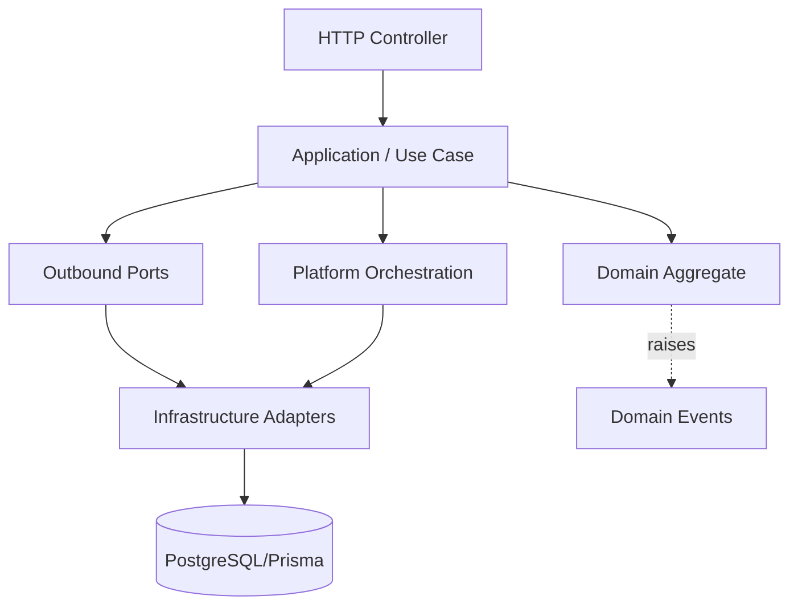
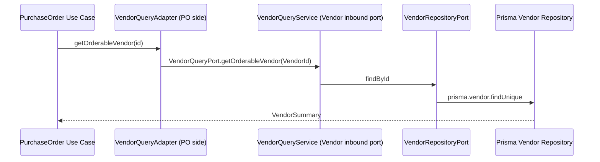
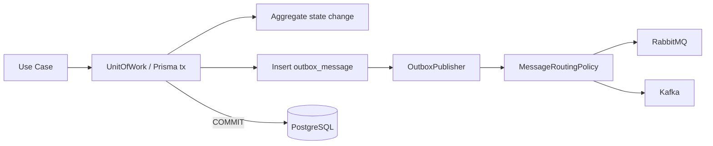
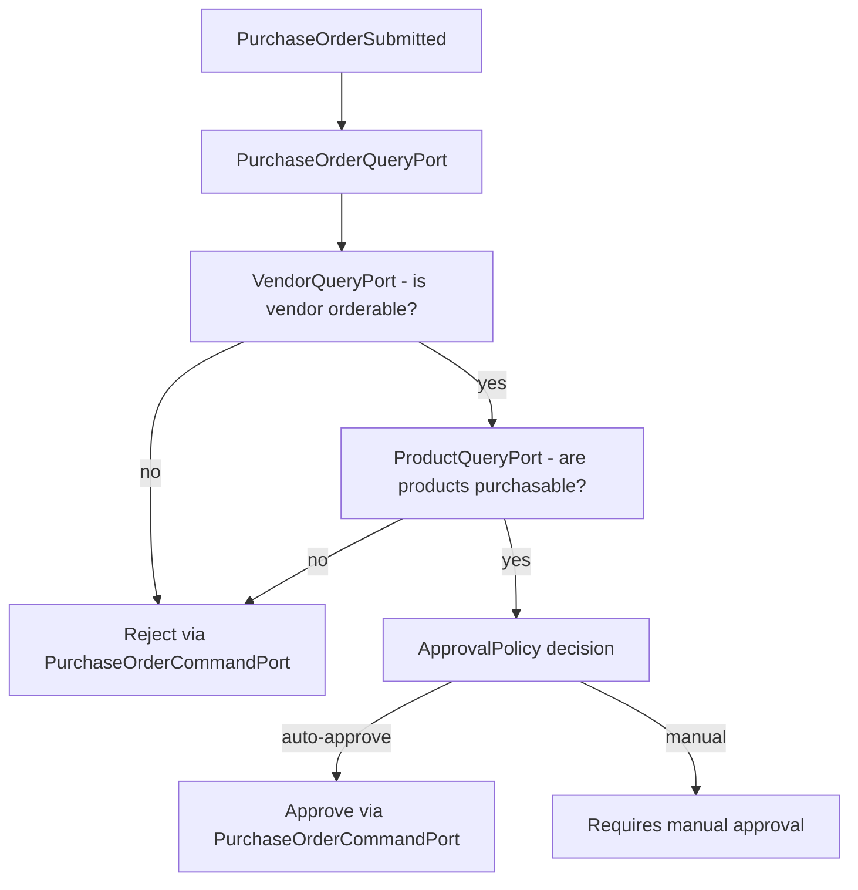

# ERP Boilerplate Architecture

A production-oriented **NestJS + TypeScript + PostgreSQL (Prisma)** ERP backend built as a
**modular monolith** following **DDD**, **Hexagonal Architecture** (Ports & Adapters),
**Clean Architecture**, and **CQRS where appropriate** — with a **transactional outbox**,
**domain events**, an example **saga/process manager**, **schedulers**, and a strict
**business ↔ infrastructure boundary** enforced by ESLint.

---

## 1. Folder Responsibilities

```text
src/
├── config/          # .env loading, typed configuration (app, db, messaging, cache, outbox, kafka...)
├── shared-kernal/   # technical NestJS cross-cutting concerns (filters, interceptors, pipes, pagination)
├── bootstrap/       # application bootstrap (security, cors, http/versioning, swagger, shutdown)
├── infrastructure/  # adapters: Prisma, Redis, RabbitMQ, Kafka, repositories, mappers, UnitOfWork
├── platform/        # orchestration: transactional outbox, event bus, saga, scheduler, routing
└── business/        # domain + application per aggregate (product, vendor, purchase-order)
```

### config/

Owns every environment value. `process.env` is read **only** here. Typed config blocks are
registered with `@nestjs/config`:

- `app.config.ts` — env, port, host, CORS, Swagger metadata
- `database.config.ts` — PostgreSQL master/slave URLs
- `message.config.ts` — RabbitMQ URL + exchange
- `kafka.config.ts` — brokers, client/group ids, enabled flag
- `cache.config.ts` — Redis URL
- `outbox.config.ts` — polling cadence, batch size, retry/backoff limits
- `auth.config.ts`, `security.config.ts`, `storage.config.ts` — JWT/security/storage

### shared-kernal/

Technical (non-business) NestJS concerns:

- `filters/http-exception.filter.ts` — maps domain errors → HTTP statuses
- `interceptors/request-id.interceptor.ts` — request/correlation ids into CLS
- `interceptors/logging.interceptor.ts` — structured request logging
- `interceptors/response.interceptor.ts` — `{ status, statusCode, data, message }` envelope
- `pipes/validator.pipe.ts` — global DTO validation
- `types/pagination.ts` — framework-independent page/result primitives

### bootstrap/

`bootstrap/bootstrap.ts` composes security, CORS, HTTP prefix + URI versioning (`/api/v1`),
Swagger, shutdown hooks and the listener. `main.ts` is just `bootstrap()`.

### infrastructure/

Concrete adapters that implement ports from `business/` and `shared-business/`:

```text
database/prisma/            PrismaMasterAdapter, PrismaSlaveAdapter, PrismaUnitOfWork
database/mappers/           domain ↔ Prisma model mapping (ProductMapper, VendorMapper, PurchaseOrderMapper)
database/repositories/      PrismaProductRepository, PrismaVendorRepository, PrismaPurchaseOrderRepository, PrismaOutboxRepository
cache/redis/                RedisAdapter, RedisCachePort (implements CachePort)
message/rabbitmq/           RabbitMQ config + RabbitMQPublisher (implements MessagePublisher)
message/kafka/              KafkaPublisher (implements MessagePublisher)
```

### platform/

Application/platform workflows that sit between business and infrastructure:

```text
outbox/       OutboxWriter (domain event → outbox row), OutboxPublisher (outbox row → broker)
events/       NestEventBusAdapter (InProcessEventBus), MessageRoutingPolicy (rabbitmq/kafka/both)
saga/         PurchaseOrderSaga — example process manager
scheduler/    PlatformScheduler — cron-driven outbox publishing/retry/cleanup
ports/        OutboxWriterPort, OutboxRepositoryPort
```

### business/

`shared-business/` holds framework-independent primitives:

```text
domain/       AggregateRoot, Entity, ValueObject, DomainEvent, Identifier, Money, Result, DomainError
application/  UseCase / CommandHandler / QueryHandler contracts
ports/        UnitOfWork, Clock, IdGenerator, InProcessEventBus, MessagePublisher, CachePort
errors/       InvariantException, PolicyViolateException
```

Each aggregate module:

```text
business/product/
├── domain/         aggregate, value-objects, events, policies, invariants, errors
├── application/    use cases, command/query services
├── ports/inbound/  ProductCommandPort, ProductQueryPort
├── ports/outbound/ ProductRepositoryPort
├── dto/            HTTP DTOs (validated at the boundary only)
├── controllers/    thin HTTP layer
└── *.module.ts     NestJS composition root
```

---

## 2. Dependency Direction



Dependencies point **toward abstractions**:

```text
Allowed:
  bootstrap → application modules
  config → infrastructure/bootstrap
  infrastructure → ports
  platform → ports
  business → shared-business
  business → other business inbound ports

Forbidden:
  domain → Prisma / NestJS / RabbitMQ / Kafka / Redis / process.env
  business use case → PrismaService / broker clients / Redis client
  PurchaseOrder → VendorRepository / PrismaVendor / PrismaProduct
```

Enforced by `eslint.config.mjs` (`no-restricted-imports`), see **§15**.

---

## 3. Ports & Adapters

Business modules define **inbound ports** (what they expose) and **outbound ports** (what they
need). NestJS DI binds tokens to adapters at the composition root.

```ts
// business/product/ports/outbound/product-repository.port.ts
export interface ProductRepositoryPort {
  save(product: Product): Promise<Product>;
  findById(id: ProductId): Promise<Product | null>;
  ...
}
export const PRODUCT_REPOSITORY = Symbol('PRODUCT_REPOSITORY');
```

```ts
// infrastructure/infrastructure.module.ts
{ provide: PRODUCT_REPOSITORY, useExisting: PrismaProductRepository },
```

Use cases inject the port **token**, never the concrete class:

```ts
@Inject(PRODUCT_REPOSITORY) private readonly productRepository: ProductRepositoryPort
```

This is why a business module can be unit-tested with fakes — see **§12**.

---

## 4. Module-to-Module Communication

Modules talk through **inbound ports of the owning module**, never another module's repository
or Prisma model.



Concretely:

- `PurchaseOrderModule` imports `VendorModule` + `ProductModule`.
- It defines narrow outbound ports (`OrderableVendorQueryPort`, `PurchasableProductQueryPort`)
  and adapter classes that delegate to the vendor/product **inbound** ports.
- `VendorQueryService.getOrderableVendor` and `ProductQueryService.getPurchasableProduct`
  enforce business rules (e.g. only ACTIVE vendors/products).

```text
PurchaseOrder → PurchaseOrder port (own)
             → Vendor inbound port  (VendorQueryService)  ✔
             → VendorRepository / PrismaVendor            ✘
```

---

## 5. Domain vs Application vs Infrastructure

| Layer | Owns | May import |
|---|---|---|
| Domain | aggregates, VOs, events, policies, invariants, errors | nothing framework/infra |
| Application | use cases, commands, query services | domain, ports, shared-business |
| Infrastructure | Prisma/Redis/RabbitMQ/Kafka adapters, repositories | ports, config |
| Platform | outbox, event bus, saga, scheduler | ports, config, business inbound ports |

Domain aggregates protect their own state. No anemic models:

```ts
purchaseOrder.approve();        // ✔ domain owns transitions
purchaseOrder.status = 'APPROVED'; // ✘ never
```

---

## 6. Product Aggregate

`business/product/domain/entities/product.aggregate.ts`

- Value objects: `ProductId`, `Sku` (normalized uppercase), `ProductName`, `Money`
- Status: `ACTIVE | INACTIVE | DISCONTINUED`
- `create/update/changePrice/activate/deactivate/discontinue`
- Invariants (`product.invariants.ts`): SKU required, name required, non-negative price,
  legal status transitions
- Policies (`product.policy.ts`): discontinued products cannot reactivate without explicit policy
- Events: `ProductCreated`, `ProductUpdated`, `ProductActivated`, `ProductDeactivated`,
  `ProductDiscontinued`

Use cases: Create, Update, ChangePrice, Status transitions, Get, List — all exposed through
`ProductCommandPort`/`ProductQueryPort`.

---

## 7. Vendor Aggregate

`business/vendor/domain/entities/vendor.aggregate.ts`

- Value objects: `VendorId`, `VendorCode`, `VendorName`, `VendorEmail`
- Status: `ACTIVE | INACTIVE | BLOCKED`
- `create/update/activate/deactivate/block`
- Invariants (`vendor.invariants.ts`): legal transitions
- Policy (`vendor.policy.ts`): blocked/inactive vendors cannot receive new purchase orders
- Events: `VendorCreated`, `VendorUpdated`, `VendorActivated`, `VendorDeactivated`, `VendorBlocked`

Exposes `VendorQueryPort` as an inbound port for other modules.

---

## 8. PurchaseOrder Aggregate

`business/purchase-order/domain/entities/purchase-order.aggregate.ts`

- Owns `PurchaseOrderLine[]`; references products/vendors **by id only**
- Status machine: `DRAFT → SUBMITTED → APPROVED → COMPLETED`, plus `REJECTED`, `CANCELLED`
- `create/addLine/removeLine/submit/approve/reject/cancel/complete`
- Invariants: ≥1 line before submit, positive quantity, valid transitions, totals = Σ lines,
  immutable after submit/approve
- Policy (`purchase-order.policy.ts`): approval threshold (e.g. orders > $10,000 need manual approval)
- Events: `PurchaseOrderCreated/Submitted/Approved/Rejected/Cancelled/Completed`, line added/removed

Cross-module validation happens in use cases via `OrderableVendorQueryPort` and
`PurchasableProductQueryPort`.

---

## 9. Transactional Outbox

Every state-changing use case runs inside a `UnitOfWork` and writes a copy of each raised
domain event into `outbox_messages` **in the same DB transaction**.



- **Never** publish inside the business transaction directly.
- `OutboxPublisher.claimBatch` marks rows `PUBLISHING` → publishes → `PUBLISHED`.
- Failures are marked `FAILED` with `attempts`/`lastError` and retried by the scheduler.
- Idempotency: message id + event id in headers; consumers should dedupe on `event-id`.

Outbox row: `eventType, aggregateType, aggregateId, payload(JSON), headers, occurredAt,
publishedAt, attempts, lastError, status`.

---

## 10. Domain Events vs Integration Events

| | Domain Event | Integration Event |
|---|---|---|
| Scope | In-process, same aggregate boundary | Across services/processes |
| Transport | `InProcessEventBus` (EventEmitter2 adapter) | RabbitMQ / Kafka |
| Durability | Not guaranteed | Transactional outbox |
| Example | `PurchaseOrderSubmitted` handled by the saga | Same event re-published as outbox message |

A use case does both: publish in-process (saga/listeners) **and** write to the outbox
(external delivery) atomically with the aggregate change.

---

## 11. Saga / Process Manager

`platform/saga/purchase-order.saga.ts` subscribes to `PurchaseOrderSubmitted` and orchestrates:



The saga talks **only** to inbound ports/use cases — never repositories directly.

---

## 12. Testing Strategy

- **Unit tests** (`*.spec.ts` next to code): aggregates, VOs, policies, invariants, use cases.
  Use cases are tested with fakes for repository/outbox/event-bus ports — no Postgres, no Nest.
  ```bash
  npm test
  ```
- **E2E smoke** (`test/app.e2e-spec.ts`): boots the whole app and verifies wiring.
  Requires `docker compose up -d`:
  ```bash
  npm run test:e2e
  ```

---

## 13. Creating a New Business Module

1. Create `business/<module>/domain` — aggregate, VOs, events, invariants, policies, errors.
2. Create `business/<module>/ports/inbound` (command/query ports + tokens) and
   `ports/outbound` (repository port + token).
3. Create `business/<module>/application` — use cases calling ports inside `UnitOfWork`,
   then write events to outbox and dispatch in-process.
4. Create `business/<module>/dto` + `controllers` (thin).
5. Create `business/<module>/<module>.module.ts` binding inbound port tokens.
6. Add Prisma model + mapper in `infrastructure/database` and a repository implementation;
   bind `provide: X_REPOSITORY, useExisting: PrismaXRepository` in `InfrastructureModule`.
7. If the module must be queried by others, expose an inbound query port and export it.
8. Wire into `AppModule`.
9. Add unit tests for aggregate invariants and use cases.

---

## 14. Error Handling

Domain throws `DomainError` subclasses (`NotFoundError`, `ConflictError`,
`InvalidStateTransitionError`, `BusinessRuleViolationError`, `ValidationError`) or
`InvariantException`/`PolicyViolateException`.

`HttpExceptionsFilter` maps them to HTTP:

| Domain error | HTTP |
|---|---|
| NotFoundError | 404 |
| InvalidStateTransitionError / ConflictError | 409 |
| ValidationError / BusinessRuleViolationError / Invariant / Policy | 422 |

Controllers never contain business rules; they only validate DTOs and call ports.

---

## 15. Architecture Enforcement (ESLint)

`eslint.config.mjs` uses `no-restricted-imports` to block, outside `infrastructure`:
`prisma/generated/prisma/client`, `@prisma/*`, `amqplib`, `kafkajs`, `ioredis`, `redis`,
`@golevelup/nestjs-rabbitmq`, `@nestjs/schedule`; and blocks `@nestjs/*` in domain folders and
cross-module outbound-port imports in domain folders.

```bash
npm run lint
```

---

## 16. Security & Future-Readiness

- JWT auth config exists (`auth.config.ts`); auth guards/decorators live in
  `shared-kernal/guards` and can be enabled per controller.
- Identifiers are UUIDs; aggregates carry `version` for optimistic concurrency.
- Multi-tenancy: add `tenantId` to aggregates/persistence without restructuring.
- API versioning via URI (`/api/v1`).

---

## 17. Commands

```bash
cp .env.example .env
docker compose up -d
npm install
npx prisma migrate dev   # creates & applies migration + regenerates client
npm run db:seed
npm run start:dev        # http://localhost:4000/api/v1, Swagger at /api/docs
```

```bash
npm run lint             # lint + architecture checks
npm test                 # unit tests
npm run test:e2e         # e2e smoke (requires docker compose up -d)
```
