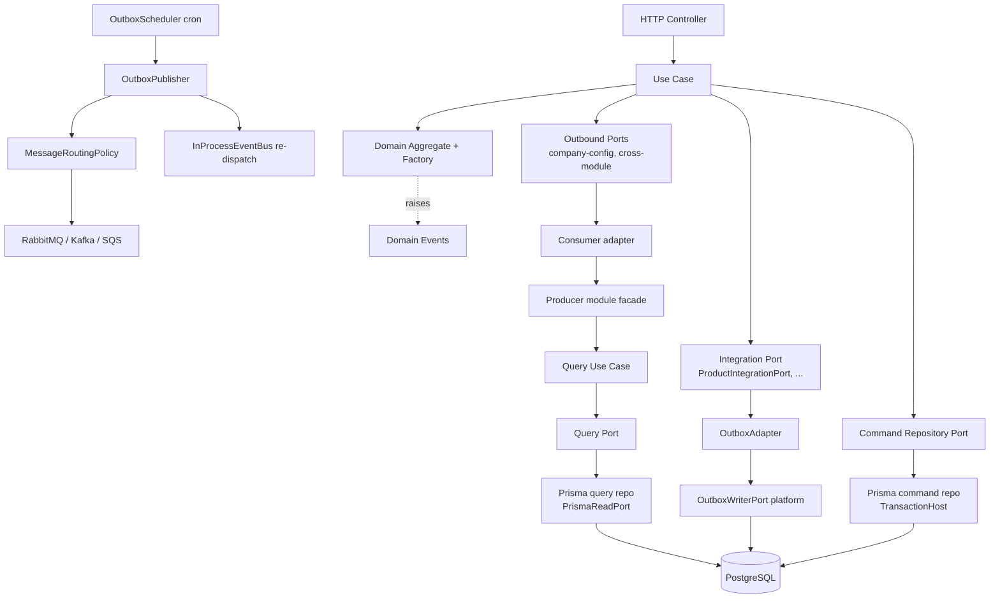
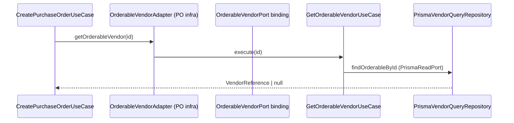
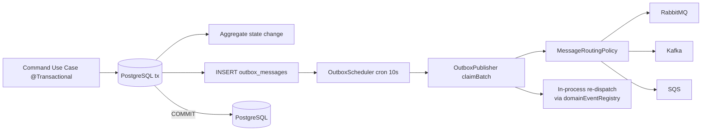

# ERP Boilerplate — Architecture

A production-oriented **NestJS 11 + TypeScript + PostgreSQL (Prisma 7)** ERP backend built as
an **event-driven modular monolith**. The codebase applies **Domain-Driven Design (DDD)**,
**Hexagonal Architecture (Ports & Adapters)**, **Clean Architecture** and a lightweight
**CQRS-style split** between command and query paths.

Key pillars:

- **Strict layer separation** — domain knows nothing about NestJS, Prisma, or any broker.
- **Ports & Adapters** — every external dependency (DB, brokers, cache, storage, email,
  metrics, company config, outbox) is behind a port (abstract class used as DI token), bound
  to an adapter in a composition-root module.
- **Transactional outbox** — integration events are persisted atomically with the aggregate
  change and published by a scheduler; no events are lost and nothing publishes inside the
  business transaction.
- **In-process event bus + integration event routing** — domain events drive local reactions;
  a routing policy decides which broker(s) receive each event.
- **Module-to-module contracts** — aggregates talk to each other through `public/` port
  contracts implemented by facades, injected **directly** through the Nest container,
  never by importing another module's internals.
- **Device-aware responses** — one controller, two response shapes (`web` full payload,
  `mobile` minimal payload) selected by the `x-device-type` header and validated with Zod.
- **Architecture enforced by ESLint** (`no-restricted-imports` in `eslint.config.mjs`).

This document is the single source of truth for the design. If you change the rules here,
update `eslint.config.mjs` and vice versa.

For the runtime **flows** (request lifecycles, module-to-module contracts, platform service
internals, opt-in registrations) see [`docs/FLOWCHARTS.md`](docs/FLOWCHARTS.md).

---

## Table of Contents

1. [Top-Level Folder Map](#1-top-level-folder-map)
2. [Layers and Responsibilities](#2-layers-and-responsibilities)
3. [Business Module Anatomy](#3-business-module-anatomy)
4. [Dependency Direction & ESLint Enforcement](#4-dependency-direction--eslint-enforcement)
5. [Ports & Adapters (Command / Query / Integration)](#5-ports--adapters-command--query--integration)
6. [Cross-Module Communication](#6-cross-module-communication)
7. [Domains / Aggregates](#7-domains--aggregates)
8. [Outbox, Events & Messaging](#8-outbox-events--messaging)
9. [Platform Layer](#9-platform-layer)
10. [Infrastructure Layer](#10-infrastructure-layer)
11. [Persistence & Data Model](#11-persistence--data-model)
12. [HTTP, Validation, Error Handling](#12-http-validation-error-handling)
13. [Observability & Security](#13-observability--security)
14. [Testing Strategy](#14-testing-strategy)
15. [Creating a New Business Module](#15-creating-a-new-business-module)
16. [Commands](#16-commands)

---

## 1. Top-Level Folder Map

```text
src/
├── app.module.ts            # root composition root + global interceptors/filter/pipe
├── main.ts                  # entry point, calls bootstrap()
├── config/                  # .env-driven typed configuration blocks + ConfigService facade
├── shared-kernel/           # technical NestJS concerns: filters, interceptors, pipes,
│                            # decorators, exceptions, types (device context, pagination)
├── bootstrap/               # app bootstrap steps (sentry, security, cors, http, swagger, ...)
├── infrastructure/          # third-party client init ONLY (Prisma, brokers, cache, AWS, CLS)
├── platform/                # services built on those clients, exposed as ports
│                            # (outbox, events, messaging, database, context, cache, audit,
│                            #  numbering, configuration, notification, observability, storage,
│                            #  condition-engine, scheduler, recurring, batch-operation, import)
├── generated/               # Prisma-generated client (DO NOT EDIT; `@prisma/client` alias)
└── business/
    ├── shared-business/     # framework-independent domain primitives + registries
    ├── catalog/product/                 # Product aggregate      (context: catalog)
    ├── party/vendor/                    # Vendor aggregate       (context: party)
    ├── procurement/purchase-order/      # PurchaseOrder aggregate (context: procurement)
    ├── procurement/good-receipt-note/   # GoodReceiptNote aggregate (context: procurement)
    └── sales/invoice/                   # Invoice aggregate       (context: sales)
```

Module aliases (see `tsconfig.json` + Jest `moduleNameMapper` in `package.json`):

| Alias | Path |
|---|---|
| `@config/*` | `src/config/*` |
| `@shared-kernel/*` | `src/shared-kernel/*` |
| `@bootstrap/*` | `src/bootstrap/*` |
| `@infrastructure/*` | `src/infrastructure/*` |
| `@platform/*` | `src/platform/*` |
| `@business/*` | `src/business/*` |
| `@test/*` | `test/*` |
| `@prisma/client` | `src/generated/client.ts` |

---

## 2. Layers and Responsibilities

### config/

The only place that reads `process.env`. Each concern is a typed `registerAs` block loaded by
`ConfigModule` (which is `@Global`):

- `app.config.ts` — env, name, port/host, log level, CORS origins, app/API URLs, Swagger
  metadata (title/description/version/path)
- `auth.config.ts` — JWT access/refresh secrets + TTLs, settings encryption key
- `database.config.ts` — driver + `postgres.url` (`DATABASE_URL`) / `postgres.readUrl`
  (`DATABASE_SLAVE_URL` → `DATABASE_READ_URL` → write URL fallback)
- `messaging.config.ts` — RabbitMQ URL + exchange + `registerHandlers`, Kafka
  brokers/clientId/groupId, SQS url/region/credentials
- `cache.config.ts` — driver (`redis` | `memcache`) + connection settings
- `storage.config.ts` — S3 endpoint/bucket/region/pathStyle/presigned TTL
- `security.config.ts` — throttler (`THROTTLE_TTL_MS`/`THROTTLE_LIMIT`), encryption key,
  tenant/organization header names
- `outbox.config.ts` — poll interval, batch size, max attempts, retry backoff, cleanup age
- `notification.config.ts` — SNS (topic ARN/region) + SES (from address/region)
- `observability.config.ts` — Sentry DSN/traces sample rate, Loki URL
- `scheduler.config.ts` — poll interval, batch size, lock TTL, reconciliation interval,
  worker concurrency, job attempts (platform/scheduler only)
- `batch-operation.config.ts` — max records per job, sync threshold, chunk size, worker
  concurrency, chunk attempts, reconciliation window, result-snapshot cap
- `import.config.ts` — file/row limits, chunk sizes, lock TTL, retention, preview, build SHA

`ConfigService` (`config/config.service.ts`) is a **typed facade** over Nest's
`ConfigService`: adapters use `getPostgres()`, `getRabbitMQ()`, `getOutbox()`, ... and never
touch `process.env` or raw string keys.

`env.util.ts` provides: `envFileCandidates()` (resolution order `.env.{NODE_ENV}.local` →
`.env.{NODE_ENV}` → `.env`), `ensureEnvLoaded()` (safe one-time env load for module-definition
time driver branching), `numericEnv`/`booleanEnv`/`stringEnv` parsers, and
`requiredInProduction()` fail-fast validation.

### shared-kernel/

Technical, non-business NestJS concerns:

```text
filters/       HttpExceptionsFilter (@Catch: validation/HTTP/statusCode-tagged errors →
               the standard error envelope)
interceptors/  RequestIdInterceptor   — requestId + x-correlation-id propagation, seeds the
                                         immutable CLS RequestContext (tenant/org/user/roles/
                                         locale/ip/userAgent)
               ResponseInterceptor   — success envelope { status, statusCode, data, message }
                                         (passes through StreamableFile/non-JSON and nestlens)
               LoggingInterceptor    — structured JSON request logging (ids, path, status,
                                         duration; never bodies)
               DeviceResponseInterceptor — reads x-device-type into CLS and maps `data`
                                         through the DTO class chosen by @DeviceResponse
pipes/         AppValidationPipe (extends nestjs-zod ZodValidationPipe; global APP_PIPE)
exceptions/    DomainException (framework-free base), InfrastructureException
decorators/    @DeviceContext param decorator, @DeviceResponse(mobile, web) metadata
               decorator, @KafkaEvent(topic) method decorator (consumed by KafkaConsumerHost)
types/         ApiResponse<T> ({ data, message }), DeviceType enum + IDeviceContext,
               pagination primitives (PageQuery, PageResult, normalizePageQuery,
               buildPageResult — default 20, max 100 per page)
```

### bootstrap/

`bootstrap/index.ts` composes independent steps, called from `main.ts`:

1. `configureSentry()` — `Sentry.init` before Nest bootstraps (no-op without `SENTRY_DSN`).
2. `NestFactory.create<FastifyApplication>` — Fastify adapter, 5 MB body limit, 30 s request/
   connection timeouts, 65 s keep-alive, leveled Nest logger.
3. `configureSecurity()` — `@fastify/helmet` (CSP directives in production) + `@fastify/compress`
   (gzip/deflate/br).
4. `configureCors()` — origins from config; empty origins are a fatal error in production.
5. `configureHttp()` — global prefix `api` + URI versioning (default `v1` → `/api/v1`).
6. `configureShutdown()` — shutdown hooks + `Sentry.close` on Fastify `onClose`.
7. `configureSwagger()` — `/api/docs` (disabled in production).
8. `configureServer()` — listen on `APP_HOST:PORT`.

### infrastructure/

**Third-party client initialization only** — no ports, no adapters, no business logic.
Deliberately **not** `@Global` so raw clients stay invisible to business modules (the single
exception is CLS, which the library requires to be global). See [§10](#10-infrastructure-layer).

### platform/

Services built on the infrastructure clients, exposed to business code as **ports**. The
`PlatformModule` imports every platform sub-module and re-exports them — and it is
**deliberately not `@Global`**: each business module lists `imports: [PlatformModule]` so the
dependency stays visible in module metadata. See [§9](#9-platform-layer).

### business/

`shared-business/` holds framework-independent primitives (see [§7](#7-domains--aggregates)).
Concrete aggregates live under bounded-context folders (`catalog`, `party`, `procurement`,
`sales`). Each context folder has a thin composing module (`CatalogModule`, `PartyModule`,
`ProcurementModule`, `SalesModule`), aggregated by `BusinessModule`. `BusinessModule` and
everything below it may never import `@infrastructure`.

---

## 3. Business Module Anatomy

Every aggregate module follows the same shape (shown for `catalog/product`):

```text
business/<context>/<module>/
├── domain/
│   ├── aggregates/          # aggregate root + <name>.invariants.ts (registry registrations)
│   ├── entities/            # child entities (e.g. PurchaseOrderLine) + their invariants
│   ├── value-objects/       # typed VOs (id, sku, name, ...) + per-VO invariants files
│   ├── events/              # domain events + <name>.registry.ts (rehydrators for the outbox)
│   ├── policies/            # policy definitions registered in policyRegistry
│   ├── factories/           # aggregate factory — the only sanctioned build path
│   ├── repositories/        # COMMAND repository port (abstract class = DI token)
│   └── types/               # enums + props/request/query-record type aliases
├── application/
│   ├── usecases/            # one class per command/query operation
│   ├── queries/             # QUERY repository port (abstract class = DI token)
│   ├── facades/             # implementations of this module's public/ ports (call own use cases)
│   ├── outbound-ports/      # ports this module CONSUMES (cross-module + company config)
│   └── integrations/
│       ├── publishes/       # <name>.integration-port.ts (send-to-outbox abstraction) +
│       │                    # per-event wire shapes (<name>.<event>.integration-event.ts)
│       └── listeners/       # broker/in-process listeners: *.event-emitter, *.rabbitmq,
│                            # *.kafka, *.sqs listener-event files
├── infrastructure/
│   ├── persistence/         # Prisma command/query repositories + domain↔row mapper
│   └── adapters/
│       ├── platform/        # adapters implementing this module's platform-facing ports
│       │                    # (outbox.adapter.ts, company-config.adapter.ts)
│       └── module/          # adapters implementing OTHER modules' outbound ports by
│                            # delegating to the owner's public/ port (consumer side)
├── presentation/
│   └── http/
│       ├── <name>.controller.ts     # thin controllers calling use cases directly
│       ├── requests/                # Zod request DTOs (createZodDto)
│       └── responses/               # Id response + per-endpoint web/mobile Zod response DTOs
├── public/
│   ├── contracts/           # plain reference shapes (ProductReference, ...)
│   ├── ports/               # abstract-class port this module EXPORTS to consumers
│   └── index.ts             # the only folder other modules may import
└── <module>.module.ts       # NestJS composition root for this aggregate
```

Anatomy of a use case:

- **Command use cases** are `@Injectable()` classes with an `execute(input)` method annotated
  `@Transactional()` (`@nestjs-cls/transactional`). They orchestrate module-local ports
  (company config), make cross-module calls through outbound ports, build/call the aggregate
  via its factory, persist through the **command repository port**, drain `pullEvents()` and
  append them to the **integration port** (which writes the outbox in the same transaction).
- **Query use cases** are read-only. They skip the aggregate and the outbox entirely and go
  through the **query repository port** bound to a Prisma implementation using
  `PrismaReadPort` (replica connection).
- Controllers call use cases **directly** — there is no inbound-port / mediator layer.

---

## 4. Dependency Direction & ESLint Enforcement



Rules (enforced in `eslint.config.mjs`):

```text
Allowed:
  infrastructure   third-party clients + config + shared-kernel exceptions only
  platform         infrastructure clients + shared-business primitives, exposed as ports
  business module  its own internals, @platform ports, shared-business, shared-kernel types,
                   ANOTHER module's public/** or application/outbound-ports/** contract
Forbidden:
  domain        → @nestjs/common, @nestjs/core, @nestjs/config, @nestjs/event-emitter
  business      → @infrastructure/**  (always; listeners included)
  business      → internals of another module: domain/**, application/queries/**,
                  application/usecases/**, application/integrations/**,
                  application/facades/**, infrastructure/**
  shared-business → @platform/**, @infrastructure/**, any concrete module (@business/*/*/**)
  raw client libs (Prisma, @prisma/adapter-pg, amqplib, kafkajs, ioredis/redis,
  @golevelup/nestjs-rabbitmq, @ssut/nestjs-sqs) → infrastructure/config/bootstrap/platform only
  @nestjs/schedule → platform only (the outbox scheduler owns cron)
```

Carve-out: `application/integrations/listeners/**` may use the subscribe decorators
(`@RabbitSubscribe`, `@KafkaEvent`, `@SqsMessageHandler`, `@OnEvent`) but not the raw client
libraries, and handlers must delegate to use cases — never run business logic inline.

Run enforcement locally:

```bash
npm run lint          # eslint with --fix (includes architecture rules)
npm run lint:check    # eslint, no fixes
```

---

## 5. Ports & Adapters (Command / Query / Integration)

Every port is an **abstract class used as its own DI token**; use cases inject the abstract
class and the module binds the concrete adapter with `useClass`/`useExisting`.

Per aggregate module there are four port families:

| Port (token) | Defined in | Implemented by | Used for |
|---|---|---|---|
| `ProductCommandRepository` | `domain/repositories/` | `PrismaProductCommandRepository` (via `TransactionHost`) | reads/writes of the aggregate inside the `@Transactional` boundary |
| `ProductQuery` | `application/queries/` | `PrismaProductQueryRepository` (via `PrismaReadPort`) | read-model queries (list/get/purchasable) |
| `ProductIntegrationPort` | `application/integrations/publishes/` | `infrastructure/adapters/platform/OutboxAdapter` (wraps platform `OutboxWriterPort`) | append raised domain events to the outbox |
| `CompanyConfigPort` (module-local) | `application/outbound-ports/` | `infrastructure/adapters/platform/CompanyConfigAdapter` (wraps platform `CompanyConfigPort`) | default currency / auto-approve threshold |

Example binding (`product.module.ts`):

```ts
@Module({
  imports: [PlatformModule],
  providers: [
    { provide: ProductCommandRepository, useClass: PrismaProductCommandRepository },
    { provide: ProductQuery, useClass: PrismaProductQueryRepository },
    { provide: ProductIntegrationPort, useClass: OutboxAdapter },
    { provide: CompanyConfigPort, useClass: CompanyConfigAdapter },
  ],
})
export class ProductModule {}
```

Cross-cutting **platform ports** business code injects (never the concrete services):
`OutboxWriterPort`, `RequestContextPort`, `CompanyConfigPort`
(platform), `NumberingPort`, `AuditPort`, `NotificationDispatchPort`, `CachePort`,
`FileStoragePort`, `LoggerPort`/`MetricsPort`/`ErrorTrackingPort`, `InProcessEventBus`,
`MessageRoutingPolicy`, `PrismaReadPort`, plus the broker publisher tokens
`RabbitMqPublisher` / `KafkaPublisher` / `SqsPublisher`.

> Note: the platform `NumberingPort` (`PrismaNumberingService`, `number_sequences` table,
> race-safe upsert increment) is available for document numbering, but PurchaseOrder/GRN
> currently generate their numbers through their own command-repository sequence helpers —
> prefer `NumberingPort` for new documents.

This is what makes use cases unit-testable with fakes (see [§14](#14-testing-strategy)).

---

## 6. Cross-Module Communication

Modules exchange **queries through contracts**, in three layers:

1. **Public port (producer-owned)** — `business/<context>/<module>/public/`:
   a plain `*Reference` contract + an abstract-class port, re-exported from `public/index.ts`.
   The producer implements it with a **facade** in `application/facades/` that delegates to
   one of its own query use cases, and **exports the port**.
2. **Outbound port (consumer-owned)** — the consuming module declares the port it needs in
   `application/outbound-ports/` (typed against the producer's contract shape) and binds an
   adapter in `infrastructure/adapters/module/` that injects the producer's public port.
3. **Direct injection** — command use cases inject the outbound port token in their
   constructor; Nest resolves the bound adapter at instantiation time (the consuming
   module `imports` the producer module so the public port is resolvable):

```ts
constructor(private readonly vendorQueryPort: OrderableVendorPort) {}
```

Current wiring:

```text
PurchaseOrder ──PurchasableProductPort──▶ ProductModule: ProductForPurchaseFacade
             ──OrderableVendorPort────▶ VendorModule:   VendorForPurchaseFacade
                                          (VendorModule additionally binds OrderableVendorPort
                                           itself via OrderableVendorQueryAdapter)
GoodReceiptNote ──PurchaseOrderPort──▶ PurchaseOrderModule: PurchaseOrderForGrnFacade

PurchaseOrderModule exposes  PurchaseOrderForGrnPort   (public/)   → consumed by GRN adapter
GoodReceiptNoteModule exposes GrnForPurchaseOrderPort  (public/)   → reserved for PurchaseOrder
```

Nest `imports` are used **only to make exported providers resolvable** (e.g.
`PurchaseOrderModule imports ProductModule, VendorModule`) — no module ever reaches into
another module's `domain`/`usecases`/`infrastructure`.



Business rules encoded in these query paths: only **ACTIVE** products are purchasable
(`findPurchasableById`) and only **ACTIVE** vendors are orderable (`findOrderableById`) —
a non-orderable vendor makes PO creation fail with `ConflictException`.

---

## 7. Domains / Aggregates

### shared-business primitives (framework-free)

```text
domain/bases/       AggregateRoot<ID> (version + addEvent/pullEvents drain snapshot),
                    Entity<ID>, ValueObject<T> (equals by props), DomainEvent
                    (eventId/occurredAt/version + correlationId/causationId/headers),
                    DomainFactory<TAggregate, TInput, TProps>
domain/common/value-objects/  Money (minor-units integer math, currency guards,
                    fromDecimal/toDecimal), VendorId
domain/registries/  invariantRegistry  — keyed Invariant list, enforce() throws on violation
                    policyRegistry     — keyed Policy list, evaluate()/enforce()
                    domainEventRegistry — event-type-name → rehydrator, used by the outbox
                    publisher to rebuild domain events for in-process re-dispatch
```

Aggregates register invariants/policies by importing side-effect files
(`*.invariants.ts`, `policies/*.ts`, `events/<name>.registry.ts`); rule classes never
cross-import aggregates.

### Product (catalog) — `domain/aggregates/product.aggregate.ts`

- VOs: `ProductId`, `Sku` (normalized uppercase), `ProductName`; `Money` unit price.
- Status: `ACTIVE | INACTIVE | DISCONTINUED`.
- Behavior: factory `create`, `update`, `changePrice`, `activate`, `deactivate`,
  `discontinue`, `isPurchasable()`.
- Invariants: non-negative price (`product.create`), legal transitions (`product.status-transition`
  — `DISCONTINUED` has no outgoing transitions).
- Policy: `product.reactivation` — a discontinued product can never be reactivated.
- Events: `ProductCreated/Updated/Activated/Deactivated/Discontinued` (+ registry rehydrators).

### Vendor (party) — `domain/aggregates/vendor.aggregate.ts`

- VOs: `VendorCode` (uppercase), `VendorName`, `VendorEmail` (lowercase), phone/address props.
- Status: `ACTIVE | INACTIVE | BLOCKED`.
- Behavior: factory `create`, `update`, `activate`, `deactivate`, `block`.
- Policy: `vendor.orderability` — blocked/inactive vendors are never returned by
  `findOrderableById`, so they cannot receive purchase orders.
- Events: `VendorCreated/Updated/Activated/Deactivated/Blocked`.

### PurchaseOrder (procurement) — `domain/aggregates/purchase-order.aggregate.ts`

- Owns `PurchaseOrderLine[]` children (same product on a line merges quantities); references
  products/vendors **by id only**.
- Status machine:

```text
DRAFT ── submit ─▶ SUBMITTED ── approve ─▶ APPROVED ── complete ─▶ COMPLETED
                     │             │
                     ├─ reject ──▶ REJECTED
                     └──────── cancel ─────▶ CANCELLED (from DRAFT/SUBMITTED/APPROVED)
```

- Behavior: `addLine`, `removeLine`, `submit`, `approve`, `reject(reason)`, `cancel`,
  `complete`, `requiresManualApproval(threshold)`, computed `subtotal`/`total` (`Money`).
- Invariants: editable only in `DRAFT`, ≥1 line before submit, positive quantity, legal
  transitions.
- Policy: `purchase-order.approval` — submitted orders with `total > autoApproveThreshold`
  (company config) require manual approval; the approve transition is a no-op for them.
- Order number: `PO-00000001` style, allocated through the command repository's
  `nextOrderSequence()`.
- Events: `PurchaseOrderCreated/Submitted/Approved/Rejected/Cancelled/Completed` +
  `LineAdded/LineRemoved`.

### GoodReceiptNote (procurement) — `domain/aggregates/grn.aggregate.ts`

- Owns `GrnLine[]` (productId, orderedQuantity, receivedQuantity, unitPrice; re-receiving the
  same product accumulates received quantity). References PO/vendors by id only.
- Status: `DRAFT | RECEIVED | COMPLETED | CANCELLED`.
- Behavior: `addLine`, `receive` (needs ≥1 line, stamps `receivedAt`), `complete`, `cancel`;
  editable only in `DRAFT`.
- Number: `GRN-<timestamp>` via the factory (a `nextGrnSequence()` helper exists on the
  command repository — switch to `NumberingPort` when hardening).
- Events: `GrnCreated/LineAdded/Received/Completed/Cancelled`.

---

## 8. Outbox, Events & Messaging

### 8.1 The transactional outbox

Every state-changing use case runs inside `@Transactional()` and appends each raised domain
event to the outbox **in the same DB transaction** as the aggregate change:
`use case → <Aggregate>IntegrationPort → OutboxAdapter → OutboxWriterPort (platform)`.



Flow details:

- `OutboxWriter.append(event, aggregateType, aggregateId)` builds an `IntegrationMessage`
  (`eventType` = domain event class name, JSON payload minus envelope fields, headers with
  `event-id`/`request-id`/`correlation-id` from `RequestContextPort`) and saves it via
  `PrismaOutboxRepository` on the caller's `TransactionHost`.
- `OutboxPublisher.publishPendingBatch()` (guarded against overlap, chunks of 10 in
  parallel): `claimBatch(batchSize)` atomically flips `PENDING|FAILED → PUBLISHING`, publishes
  to each broker target, re-dispatches the rehydrated domain event in-process, then
  `markPublished` (or `markFailed`, incrementing `attempts`).
- `OutboxScheduler` (`@nestjs/schedule` cron):
  - every 10 s — publish pending batch;
  - every minute — `retryFailed()` re-queues `FAILED` rows under `maxAttempts`;
  - every hour — `cleanup()` deletes `PUBLISHED` rows older than `cleanupOlderThanHours`.
- `OutboxMessageStatus`: `PENDING → PUBLISHING → PUBLISHED | FAILED`.
- Publishing is **never** inside the business transaction. Business code only writes; the
  scheduler owns delivery. Brokers degrade gracefully: Kafka disabled without `KAFKA_BROKERS`,
  SQS disabled without `SQS_URL`.

### 8.2 Domain events vs integration events

| | Domain event | Integration event |
|---|---|---|
| Scope | In-process, same monolith | Across brokers/processes |
| Transport | `InProcessEventBus` (EventEmitter2 adapter, wildcard) | RabbitMQ / Kafka / SQS |
| Durability | Best effort | Transactional outbox (guaranteed at-least-once) |
| Persisted | No | `outbox_messages` |
| Example | `ProductCreated` → `@OnEvent` listener | Same event published as the full `IntegrationMessage` envelope |

Each module's `integrations/publishes/*.integration-event.ts` files declare the typed wire
shape per event (`eventType: 'product.created'`, etc.) as a publish contract; the outbox
itself serializes the domain event payload under the event class name.

### 8.3 Message routing policy

`platform/events/message-routing.policy.ts` — the single place defining which brokers receive
which events. Fan-out is explicit: adding a Kafka/SQS listener means adding the event here.

```ts
const FAN_OUT_EVENTS: Record<string, BrokerTargets> = {
  ProductCreated: ['rabbitmq', 'kafka', 'sqs'],
  VendorCreated: ['rabbitmq', 'kafka', 'sqs'],
  PurchaseOrderCreated: ['rabbitmq', 'kafka', 'sqs'],
  GrnCreated: ['rabbitmq', 'kafka', 'sqs'],
};
// everything else → ['rabbitmq']
```

All transports carry the **same envelope** (`eventType`, `aggregateType`, `aggregateId`,
`payload`, `headers`, `occurredAt`): RabbitMQ publishes the envelope to the topic exchange
`erp.events` with the event type as routing key, Kafka uses the event type as topic, SQS goes
to the configured queue.

### 8.4 Listeners

Listeners live in `business/<context>/<module>/application/integrations/listeners/` — one
class per transport per module:

- `*.rabbitmq.listener-event.ts` — `@RabbitSubscribe` (durable queue, e.g.
  `product-created.erp`, routing key = event type).
- `*.kafka.listener-event.ts` — custom `@KafkaEvent('<EventType>')` decorator; the
  infrastructure `KafkaConsumerHost` discovers decorated methods via `DiscoveryService` at
  bootstrap and wires one shared consumer per topic.
- `*.sqs.listener-event.ts` — `@SqsMessageHandler('consumer1')` (`@ssut/nestjs-sqs`).
- `*.event-emitter.listener-event.ts` — `@OnEvent('<EventClassName>')` for in-process
  reactions (fed by the outbox publisher's re-dispatch).

Handlers currently log (they are template examples); real reactions must delegate to use
cases/facades. Consumers are the only business code allowed to touch broker decorators.

---

## 9. Platform Layer

Each sub-system owns its folder, module and ports; `PlatformModule` composes and re-exports
them (not global — business modules import it explicitly):

```text
platform/
├── outbox/          OutboxModule — OutboxWriter (OutboxWriterPort), OutboxPublisher,
│                    OutboxScheduler, PrismaOutboxRepository (OutboxRepository)
├── events/          EventsModule — NestEventBusAdapter (InProcessEventBus),
│                    DefaultMessageRoutingPolicy (MessageRoutingPolicy)
├── messaging/       MessagingModule — binds RabbitMqPublisher/KafkaPublisher/SqsPublisher
│                    tokens to MessagePublisher adapters over the infra clients
├── database/        DatabaseModule — PrismaReadPort (backed by PrismaReadService)
├── context/         ContextModule — ClsRequestContextService (RequestContextPort);
│                    ports also define RequestContext, Clock/SystemClock, UnitOfWork
├── cache/           CacheModule — Redis or Memcached CachePort adapter, chosen by the same
│                    resolveCacheDriver() the infrastructure layer uses (exactly one client)
├── configuration/   ConfigurationModule — PrismaCompanyConfigAdapter (CompanyConfigPort),
│                    DEFAULT_COMPANY_ID fallback config (currency USD, threshold 10 000)
├── audit/           AuditModule — PrismaAuditService (AuditPort): transactional audit rows
│                    enriched with request/correlation/tenant context from CLS
├── numbering/       NumberingModule — PrismaNumberingService (NumberingPort): race-safe
│                    upsert-increment sequences with prefix/padding
├── notification/    NotificationModule — NotificationDispatchService
│                    (NotificationDispatchPort) → SES email / SNS push-sms adapters
├── observability/   ObservabilityModule — ConsoleLoggerAdapter (LoggerPort),
│                    PrometheusMetricsAdapter (MetricsPort),
│                    SentryErrorTrackingAdapter (ErrorTrackingPort, self-disabling)
├── storage/         StorageModule — S3FileStorageAdapter (FileStoragePort:
│                    upload/download/delete/metadata/presigned URL)
├── condition-engine/ ConditionEngineModule — ConditionEvaluationService (ConditionEvaluator)
│                    + FieldResolverRegistry; generic AND/OR rule gate; data-owning modules
│                    register FieldResolvers (opt-in, never imported here)
├── scheduler/       SchedulerModule — DB-backed ScheduledJob table polled by SchedulerTicker,
│                    BullMQ async execution, RedisDistributedLockAdapter, per-jobType fire
│                    handlers via ScheduledJobHandlerRegistry, RabbitMqSchedulerEventPublisher;
│                    inbound SchedulerPort facade + 9 granular ports; HTTP /scheduled-jobs
├── recurring/       RecurringModule — RecurringTemplate/Execution (generic TIME+EVENT trigger
│                    model), RecurringGenerationHandler (plugs into scheduler),
│                    RecurringGeneratorRegistry, DomainEventDispatcher; HTTP /recurring-templates
├── batch-operation/ BatchOperationModule — Sync/Async bulk transitions, job+row tables,
│                    BatchOperationHandlerRegistry (aggregate handlers opt in from their own
│                    module), BullMQ chunk fan-out, reconciliation cron; HTTP /batch-operations
└── import/          ImportModule — upload→parse→mapping→validation→execution pipeline over
                     S3 storage objects, BullMQ fan-out, ImportHandlerRegistry (entities opt in
                     from their own module), xlsx/CSV parsing, reconciliation; HTTP /import
```

Business code injects the **port abstractions** and never imports concrete platform services
or infrastructure clients.

### 9.1 Opt-in registration (business → platform, dependency points inward)

The scheduler, recurring, batch-operation and import services each own a **registry**
(`ScheduledJobHandlerRegistry`, `RecurringGeneratorRegistry`, `BatchOperationHandlerRegistry`,
`ImportHandlerRegistry`). A platform service never imports a business module — instead the
**owning module** injects the registry (and its own handler) directly and calls
`register(...)` in `onApplicationBootstrap`, once the whole container is built. Duplicates /
supportedOperations mismatches throw at boot. The registry classes are exported through each
platform sub-module and re-exported by `PlatformModule`, so any module importing
`PlatformModule` can inject them without a `ModuleRef` lookup.

```ts
// procurement/purchase-order.module.ts
@Module({
  imports: [PlatformModule, ProductModule, VendorModule],
  providers: [PurchaseOrderBatchOperationAdapter, /* ... */],
})
export class PurchaseOrderModule implements OnApplicationBootstrap {
  constructor(
    private readonly batchHandlers: BatchOperationHandlerRegistry,
    private readonly batchOperationHandler: PurchaseOrderBatchOperationAdapter,
  ) {}

  onApplicationBootstrap(): void {
    this.batchHandlers.register(
      'PurchaseOrder',
      ['submit', 'approve', 'reject', 'cancel'],
      this.batchOperationHandler,
    );
  }
}

// platform/recurring/recurring.module.ts — Recurring plugs into the scheduler the same way
onApplicationBootstrap(): void {
  this.scheduledJobHandlers.register('Recurring', this.generationHandler);
}
```

## 10. Infrastructure Layer

Pure client wiring — each sub-module initializes a third-party client and exposes it only to
the platform layer (and to CLS, globally by necessity):

```text
infrastructure/
├── database/prisma/   PrismaWriteService + PrismaReadService: PrismaClient subclasses on the
│                      PrismaPg driver adapter over pg.Pool. Read reuses the write pool when
│                      no replica URL is configured. Health check SELECT 1 on boot (fatal in
│                      production, warning elsewhere).
├── context/           ClsModule.forRoot (global + middleware) with ClsPluginTransactional →
│                      TransactionalAdapterPrisma keyed on PrismaWriteService. This powers
│                      @Transactional() and the TransactionHost injected by command repos.
├── cache/             CacheModule.forRoot() selected by CACHE_DRIVER: RedisService (ioredis,
│                      lazy-configured, retry strategy) or @andreafspeziale/nestjs-memcached.
│                      Exported as the shared INFRA_CACHE_MODULE singleton.
├── messaging/         EventEmitterModule (wildcard), @golevelup RabbitMQ module
│                      (topic exchange erp.events, persistent publishes, NACK on handler
│                      error), @ssut/nestjs-sqs (no-op when unconfigured), KafkaService
│                      (kafkajs producer, disabled without brokers) + KafkaConsumerHost
│                      (@KafkaEvent handler discovery/wiring).
├── notification/      SesService / SnsService AWS client wrappers (self-disabling when the
│                      from-address / topic is missing; default credential chain otherwise).
├── storage/           @amirrivand/nestjs-file-storage S3 disk config factory.
├── queue/             QueueModule — shared BullMQ wiring (available; not yet imported by
│                      InfrastructureModule — register it when introducing job queues).
└── infrastructure.module.ts  non-global root composing the client modules.
```

**Note:** aggregate persistence adapters (command/query repositories + mappers) do **not**
live here — they live inside each business module's `infrastructure/` folder so a module's
persistence stays encapsulated with it.

---

## 11. Persistence & Data Model

- **Prisma 7**, `prisma-client` generator (CJS module format) output to `src/generated/` —
  import through the `@prisma/client` alias (`src/generated/client.ts`). Generated code is
  ESLint-ignored.
- `prisma.config.ts` points at `prisma/schema` (folder) + `prisma/migrations`; the datasource
  URL comes from `DATABASE_URL` via the config file (no `env()` in the schema).
- Schema is **split per aggregate** under `prisma/schema/<context>/<module>.prisma`:

| Model | Table | Notes |
|---|---|---|
| `Product` | `products` | unique `sku`, `status` enum, `unitPrice Decimal(18,2)`, `version` |
| `Vendor` | `vendors` | unique `code`, `status` enum, `version` |
| `PurchaseOrder` | `purchase_orders` | unique `orderNumber`, vendor by uuid id, totals, `version` |
| `PurchaseOrderLine` | `purchase_order_lines` | `@@unique([purchaseOrderId, productId])`, cascade delete |
| `GoodReceiptNote` | `good_receipt_notes` | unique `grnNumber`, purchaseOrderId + vendorId refs, `receivedAt` |
| `GrnLine` | `grn_lines` | ordered/received quantities, `@@unique([grnId, productId])` |
| `OutboxMessage` | `outbox_messages` | JSON payload/headers, status enum, `@@index([status, publishedAt])` |
| `CompanyConfig` | `company_configs` | unique `companyId`, default currency, auto-approve threshold |
| `NumberSequence` | `number_sequences` | unique `key`, BigInt `currentValue`, prefix/padding/step |
| `AuditLog` | `audit_logs` | action/entity/actor, tenant/org/request/correlation ids |
| `Invoice` | `invoices` | unique `invoiceNo`, `customerId`, `status` enum, `lines` JSON, `version` (sales demo) |
| `ScheduledJob` | `scheduled_jobs` | jobType/scope/scheduleMode, `nextRunAt`, `status`, `version`, `lockedUntil/By` |
| `ScheduledJobDispatchLog` / `ScheduledJobEditLog` | `scheduled_job_dispatch_log` / `scheduled_job_edit_log` | dispatch outcomes + cron/nextRun edits |
| `RecurringTemplate` / `RecurringExecution` | `recurring_templates` / `recurring_executions` | TIME+EVENT trigger model; execution unique on `(templateId, triggerKey)` = idempotency |
| `BatchOperationJob` / `BatchOperationJobRow` | `batch_operation_jobs` / `batch_operation_job_rows` | header counters + per-row claim/status/result_snapshot |
| `StorageObject` / `ImportJob` / `ImportJobRow` | `storage_objects` / `import_jobs` / `import_job_rows` | upload + job (descriptor snapshot, statusHistory) + row outcomes |

All money columns are `Decimal(18,2)`; domain converts through `Money` (minor units).
Migrations: `init`, `add_platform_numbering_audit`, `add_company_config`,
`add_platform_services_and_invoice` (scheduler/recurring/batch-operation/import + invoice) under
`prisma/migrations/`.

- **Command side** (`*CommandRepository` impls) injects `TransactionHost<TransactionalAdapterPrisma>`
  so every read-modify-save participates in the use case's `@Transactional()` boundary — and
  the outbox row commits in the same transaction. `version` is written back for optimistic
  concurrency.
- **Query side** (`*QueryRepository` impls) injects `PrismaReadPort` (the replica client) and
  returns plain records (`ProductQueryRecord`, ...) — never aggregates.
- Each module keeps a `prisma-<name>.mapper.ts` translating domain ↔ row (`toDomain`, `toRow`,
  `toRecord`).

---

## 12. HTTP, Validation, Error Handling

### Global pipeline (registered in `AppModule`)

```text
Request → RequestIdInterceptor → LoggingInterceptor → DeviceResponseInterceptor
       → AppValidationPipe (Zod) → Controller → Use Case → ...
       → HttpExceptionsFilter (errors) → ResponseInterceptor (success envelope)
```

- **RequestIdInterceptor** — generates `requestId`, propagates `x-correlation-id`, and seeds
  the immutable `RequestContext` snapshot in CLS from headers (`x-tenant-id`,
  `x-organization-id`, `x-user-id`, `x-roles`, `accept-language`) — consumed by outbox,
  audit, logging and `RequestContextPort`.
- **DeviceResponseInterceptor** — reads `x-device-type` (`mobile` | default `web`) into CLS;
  when the handler is annotated `@DeviceResponse(MobileDto, WebDto)`, maps `data` through the
  matching Zod DTO (arrays mapped item-wise).
- **ResponseInterceptor** — success envelope `{ status: 'SUCCESS', statusCode, data, message }`;
  controllers return `{ data, message }` (the `ApiResponse<T>` type) or plain values (default
  message). Stream/files bypass wrapping.
- **AppValidationPipe** — global `nestjs-zod` pipe; request DTOs are
  `createZodDto(z.object({...}))` classes in `presentation/http/requests/`.

### Error mapping (`HttpExceptionsFilter`)

| Thrown | Response |
|---|---|
| `BadRequestException` with string[] messages (Zod validation) | `422 { status:'VALIDATE_ERROR', data: { field: msg } }` |
| Nest `HttpException` (`NotFoundException` 404, `ConflictException` 409, ...) | `{ status:'ERROR', statusCode, message }` |
| Plain `Error` carrying a numeric `statusCode` (invariant/policy/`Money` violations → 422) | `{ status:'ERROR', statusCode, message }` |
| Anything else | `500 { status:'SERVER_ERROR', message:'Internal server error' }` — details never leak |

Domain code throws **framework-free** errors (`DomainException`/`InfrastructureException`
classes exist in `shared-kernel/exceptions/`; registered invariants currently throw
`Error` + `statusCode: 422`, which the filter maps). Controllers stay thin: validate DTO →
call use case → wrap `{ data, message }`.

### REST surface (all under `/api/v1`)

| Module | Endpoints |
|---|---|
| products | `POST /products`, `GET /products` (paged), `GET /products/:id`, `PATCH /products/:id`, `PATCH /products/:id/change-price`, `PATCH /products/:id/{activate,deactivate,discontinue}` |
| vendors | `POST /vendors`, `GET /vendors` (paged), `GET /vendors/:id`, `PATCH /vendors/:id`, `PATCH /vendors/:id/{activate,deactivate,block}` |
| purchase-orders | `POST /purchase-orders`, `GET /purchase-orders` (paged), `GET /purchase-orders/:id`, `POST /purchase-orders/:id/lines`, `DELETE /purchase-orders/:id/lines/:productId`, `PATCH /purchase-orders/:id/{submit,approve,reject,cancel,complete}` |
| grn | `POST /grn`, `GET /grn` (paged), `GET /grn/:id`, `POST /grn/:id/lines`, `PATCH /grn/:id/{receive,complete}` |
| invoices | `POST /invoices`, `GET /invoices/:id`, `POST /invoices/:id/post` (sales demo) |
| scheduler | `GET /scheduled-jobs` (+`/:id`, `/:id/dispatch-log`), `PATCH /scheduled-jobs/:id`, `POST /scheduled-jobs/:id/cancel`, `GET /scheduler/health` |
| recurring | `POST /recurring-templates`, `GET /recurring-templates` (+`/:id`), `POST /recurring-templates/:id/{pause,resume,cancel}` |
| batch-operations | `GET /batch-operations/_registry`, `POST /batch-operations/validate`, `POST /batch-operations` (Sync 200 / Async 202), `GET /batch-operations` (+`/:id`, `/:id/rows`), `POST /batch-operations/:id/cancel` |
| import | `GET /import/_registry`, `POST /import/uploads`, `POST /import/jobs`, `GET /import/jobs` (+`/:id`, `/:id/preview`, `/:id/report`), `PATCH /import/jobs/:id/mapping`, `POST /import/jobs/:id/{execute,cancel}`, `GET /import/:entityKey/init` |

---

## 13. Observability & Security

### Observability

- `LoggerPort` (console adapter; swap for Loki/structured shipping behind the same port).
- `MetricsPort` (Prometheus `prom-client` registry with `erp_` default-metric prefix).
- `ErrorTrackingPort` (Sentry adapter, self-disabling without DSN; `Sentry.init` happens once
  in bootstrap so boot failures are captured too).
- Structured request logging + CLS request/correlation ids make every log, outbox row and
  audit entry traceable to a request.

### Security

- Helmet (with production CSP) + response compression at the Fastify level.
- Strict CORS from config; empty `CORS_ORIGINS` aborts production boot.
- Throttler settings exposed through config (`THROTTLE_TTL_MS`/`THROTTLE_LIMIT`).
- JWT/auth packages present (`auth.config.ts`, `@nestjs/jwt`, `passport-jwt`, `jwks-rsa`,
  `bcrypt`); guards are opt-in per controller (`@ApiBearerAuth()` is already on controllers).
- Multi-tenancy groundwork: `x-tenant-id`/`x-organization-id` flow into CLS `RequestContext`
  and are stamped onto audit + outbox metadata.
- UUID identifiers everywhere; aggregates carry `version` for optimistic concurrency.
- Secrets only via env (`requiredInProduction` fail-fast); 5 MB request body limit.
- API versioning via URI (`/api/v1`), Swagger disabled in production.

---

## 14. Testing Strategy

- **Unit tests** (`*.spec.ts`, colocated, Jest + `tsconfig.jest.json`): aggregate behavior,
  invariants, policies — e.g. `purchase-order.aggregate.spec.ts` covers line math, submit/
  approve/reject transitions, event raising and the approval threshold policy.
  Use cases can be tested with fakes for the repository/query/integration ports; the
  `@Transactional()` decorator runs as no-op via `test/utils/noop-transaction-host.ts`
  (`initNoopTransactionHost()`), so no Postgres, no brokers, no Nest runtime.

  ```bash
  npm test
  ```

- **E2E smoke** (`test/app.e2e-spec.ts`, `jest-e2e.json`): boots the full `AppModule` against
  `docker compose` services and asserts DI wiring (use cases + platform ports resolve) and
  the JSON error envelope on unknown routes via Fastify `inject`.

  ```bash
  docker compose up -d
  npm run test:e2e
  ```

- Coverage: `npm run test:cov`. `nestjs-doctor` is available for module-graph checks.

---

## 15. Creating a New Business Module

1. **Domain** — `domain/aggregates` (aggregate + `<name>.invariants.ts`),
   `domain/value-objects`, `domain/events` + `domain/events/<name>.registry.ts`
   (rehydrators!), `domain/policies`, `domain/factories` (side-effect-import the
   invariants/policies files here), `domain/types`, `domain/repositories/<name>-command.repository.ts`
   (abstract class port).
2. **Application** — `application/usecases` (commands: `@Transactional()`,
   factory → save → drain events → integration port; queries via the query port),
   `application/queries/<name>.query.ts` (query port),
   `application/outbound-ports/` (module-local `CompanyConfigPort` + any cross-module ports),
   `application/integrations/publishes/<name>.integration-port.ts`.
3. **Public contract** — `public/contracts/<name>-reference.contract.ts`,
   `public/ports/...` + `public/index.ts`; implement with `application/facades/` delegating to
   your own query use cases; export the port from your module.
4. **Infrastructure** — `infrastructure/persistence/` (Prisma command repo on
   `TransactionHost`, query repo on `PrismaReadPort`, mapper),
   `infrastructure/adapters/platform/` (outbox + company-config + numbering adapters; and, for opted-in aggregates, the batch/import/recurring handler adapters).
5. **Presentation** — `presentation/http/` controller (thin) + Zod request DTOs +
   web/mobile response DTOs wired through `@DeviceResponse`.
6. **Module** — `<name>.module.ts`: `imports: [PlatformModule]`, bind every port to its
   adapter, register listeners, export your public port(s). Add the module to its context
   module (e.g. `ProcurementModule`).
7. **Persistence schema** — `prisma/schema/<context>/<name>.prisma`, then
   `npm run db:migrate` (client regenerates to `src/generated/`).
8. **Listeners** — only if the module reacts to events; add `integrations/listeners/` classes
   and register new fan-out targets in `FAN_OUT_EVENTS` (routing policy) when a Kafka/SQS
   listener is added.
9. **Enforcement list** — add `<context>/<module>` to `businessModules` in
   `eslint.config.mjs`.
10. **Tests** — aggregate spec + use case fakes; `npm test`, then `npm run lint:check`.

Symmetry rule: if your module needs data from another module, define an **outbound port** in
`application/outbound-ports/` typed against the producer's `public/` contract, bind a
consumer-side adapter in `infrastructure/adapters/module/`, and inject the port directly —
never import the other module's internals.

---

## 16. Commands

```bash
cp .env.example .env
docker compose up -d          # PostgreSQL, Redis, RabbitMQ, Kafka (KRaft single node)
npm install                   # also runs prisma generate (postinstall)
npm run db:migrate            # create/apply migrations + regenerate client
npm run db:seed               # sample products & vendors
npm run start:dev             # http://localhost:4000/api/v1, Swagger /api/docs
```

```bash
npm run lint:check            # lint + architecture checks (no fixes)
npm run lint                  # lint + auto-fix
npm test                      # unit tests
npm run test:e2e              # e2e smoke (requires docker compose up -d)
npm run build                 # compile to dist/
npm run start:prod            # build + run compiled app (tsconfig-paths for aliases)
npm run db:generate           # prisma generate
npm run db:deploy             # apply migrations (staging/production)
npm run prisma:studio         # Prisma Studio UI
```

Environment drivers: `CACHE_DRIVER` (redis/memcache), `KAFKA_BROKERS` (empty → Kafka off),
`SQS_URL` (empty → SQS off), `REDIS_URL`, `SENTRY_DSN`, `DATABASE_SLAVE_URL` (read replica),
`OUTBOX_*` tuning knobs — all optional with safe local defaults.
