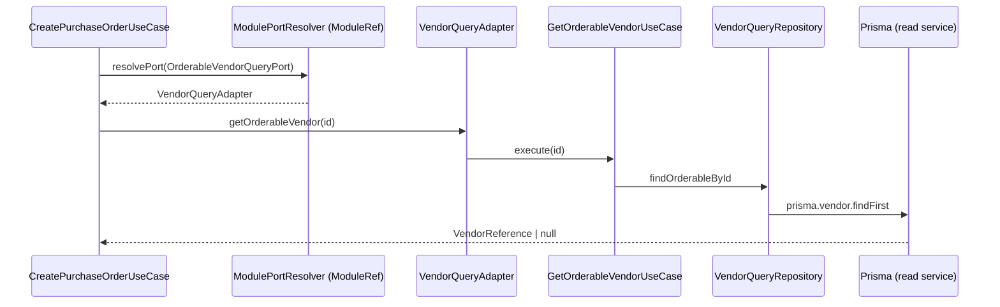
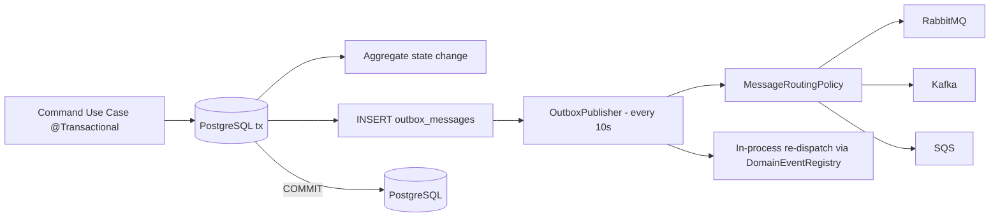

# ERP Boilerplate — Architecture

A production-oriented **NestJS 11 + TypeScript + PostgreSQL (Prisma 7)** ERP backend built as
an **event-driven modular monolith**. The codebase applies **Domain-Driven Design (DDD)**,
**Hexagonal Architecture (Ports & Adapters)**, **Clean Architecture** and a lightweight
**CQRS-style split** between command and query paths.

Key pillars:

- **Strict layer separation** — domain knows nothing about NestJS, Prisma, or any broker.
- **Ports & Adapters** — every external dependency (DB, brokers, cache, storage, email, metrics)
  is behind a port token bound to an adapter at the composition root.
- **Transactional outbox** — integration events are persisted atomically with the aggregate
  change and published by a scheduler; no events are lost and nothing publishes inside the
  business transaction.
- **In-process event bus + integration event routing** — domain events drive local reactions;
  a routing policy decides which broker(s) receive each event.
- **Module-to-module calls through the container** — aggregates talk to each other through
  outbound ports resolved via `ModuleRef`, never by importing another module's internals.
- **Architecture enforced by ESLint** (`no-restricted-imports`).

This document is the single source of truth for the design. If you change the rules here,
update `eslint.config.mjs` and vice versa.

---

## Table of Contents

1. [Top-Level Folder Map](#1-top-level-folder-map)
2. [Layers and Responsibilities](#2-layers-and-responsibilities)
3. [Business Module Anatomy](#3-business-module-anatomy)
4. [Dependency Direction & ESLint Enforcement](#4-dependency-direction--eslint-enforcement)
5. [Ports & Adapters (Command / Query)](#5-ports--adapters-command--query)
6. [Cross-Module Communication](#6-cross-module-communication)
7. [Domains / Aggregates](#7-domains--aggregates)
8. [Outbox, Events & Messaging](#8-outbox-events--messaging)
9. [Platform Layer](#9-platform-layer)
10. [Infrastructure Layer](#10-infrastructure-layer)
11. [Persistence & Data Model](#11-persistence--data-model)
12. [HTTP, Validation, Error Handling](#12-http-validation-error-handling)
13. [Observability & Security](#13-observability--security)
14. [Testing Strategy](#14-testing-strategy)
15. [Creating a New Business Module](#15-creating-a-new-business-module)
16. [Commands](#16-commands)

---

## 1. Top-Level Folder Map

```text
src/
├── app.module.ts            # root composition root + global interceptors/filter/pipe
├── main.ts                  # entry point, calls bootstrap()
├── config/                  # .env-driven typed configuration blocks
├── shared-kernel/           # technical (non-business) NestJS concerns + platform ports
├── bootstrap/               # app bootstrap steps (security, CORS, http, swagger, ...)
├── infrastructure/          # cross-cutting client adapters (Prisma, brokers, cache, ...)
├── platform/                # orchestration sub-systems (outbox, events, audit, ...)
└── business/
    ├── shared-business/     # framework-independent domain/application/port primitives
    ├── catalog/product/     # Product aggregate (bounded context: catalog)
    ├── supplier/vendor/     # Vendor aggregate (bounded context: supplier)
    └── procurement/purchase/# PurchaseOrder aggregate (bounded context: procurement)
```

Module aliases (see `tsconfig.json`):

| Alias | Path |
|---|---|
| `@config/*` | `src/config/*` |
| `@shared-kernel/*` | `src/shared-kernel/*` |
| `@bootstrap/*` | `src/bootstrap/*` |
| `@infrastructure/*` | `src/infrastructure/*` |
| `@platform/*` | `src/platform/*` |
| `@business/*` | `src/business/*` |
| `@prisma/*` | `src/generated/prisma/*` |

---

## 2. Layers and Responsibilities

### config/

The only place that reads `process.env`. Each concern is a typed
`registerAs` block loaded by `ConfigModule` (which is `@Global`):

- `app.config.ts` — env, port, host, CORS, Swagger metadata
- `auth.config.ts` — JWT secrets/TTLs
- `database.config.ts` — master (`DATABASE_URL`) / slave (`DATABASE_SLAVE_URL`)
- `messaging.config.ts` — RabbitMQ URL + exchange, Kafka brokers/client/group, SQS
- `cache.config.ts` — driver (redis/memcached) + connection settings
- `storage.config.ts` — S3 endpoint/bucket/presigned TTL
- `security.config.ts` — encryption key, throttling, tenant/organization headers
- `outbox.config.ts` — batch size, max attempts, cleanup age
- `notification.config.ts` — SNS/SES
- `observability.config.ts` — Sentry DSN, Loki URL, log level

Env file resolution order: `.env.{NODE_ENV}.local` → `.env.{NODE_ENV}` → `.env`.

### shared-kernel/

Technical, non-business NestJS concerns plus **ports** shared by the platform and
infrastructure layers:

```text
filters/       HttpExceptionsFilter (domain error → HTTP status)
interceptors/  RequestIdInterceptor (request/correlation ids + CLS context)
               ResponseInterceptor ({ status, statusCode, data, message } envelope)
               LoggingInterceptor (structured JSON request logging)
pipes/         AppValidationPipe (global DTO validation)
exceptions/    DomainException, InfrastructureException
ports/         cache, context (CLS), notification (email), observability
               (logger/metrics/error-tracking), storage — framework-independent interfaces
types/         pagination primitives (PageQuery, PaginatedResult)
decorators/    @KafkaEvent (custom Kafka subscribe decorator)
```

### bootstrap/

`bootstrap/index.ts` composes independent steps, called from `main.ts`:

1. `configureSentry()` — Sentry init before Nest bootstraps.
2. `NestFactory.create<FastifyApplication>` with Fastify adapter + production defaults.
3. `configureSecurity()` — Helmet, throttling.
4. `configureCors()`
5. `configureHttp()` — global prefix `api` + URI versioning (default `v1` → `/api/v1`).
6. `configureShutdown()` — graceful shutdown hooks.
7. `configureSwagger()` — `/api/docs`.
8. `configureServer()` — listen on `HOST:PORT`.

### infrastructure/

Cross-cutting client adapters (see [§10](#10-infrastructure-layer)). Infrastructure has
**no business logic** — it implements ports defined by the shared-kernel/platform layers.

### platform/

Cross-cutting support services used by business modules (see [§9](#9-platform-layer)).
The `PlatformModule` (`@Global`) is the composition root: it imports the sub-modules and
re-exports their port classes (`OutboxWriterPort`, `InProcessEventBus`,
`MESSAGE_ROUTING_POLICY`, `NUMBERING`, `AUDIT`, `NOTIFICATION_DISPATCH`, `COMPANY_CONFIG`).

### business/

`shared-business/` holds framework-independent primitives:

```text
domain/        AggregateRoot, Entity, DomainEvent, factories, identifiers,
               InvariantRegistry, PolicyRegistry, DomainEventRegistry, Money, Result
application/   UseCase / CommandUseCase / QueryUseCase / Handlers
ports/         UnitOfWork, Clock, IdGenerator, InProcessEventBus, MessagePublisher,
               ModulePortResolver
errors/        InvariantViolateError, PolicyViolateError
```

The concrete aggregates live under bounded-context folders (catalog, supplier,
procurement). Each context can grow vertically without crossing module boundaries
(see [§3](#3-business-module-anatomy)).

---

## 3. Business Module Anatomy

Every aggregate module follows the same shape:

```text
business/<context>/<module>/
├── domain/
│   ├── entities/          # aggregate root + child entities
│   ├── value-objects/     # typed VOs (id, sku, name, money, ...)
│   ├── events/            # domain events (raised by the aggregate)
│   ├── invariants/        # invariant definitions + registration
│   ├── policies/          # business policy definitions + registration
│   ├── errors/            # module-specific domain errors
│   ├── factories/         # aggregate factory (only sanctioned build path)
│   └── ports/             # command & query repository ports (abstract classes)
├── application/
│   ├── usecase/           # CommandUseCase / QueryUseCase classes
│   ├── adapters/          # implementations of OTHER modules' outbound ports
│   ├── consumers/         # message consumers (RabbitMQ / Kafka / SQS / in-process)
│   └── ports/outbound/    # outbound cross-module ports (consumed by this module)
├── infrastructure/
│   └── persistence/       # Prisma command/query repositories + domain↔model mappers
├── presentation/
│   └── http/              # controllers (thin) + request DTOs (validated at boundary)
└── <module>.module.ts     # NestJS composition root for this aggregate
```

Anatomy of a use case:

- **Command use cases** (`CommandUseCase<Input, Result>`) mutate state. They run inside a
  `@Transactional()` boundary, orchestrate platform ports (e.g. company config), make
  cross-module calls through outbound ports, build/call the aggregate, persist it through
  the **command repository**, and append raised domain events to the **outbox**.
- **Query use cases** (`QueryUseCase<Query, Result>`) are read-only. They skip the domain and
  the outbox entirely and query through the **query repository** (read model / Prisma slave).

---

## 4. Dependency Direction & ESLint Enforcement

```mermaid
flowchart TD
    HTTP[HTTP Controller] --> UC[Use Case]
    UC --> DOM[Domain Aggregate]
    UC --> PLAT[Platform Ports<br/>outbox, event bus, config, numbering]
    UC --> OUTBOUND[Outbound Ports<br/>own repo + cross-module]
    OUTBOUND --> RESOLVER[ModulePortResolver<br/>(ModuleRef)]
    RESOLVER --> OTHERCASE[Other module's use case<br/>via its adapter]
    UC --> REPO[Command/Query Repository]
    REPO --> DB[(PostgreSQL / Prisma)]
    PLAT --> INFRA[Infrastructure Clients]
    INFRA --> BRK[RabbitMQ / Kafka / SQS / Cache / S3 / Sentry]
    DOM -. raises .-> EV[Domain Events]
    EV --> UOW[(outbox_messages<br/>same tx)]
    UOW --> SCHED[Outbox Publisher]
    SCHED --> BRK
```

Rules (enforced in `eslint.config.mjs`, see §4.1):

```text
Allowed:
  bootstrap        → application modules
  config           → nothing business-specific
  infrastructure   → shared-kernel ports, config
  platform         → shared-business ports, config, business ports
  business/shared  → domain/application/ports primitives
  business aggregate → shared-business, platform ports, own outbound ports
Forbidden:
  domain        → Prisma / NestJS / RabbitMQ / Kafka / Redis / process.env
  business      → infrastructure repository/mapper/messaging implementations
  business      → cross-module outbound ports (owned by the consumer)
  business      → @nestjs/schedule (belongs to platform)
```

### 4.1 ESLint rules

`eslint.config.mjs` uses `no-restricted-imports`:

1. Outside `infrastructure`, `config`, `bootstrap`, `platform` and business
   `application/consumers`: `prisma/generated/prisma/*`, `@prisma/*`, `amqplib`, `kafkajs`,
   `ioredis`, `redis`, `@golevelup/nestjs-rabbitmq`, `@nestjs/schedule` are **errors**.
2. Business user code cannot import infrastructure implementations:
   `@infrastructure/database/repositories/*`, `@infrastructure/database/mappers/*`,
   `@infrastructure/message/*`.
3. Domain folders and `application/ports/**` cannot import outbound ports of other modules
   (`@business/*/.../outbound/*`).
4. Domain folders cannot import any `@nestjs/*` package.

Run enforcement locally:

```bash
npm run lint          # eslint with --fix
npm run lint:check    # eslint, no fixes
```

---

## 5. Ports & Adapters (Command / Query)

### Repository ports

Each aggregate defines two repository ports in `domain/ports/`:

```ts
// domain/ports/product-command-repository.port.ts
export abstract class ProductCommandRepositoryPort {
  abstract save(product: Product): Promise<Product>;
}

// domain/ports/product-query-repository.port.ts
export abstract class ProductQueryRepositoryPort {
  abstract findById(id: string): Promise<ProductQueryRecord | null>;
  abstract findPurchasableById(id: string): Promise<ProductQueryRecord | null>;
}
```

Bindings happen in the aggregate's module:

```ts
@Module({
  providers: [
    { provide: ProductCommandRepositoryPort, useClass: PrismaProductCommandRepository },
    { provide: ProductQueryRepositoryPort, useClass: PrismaProductQueryRepository },
  ],
})
export class ProductModule {}
```

Use cases inject the **abstract class** directly:

```ts
@Inject(ProductCommandRepositoryPort)
private readonly productRepository: ProductCommandRepositoryPort
```

This is what makes use cases unit-testable with fakes (see [§14](#14-testing-strategy)).

### Cross-cutting port classes exported globally

Business modules inject `@Platform` and `@shared-kernel` port classes directly:

- `OutboxWriterPort` — append raised domain events to the outbox (called inside the
  `@Transactional` boundary; delivery is owned by the outbox publisher).
- `ModulePortResolver` — resolve a port/use-case from the Nest container for
  cross-module calls.
- `CompanyConfigPort`, `NumberingPort`, `AuditPort`, `NotificationDispatchPort` — platform services.
- `InProcessEventBus` / `MessageRoutingPolicy` — consumed by the outbox publisher and
  platform; business modules react to events via `@OnEvent`/broker consumers instead of
  publishing directly.

---

## 6. Cross-Module Communication

**Modules do not import each other.** A consuming module defines an **outbound port** typed
against a local structural reference shape; the producing module implements that contract with
an adapter that only calls its own use cases; the consumer resolves it at runtime through the
`ModulePortResolver` (implemented by `NestModulePortResolver` over `ModuleRef.get(token,
{ strict: false })`).

Example — PurchaseOrder needs vendor + product data:

```text
business/procurement/purchase/application/ports/outbound/vendor-query.port.ts
└─ OrderableVendorQueryPort { getOrderableVendor(id): Promise<VendorReference|null> }
    + port: OrderableVendorQueryPort (abstract class, used as token)

business/supplier/vendor/application/adapters/vendor-query.adapter.ts
└─ implements OrderableVendorQueryPort
   └─ delegates to GetOrderableVendorUseCase (its own module)

business/supplier/vendor/vendor.module.ts
└─ { provide: OrderableVendorQueryPort, useExisting: VendorQueryAdapter }
   + exports OrderableVendorQueryPort
```

The use case resolves the port lazily and calls it:

```ts
private get vendorQueryPort(): OrderableVendorQueryPort {
  return this.portResolver.resolvePort<OrderableVendorQueryPort>(OrderableVendorQueryPort);
}
```



Rules for cross-module adapters:

- The adapter lives in the **producing** module (`application/adapters`) and calls **only** its
  own use cases.
- The consuming module owns the port contract (structural reference shapes).
- No `import { VendorModule } ...`; no direct access to another module's repository.

---

## 7. Domains / Aggregates

Aggregates are rich: they enforce their own invariants and raise events. State transitions
**must** go through aggregate methods, never setters.

### shared-business domain primitives

- `AggregateRoot<ID>` — tracks `version` (optimistic concurrency) and a domain-event
  snapshot drained via `pullEvents()`.
- `Entity<ID>`, `ValueObject`, `DomainEvent`, `Identifier`, `Money`, `Result`.
- `InvariantRegistry` / `PolicyRegistry` — aggregates register invariants and policies;
  rule classes are kept decoupled from aggregate classes (no cross-imports).
- `DomainEventRegistry` — maps event type names to **rehydrators** so the outbox publisher can
  rebuild a domain event from a persisted payload and re-dispatch it in-process.

### Product (catalog)

`business/catalog/product/domain/entities/product.aggregate.ts`

- VOs: `ProductId`, `Sku` (normalized uppercase), `ProductName`, `Money`.
- Status: `ACTIVE | INACTIVE | DISCONTINUED`.
- Behavior: `create / update / changePrice / activate / deactivate / discontinue`.
- Invariants: SKU required, name required, non-negative price, legal transitions.
- Policy: discontinued products cannot be reactivated without an explicit policy allowance.
- Events: `ProductCreated`, `ProductUpdated`, `ProductActivated`, `ProductDeactivated`,
  `ProductDiscontinued`.

### Vendor (supplier)

`business/supplier/vendor/domain/entities/vendor.aggregate.ts`

- VOs: `VendorId`, `VendorCode`, `VendorName`, `VendorEmail` (plus phone/address fields).
- Status: `ACTIVE | INACTIVE | BLOCKED`.
- Behavior: `create / update / activate / deactivate / block`.
- Policy: blocked/inactive vendors cannot receive new purchase orders — enforced on the
  PurchaseOrder side through `OrderableVendorQueryPort` (only returns orderable vendors).
- Events: `VendorCreated`, `VendorUpdated`, `VendorActivated`, `VendorDeactivated`,
  `VendorBlocked`.

### PurchaseOrder (procurement)

`business/procurement/purchase/domain/entities/purchase-order.aggregate.ts`

- Owns `PurchaseOrderLine[]`; references products/vendors **by id only**.
- Status machine:

```text
DRAFT ── submit ──▶ SUBMITTED ── approve ──▶ APPROVED ── complete ──▶ COMPLETED
                      │             │
                      ├─ reject ──▶ REJECTED
                      └─ cancel ──▶ CANCELLED
```

- Behavior: `create / addLine / removeLine / submit / approve / reject / cancel / complete`.
- Invariants: ≥1 line before submit, positive quantity, valid transitions, total = Σ lines,
  immutable after submit/approve.
- Policy: orders above the company `autoApproveThreshold` require manual approval
  (`requiresManualApproval(threshold)`); the transition use case does not approve those
  automatically.
- Events: `PurchaseOrderCreated/Submitted/Approved/Rejected/Cancelled/Completed` plus
  line-added/removed events.

---

## 8. Outbox, Events & Messaging

### 8.1 The transactional outbox

Every state-changing use case runs inside `@Transactional()` and appends each raised domain
event to the outbox **in the same DB transaction** as the aggregate change.



Flow details:

- `OutboxWriter.append(event, aggregateType, aggregateId)` builds an `IntegrationMessage`
  (with `event-id`, `request-id`, `correlation-id` headers) and saves it.
- `OutboxScheduler` (cron, `@nestjs/schedule`):
  - **every 10s** — `publishPendingBatch()`: `claimBatch(batchSize)` marks rows `PUBLISHING`,
    publishes to each broker returned by the routing policy, optionally re-dispatches the
    rehydrated domain event in-process, then flips rows to `PUBLISHED`.
  - **every minute** — `retryFailed()`: re-queues `FAILED` rows up to `maxAttempts`.
  - **every hour** — `cleanup()`: deletes `PUBLISHED` rows older than `cleanupOlderThanHours`.
- `OutboxMessageStatus`: `PENDING → PUBLISHING → PUBLISHED | FAILED`.
- Publishing is **never** inside the business transaction. Business code only writes; the
  scheduler owns delivery.

### 8.2 Domain events vs integration events

| | Domain event | Integration event |
|---|---|---|
| Scope | In-process, same aggregate boundary | Across brokers/processes |
| Transport | `IN_PROCESS_EVENT_BUS` (EventEmitter2 adapter) | RabbitMQ / Kafka / SQS |
| Durability | Best effort | Transactional outbox (guaranteed) |
| Persisted | No | `outbox_messages` |
| Example | `PurchaseOrderSubmitted` consumed by event-emitter consumers | Same event routed by `MessageRoutingPolicy` |

The outbox publisher is the **single dispatch point**: it publishes to brokers and
re-dispatches the event in-process after a successful publish, using `DomainEventRegistry`
rehydrators to reconstruct the event object.

### 8.3 Message routing policy

`platform/events/message-routing.policy.ts` — the single place defining which brokers receive
which events:

```ts
export class DefaultMessageRoutingPolicy implements MessageRoutingPolicy {
  resolve(eventType: string): BrokerTargets {
    if (eventType.startsWith('Product')) return ['rabbitmq', 'kafka'];
    return ['rabbitmq'];
  }
}
```

### 8.4 Consumers

Consumers live in `business/<module>/application/consumers/`:

- `*.rabbitmq.consumer.ts` — `@RabbitSubscribe` (`@golevelup/nestjs-rabbitmq`).
- `*.kafka.consumer.ts` — custom `@KafkaEvent` decorator (`shared-kernel/decorators`).
- `*.sqs.consumer.ts` — `@SqsMessageHandler` (`@ssut/nestjs-sqs`).
- `*.event-emitter.consumer.ts` — `@OnEvent` (`@nestjs/event-emitter`) for in-process domain
  event reactions.

Consumers are intentionally allowed to touch broker decorator libraries (ESLint carve-out)
but their handlers must delegate to use cases/services — never do business logic inline.

---

## 9. Platform Layer

Each platform sub-system owns its folder, its `@Global` module and its ports:

```text
platform/
├── outbox/          OutboxModule — OutboxWriter, OutboxPublisher, OutboxScheduler,
│                    PrismaOutboxRepository
│                    ports/: OutboxWriterPort, OutboxRepositoryPort
├── events/          EventsModule — NestEventBusAdapter (InProcessEventBus),
│                    DefaultMessageRoutingPolicy (MessageRoutingPolicy)
├── audit/           AuditModule — PrismaAuditService + AuditPort
├── numbering/       NumberingModule — PrismaNumberingService + NumberingPort
├── notification/    NotificationModule — NotificationDispatchService + NotificationPort
├── configuration/   ConfigurationModule — PrismaCompanyConfigAdapter + CompanyConfigPort
└── platform.module.ts  @Global composition root re-exporting all port classes
```

`PlatformModule` is `@Global` and the single composition root business modules depend on.
Business code injects the **port classes** (`OutboxWriterPort`, `CompanyConfigPort`, ...) and never
imports the concrete platform services.

---

## 10. Infrastructure Layer

Pure adapters — clients wired to the ports defined by shared-kernel/platform:

```text
infrastructure/
├── database/prisma/     PrismaWriteService, PrismaReadService (driver adapter PrismaPg),
│                        PrismaModule (@Global)
├── context/             ClsService-backed RequestContextService,
│                        NestModulePortResolver (ModuleRef)
├── messaging/           RabbitMQ publisher (golevelup), Kafka publisher (kafkajs),
│                        KafkaConsumerHost, SQS publisher (@ssut/nestjs-sqs),
│                        RabbitMqPublisher, KafkaPublisher, SqsPublisher
├── cache/               RedisAdapter, MemcachedAdapter (implements CachePort)
├── notification/        SES email adapter, SNS notification adapter
├── observability/       SentryErrorTracking (ErrorTrackingPort), PrometheusMetrics
│                        (MetricsPort), ConsoleLoggerAdapter (LoggerPort)
├── storage/             S3FileStorageAdapter (FileStoragePort)
└── infrastructure.module.ts  @Global root importing the client modules
```

**Note:** aggregate persistence adapters (command/query repositories + mappers) do **not** live
here — they live in each business module's `infrastructure/persistence/` folder so a module's
persistence stays encapsulated with it. The top-level `infrastructure/` only hosts
cross-cutting clients.

---

## 11. Persistence & Data Model

- **Prisma 7** with the **pg driver adapter** (`PrismaPg`), client generated to
  `src/generated/prisma/` (CJS). `prisma.config.ts` points the schema folder and migrations
  path; no `url = env()` in the schema — the URL comes from the config file.
- Schema is **split per aggregate** under `prisma/schema/` and aggregated by
  `schema.prisma`:

```text
prisma/schema/
├── schema.prisma        # generator + datasource (postgresql)
├── product.prisma       # Product
├── vendor.prisma        # Vendor
├── purchase-order.prisma# PurchaseOrder, PurchaseOrderLine
├── outbox.prisma        # OutboxMessage + OutboxMessageStatus enum
└── platform.prisma      # CompanyConfig, NumberSequence, AuditLog
```

Models:

| Model | Table | Purpose |
|---|---|---|
| `Product` | `products` | Catalog item |
| `Vendor` | `vendors` | Supplier |
| `PurchaseOrder` / `PurchaseOrderLine` | `purchase_orders` / `purchase_order_lines` | Procurement aggregate |
| `OutboxMessage` | `outbox_messages` | Transactional outbox |
| `CompanyConfig` | `company_configs` | Company defaults (currency, auto-approve threshold) |
| `NumberSequence` | `number_sequences` | Document numbering (PO-00000001 …) |
| `AuditLog` | `audit_logs` | Audit trail |

Migrations live in `prisma/migrations/`. Each model maps to domain via a mapper in the
module's `infrastructure/persistence/` (`*.mapper.ts`).

`PrismaWriteService` powers command repositories and the transactional unit-of-work
(`@Transactional` from `@nestjs-cls/transactional`); `PrismaReadService` (optionally a
read replica via `DATABASE_SLAVE_URL`) powers query repositories.

---

## 12. HTTP, Validation, Error Handling

### Global pipeline (registered in `AppModule`)

```text
Request → RequestIdInterceptor → ResponseInterceptor → LoggingInterceptor
       → AppValidationPipe → Controller → Use Case → ... → HttpExceptionsFilter
```

- **RequestIdInterceptor** — generates `requestId`, propagates `x-correlation-id`, seeds the
  CLS `RequestContext` (tenant/organization/user/roles/locale/ip) used across the request.
- **ResponseInterceptor** — wraps success payloads:
  `{ status: 'SUCCESS', statusCode, data, message }`.
- **LoggingInterceptor** — structured request logging with request/correlation ids.
- **AppValidationPipe** — DTO validation at the boundary (`class-validator`).
- **HttpExceptionsFilter** — maps domain errors to HTTP statuses:

| Domain error | HTTP |
|---|---|
| `NotFoundError` | 404 |
| `InvalidStateTransitionError` / `ConflictError` | 409 |
| `ValidationError` / `BusinessRuleViolationError` / `InvariantViolateError` / `PolicyViolateError` | 422 |
| Unknown | 500 (logged) |

DTO validation failures return `{ status: 'VALIDATE_ERROR', statusCode: 422, data: { field: msg } }`;
domain errors return `{ status: 'ERROR', ... }`; unexpected exceptions return
`{ status: 'SERVER_ERROR', statusCode: 500, ... }` (details never leak to the client).

Controllers are **thin**: they validate DTOs and call use cases. No business rules in
controllers, no setters on aggregates.

---

## 13. Observability & Security

### Observability

- `LoggerPort` — console adapter; extend with Loki/structured log shipping.
- `MetricsPort` — Prometheus adapter (`prom-client`).
- `ErrorTrackingPort` — Sentry adapter (initialized in `bootstrap`).
- Structured logging interceptors + CLS request/correlation ids make every log and outbox
  message traceable to a request.

### Security

- Helmet (Fastify), throttler defaults (`THROTTLE_TTL_MS`, `THROTTLE_LIMIT`).
- JWT auth config + passport packages present (`auth.config.ts`, `@nestjs/jwt`,
  `passport-jwt`); auth guards/decorators can be added per controller under
  `shared-kernel/`.
- Tenant/organization context from headers (`x-tenant-id`, `x-organization-id`) into CLS;
  `tenantId`/`organizationId` columns already exist on audit logs so multi-tenancy can be
  extended to aggregates without restructuring.
- Identifiers are UUIDs; aggregates carry `version` for optimistic concurrency.
- API versioning via URI (`/api/v1`).

---

## 14. Testing Strategy

- **Unit tests** (`*.spec.ts`, colocated): aggregates, invariants, policies, mappers,
  use cases. Use cases are tested with **fakes** for repository/outbox/platform ports — no
  Postgres, no brokers, no Nest runtime:

  ```bash
  npm test
  ```

  Example: `create-product.usecase.spec.ts`, `product.aggregate.spec.ts`,
  `purchase-order.aggregate.spec.ts`, `vendor.aggregate.spec.ts`.

- **E2E smoke** (`test/app.e2e-spec.ts`): boots the whole app against `docker compose`
  services and verifies wiring:

  ```bash
  npm run test:e2e
  ```

- Coverage: `npm run test:cov`.

---

## 15. Creating a New Business Module

1. **Domain** — `domain/entities` (aggregate + child entities), `domain/value-objects`,
   `domain/events`, `domain/invariants` (+ registration), `domain/policies`
   (+ registration), `domain/errors`, `domain/factories`.
2. **Ports** — `domain/ports/product-command-repository.port.ts` +
    `product-query-repository.port.ts` with abstract classes.
3. **Application** — `application/usecase` command use cases (`@Transactional`, aggregate →
   save → outbox) and query use cases (read-only via query repo). Add event rehydrators to
   the `DomainEventRegistry` if consumers should listen to rebuilt events.
4. **Consumers** — `application/consumers` only if the module reacts to broker/in-process
   events.
5. **Presentation** — `presentation/http` controllers + request DTOs (validated at boundary).
6. **Module** — `<module>.module.ts` binding command/query repository ports and exporting
   anything other modules may resolve (cross-module adapters + port classes).
7. **Persistence** — Prisma model file under `prisma/schema/`, migration, mapper +
   command/query repositories in `infrastructure/persistence/`.
8. **Wire** — add the module to `AppModule` imports.
9. **Tests** — aggregate invariants + use case fakes; run `npm test`.
10. **Enforcement** — run `npm run lint:check` to confirm no dependency-rule violations.

Symmetry rule: if your module needs data from another module, define an outbound port in
`application/ports/outbound/`, have the owner implement it, and resolve it via
`MODULE_PORT_RESOLVER` — never import the other module.

---

## 16. Commands

```bash
cp .env.example .env
docker compose up -d          # PostgreSQL, Redis, RabbitMQ, Kafka
npm install                   # also runs prisma generate (postinstall)
npx prisma migrate dev        # create/apply migration + regenerate client
npm run db:seed               # sample products & vendors
npm run start:dev             # http://localhost:4000/api/v1, Swagger /api/docs
```

```bash
npm run lint:check            # lint + architecture checks (no fixes)
npm run lint                  # lint + auto-fix
npm test                      # unit tests
npm run test:e2e              # e2e smoke (requires docker compose up -d)
npm run build                 # compile to dist/
npm run start:prod            # run compiled app
npx prisma studio             # Prisma Studio
```

Full developer and maintainer workflows: see `DEVELOPER.md` and `MAINTAINER.md`.