# DI Wiring — who injects whom, which token binds to which implementation

**Generated** by `scripts/generate-di-wiring.mjs` (`npm run docs:di`) from real source:
`@Module` provider bindings + every constructor, with each dependency resolved through the
consuming file's own imports — so module-local tokens (each module's own `CompanyConfigPort` /
`NumberingPort`) are attributed to the right module, and only genuinely cross-boundary edges
appear. Blocks are validated for mermaid-safe syntax at generation time.

- solid `-->|injects|` — constructor dependency
- dashed `-.->` — Nest binding declared in the module (`useClass` / `useExisting`)
- `TransactionHost / Queue / AmqpConnection …` — library providers (write TX host, BullMQ, brokers)
- `injects via OwnerModule` — the token is provided by a DIFFERENT module (cross-boundary)
- `XModule bootstrap` — what the module class injects to register opt-in handlers

---

## Cross-module graph (Nest imports + token ownership)

```mermaid
flowchart LR
    AppModule["AppModule"]
    ConfigModule["ConfigModule"]
    AppModule -->|ConfigService| ConfigModule
    VendorModule["VendorModule"]
    ContextModule__src_platform_context_["ContextModule (src/platform/context)"]
    ContextModule__src_platform_context__2["ContextModule__src_platform_context_"]
    VendorModule -->|PrismaReadPort| ContextModule__src_platform_context__2
    OutboxModule["OutboxModule"]
    VendorModule -->|OutboxWriterPort| OutboxModule
    ConfigurationModule["ConfigurationModule"]
    VendorModule -->|CompanyConfigPort| ConfigurationModule
    GoodReceiptNoteModule["GoodReceiptNoteModule"]
    GoodReceiptNoteModule -->|PrismaReadPort| ContextModule__src_platform_context__2
    GoodReceiptNoteModule -->|OutboxWriterPort| OutboxModule
    GoodReceiptNoteModule -->|CompanyConfigPort| ConfigurationModule
    PurchaseOrderModule["PurchaseOrderModule"]
    GoodReceiptNoteModule -->|PurchaseOrderForGrnPort| PurchaseOrderModule
    ProductModule["ProductModule"]
    ProductModule -->|PrismaReadPort| ContextModule__src_platform_context__2
    ProductModule -->|OutboxWriterPort| OutboxModule
    ProductModule -->|CompanyConfigPort| ConfigurationModule
    RecurringModule["RecurringModule"]
    PurchaseOrderModule -->|RecurringTemplatePort, RecurringExecutionPort| RecurringModule
    PurchaseOrderModule -->|RequestContextPort, PrismaReadPort| ContextModule__src_platform_context__2
    ObservabilityModule["ObservabilityModule"]
    PurchaseOrderModule -->|LoggerPort| ObservabilityModule
    PurchaseOrderModule -->|OutboxWriterPort| OutboxModule
    PurchaseOrderModule -->|CompanyConfigPort| ConfigurationModule
    NumberingModule["NumberingModule"]
    PurchaseOrderModule -->|NumberingPort| NumberingModule
    PurchaseOrderModule -->|ProductForPurchasePort| ProductModule
    PurchaseOrderModule -->|VendorForPurchasePort| VendorModule
    InvoiceModule["InvoiceModule"]
    InvoiceModule -->|RecurringExecutionPort| RecurringModule
    InvoiceModule -->|LoggerPort| ObservabilityModule
    InvoiceModule -->|PrismaReadPort| ContextModule__src_platform_context__2
    InvoiceModule -->|OutboxWriterPort| OutboxModule
    InvoiceModule -->|CompanyConfigPort| ConfigurationModule
    InvoiceModule -->|NumberingPort| NumberingModule
    PrismaModule["PrismaModule"]
    PrismaModule -->|ConfigService| ConfigModule
    MessagingModule__src_infrastructure_messaging_["MessagingModule (src/infrastructure/messaging)"]
    MessagingModule__src_infrastructure_messaging__2["MessagingModule__src_infrastructure_messaging_"]
    MessagingModule__src_infrastructure_messaging__2 -->|ConfigService| ConfigModule
    NotificationModule__src_infrastructure_notification_["NotificationModule (src/infrastructure/notification)"]
    NotificationModule__src_infrastructure_notification__2["NotificationModule__src_infrastructure_notification_"]
    NotificationModule__src_infrastructure_notification__2 -->|ConfigService| ConfigModule
    AuditModule["AuditModule"]
    AuditModule -->|RequestContextPort| ContextModule__src_platform_context__2
    BatchOperationModule["BatchOperationModule"]
    BatchOperationModule -->|OutboxWriterPort| OutboxModule
    BatchOperationModule -->|ConfigService| ConfigModule
    BatchOperationModule -->|NumberingPort| NumberingModule
    BatchOperationModule -->|RequestContextPort| ContextModule__src_platform_context__2
    BatchOperationModule -->|AuditPort| AuditModule
    ConfigurationModule -->|ConfigService| ConfigModule
    ConfigurationModule -->|RequestContextPort| ContextModule__src_platform_context__2
    ContextModule__src_platform_context__2 -->|ConfigService| ConfigModule
    ContextModule__src_platform_context__2 -->|PrismaWriteService| PrismaModule
    IdempotencyModule["IdempotencyModule"]
    IdempotencyModule -->|RequestContextPort| ContextModule__src_platform_context__2
    IdempotencyModule -->|ConfigService| ConfigModule
    ImportModule["ImportModule"]
    ImportModule -->|OutboxWriterPort| OutboxModule
    ImportModule -->|ConfigService| ConfigModule
    StorageModule__src_platform_storage_["StorageModule (src/platform/storage)"]
    StorageModule__src_platform_storage__2["StorageModule__src_platform_storage_"]
    ImportModule -->|FileStoragePort| StorageModule__src_platform_storage__2
    ImportModule -->|RequestContextPort| ContextModule__src_platform_context__2
    ImportModule -->|NumberingPort| NumberingModule
    ImportModule -->|AuditPort| AuditModule
    LockingModule["LockingModule"]
    CacheModule__src_infrastructure_cache_["CacheModule (src/infrastructure/cache)"]
    CacheModule__src_infrastructure_cache__2["CacheModule__src_infrastructure_cache_"]
    LockingModule -->|RedisService| CacheModule__src_infrastructure_cache__2
    MessagingModule__src_platform_messaging_["MessagingModule (src/platform/messaging)"]
    MessagingModule__src_platform_messaging__2["MessagingModule__src_platform_messaging_"]
    MessagingModule__src_platform_messaging__2 -->|ConfigService| ConfigModule
    NotificationModule__src_platform_notification_["NotificationModule (src/platform/notification)"]
    NotificationModule__src_platform_notification__2["NotificationModule__src_platform_notification_"]
    NotificationModule__src_platform_notification__2 -->|LoggerPort| ObservabilityModule
    NumberingModule -->|RequestContextPort| ContextModule__src_platform_context__2
    ObservabilityModule -->|ConfigService| ConfigModule
    OutboxModule -->|RequestContextPort| ContextModule__src_platform_context__2
    EventsModule["EventsModule"]
    OutboxModule -->|MessageRoutingPolicy, InProcessEventBus| EventsModule
    OutboxModule -->|RabbitMqPublisher, KafkaPublisher, SqsPublisher| MessagingModule__src_platform_messaging__2
    OutboxModule -->|ConfigService| ConfigModule
    RecurringModule -->|OutboxWriterPort| OutboxModule
    SchedulerModule["SchedulerModule"]
    RecurringModule -->|SchedulerPort, ScheduledJobHandlerRegistry| SchedulerModule
    ConditionEngineModule["ConditionEngineModule"]
    RecurringModule -->|ConditionEvaluator| ConditionEngineModule
    RecurringModule -->|RequestContextPort| ContextModule__src_platform_context__2
    RecurringModule -->|AuditPort| AuditModule
    SchedulerModule -->|ConfigService| ConfigModule
    SchedulerModule -->|RabbitMqPublisher| MessagingModule__src_platform_messaging__2
    SchedulerModule -->|RequestContextPort| ContextModule__src_platform_context__2
    SchedulerModule -->|AuditPort| AuditModule
    SchedulerModule -->|DistributedLockPort| LockingModule
```

---

## Per-module wiring

### Business — party/vendor

#### VendorModule — `src/business/party/vendor/vendor.module.ts`

imports: PlatformModule · exports: VendorForPurchasePort

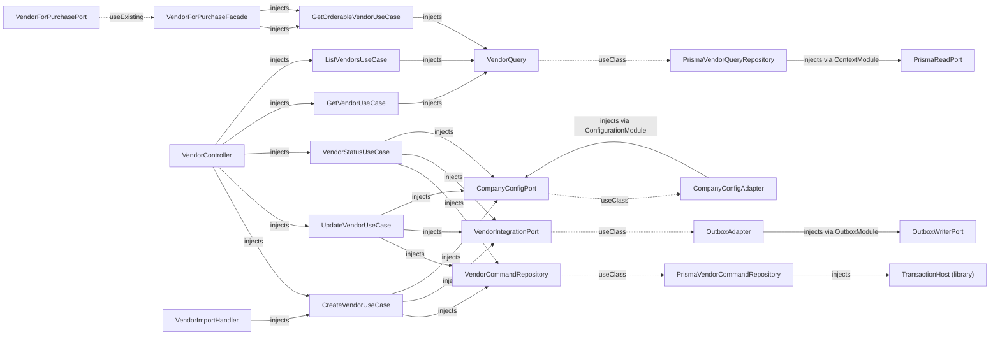

### Business — procurement

#### GoodReceiptNoteModule — `src/business/procurement/good-receipt-note/good-receipt-note.module.ts`

imports: PlatformModule, PurchaseOrderModule · exports: GrnForPurchaseOrderPort

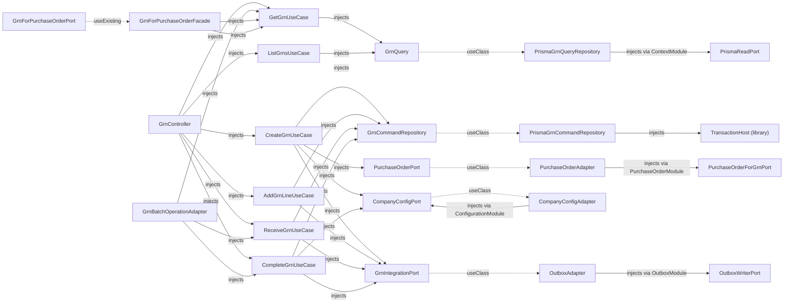

#### PurchaseOrderModule — `src/business/procurement/purchase-order/purchase-order.module.ts`

imports: PlatformModule, ProductModule, VendorModule · exports: PurchaseOrderForGrnPort

```mermaid
flowchart LR
    PurchaseOrderForGrnPort["PurchaseOrderForGrnPort"]
    PurchaseOrderForGrnFacade["PurchaseOrderForGrnFacade"]
    PurchaseOrderForGrnPort -.->|useExisting| PurchaseOrderForGrnFacade
    PurchaseOrderCommandRepository["PurchaseOrderCommandRepository"]
    PrismaPurchaseOrderCommandRepository["PrismaPurchaseOrderCommandRepository"]
    PurchaseOrderCommandRepository -.->|useClass| PrismaPurchaseOrderCommandRepository
    PurchaseOrderQuery["PurchaseOrderQuery"]
    PrismaPurchaseOrderQueryRepository["PrismaPurchaseOrderQueryRepository"]
    PurchaseOrderQuery -.->|useClass| PrismaPurchaseOrderQueryRepository
    PurchaseOrderIntegrationPort["PurchaseOrderIntegrationPort"]
    OutboxAdapter["OutboxAdapter"]
    PurchaseOrderIntegrationPort -.->|useClass| OutboxAdapter
    CompanyConfigPort["CompanyConfigPort"]
    CompanyConfigAdapter["CompanyConfigAdapter"]
    CompanyConfigPort -.->|useClass| CompanyConfigAdapter
    NumberingPort["NumberingPort"]
    NumberingAdapter["NumberingAdapter"]
    NumberingPort -.->|useClass| NumberingAdapter
    PurchasableProductPort["PurchasableProductPort"]
    PurchasableProductAdapter["PurchasableProductAdapter"]
    PurchasableProductPort -.->|useClass| PurchasableProductAdapter
    OrderableVendorPort["OrderableVendorPort"]
    OrderableVendorAdapter["OrderableVendorAdapter"]
    OrderableVendorPort -.->|useClass| OrderableVendorAdapter
    PurchaseOrderController["PurchaseOrderController"]
    CreatePurchaseOrderUseCase["CreatePurchaseOrderUseCase"]
    PurchaseOrderController -->|injects| CreatePurchaseOrderUseCase
    AddPurchaseOrderLineUseCase["AddPurchaseOrderLineUseCase"]
    PurchaseOrderController -->|injects| AddPurchaseOrderLineUseCase
    RemovePurchaseOrderLineUseCase["RemovePurchaseOrderLineUseCase"]
    PurchaseOrderController -->|injects| RemovePurchaseOrderLineUseCase
    PurchaseOrderTransitionUseCase["PurchaseOrderTransitionUseCase"]
    PurchaseOrderController -->|injects| PurchaseOrderTransitionUseCase
    GetPurchaseOrderUseCase["GetPurchaseOrderUseCase"]
    PurchaseOrderController -->|injects| GetPurchaseOrderUseCase
    ListPurchaseOrdersUseCase["ListPurchaseOrdersUseCase"]
    PurchaseOrderController -->|injects| ListPurchaseOrdersUseCase
    CreateRecurringPurchaseOrderUseCase["CreateRecurringPurchaseOrderUseCase"]
    PurchaseOrderController -->|injects| CreateRecurringPurchaseOrderUseCase
    CreateRecurringFromPurchaseOrderUseCase["CreateRecurringFromPurchaseOrderUseCase"]
    PurchaseOrderController -->|injects| CreateRecurringFromPurchaseOrderUseCase
    PurchaseOrderBatchOperationAdapter["PurchaseOrderBatchOperationAdapter"]
    PurchaseOrderBatchOperationAdapter -->|injects| GetPurchaseOrderUseCase
    PurchaseOrderBatchOperationAdapter -->|injects| PurchaseOrderTransitionUseCase
    CreatePurchaseOrderUseCase -->|injects| PurchaseOrderCommandRepository
    CreatePurchaseOrderUseCase -->|injects| OrderableVendorPort
    CreatePurchaseOrderUseCase -->|injects| PurchaseOrderIntegrationPort
    CreatePurchaseOrderUseCase -->|injects| CompanyConfigPort
    AddPurchaseOrderLineUseCase -->|injects| PurchaseOrderCommandRepository
    AddPurchaseOrderLineUseCase -->|injects| PurchasableProductPort
    AddPurchaseOrderLineUseCase -->|injects| PurchaseOrderIntegrationPort
    AddPurchaseOrderLineUseCase -->|injects| CompanyConfigPort
    RemovePurchaseOrderLineUseCase -->|injects| PurchaseOrderCommandRepository
    RemovePurchaseOrderLineUseCase -->|injects| PurchaseOrderIntegrationPort
    RemovePurchaseOrderLineUseCase -->|injects| CompanyConfigPort
    PurchaseOrderTransitionUseCase -->|injects| PurchaseOrderCommandRepository
    PurchaseOrderTransitionUseCase -->|injects| PurchaseOrderIntegrationPort
    PurchaseOrderTransitionUseCase -->|injects| CompanyConfigPort
    GetPurchaseOrderUseCase -->|injects| PurchaseOrderQuery
    ListPurchaseOrdersUseCase -->|injects| PurchaseOrderQuery
    CreateRecurringPurchaseOrderUseCase -->|injects| OrderableVendorPort
    CreateRecurringPurchaseOrderUseCase -->|injects| NumberingPort
    RecurringTemplatePort["RecurringTemplatePort"]
    CreateRecurringPurchaseOrderUseCase -->|injects via RecurringModule| RecurringTemplatePort
    RequestContextPort["RequestContextPort"]
    CreateRecurringPurchaseOrderUseCase -->|injects via ContextModule| RequestContextPort
    CreateRecurringFromPurchaseOrderUseCase -->|injects| GetPurchaseOrderUseCase
    CreateRecurringFromPurchaseOrderUseCase -->|injects| NumberingPort
    CreateRecurringFromPurchaseOrderUseCase -->|injects via RecurringModule| RecurringTemplatePort
    CreateRecurringFromPurchaseOrderUseCase -->|injects via ContextModule| RequestContextPort
    GenerateRecurringPurchaseOrderUseCase["GenerateRecurringPurchaseOrderUseCase"]
    GenerateRecurringPurchaseOrderUseCase -->|injects| CreatePurchaseOrderUseCase
    GenerateRecurringPurchaseOrderUseCase -->|injects| AddPurchaseOrderLineUseCase
    GenerateRecurringPurchaseOrderUseCase -->|injects| GetPurchaseOrderUseCase
    GenerateRecurringPurchaseOrderUseCase -->|injects| PurchaseOrderTransitionUseCase
    RecurringExecutionPort["RecurringExecutionPort"]
    GenerateRecurringPurchaseOrderUseCase -->|injects via RecurringModule| RecurringExecutionPort
    LoggerPort["LoggerPort"]
    GenerateRecurringPurchaseOrderUseCase -->|injects via ObservabilityModule| LoggerPort
    RecurringOccurrenceRequestedRabbitMQListener["RecurringOccurrenceRequestedRabbitMQListener"]
    RecurringOccurrenceRequestedRabbitMQListener -->|injects| GenerateRecurringPurchaseOrderUseCase
    PurchaseOrderForGrnFacade -->|injects| GetPurchaseOrderUseCase
    PurchaseOrderForGrnFacade -->|injects| GetPurchaseOrderUseCase
    TransactionHost__library_["TransactionHost (library)"]
    PrismaPurchaseOrderCommandRepository -->|injects| TransactionHost__library_
    PrismaReadPort["PrismaReadPort"]
    PrismaPurchaseOrderQueryRepository -->|injects via ContextModule| PrismaReadPort
    OutboxWriterPort["OutboxWriterPort"]
    OutboxAdapter -->|injects via OutboxModule| OutboxWriterPort
    CompanyConfigAdapter -->|injects via ConfigurationModule| CompanyConfigPort
    NumberingAdapter -->|injects via NumberingModule| NumberingPort
    ProductForPurchasePort["ProductForPurchasePort"]
    PurchasableProductAdapter -->|injects via ProductModule| ProductForPurchasePort
    VendorForPurchasePort["VendorForPurchasePort"]
    OrderableVendorAdapter -->|injects via VendorModule| VendorForPurchasePort
```

### Business — sales/invoice

#### InvoiceModule — `src/business/sales/invoice/invoice.module.ts`

imports: PlatformModule · exports: InvoiceForReportsPort

```mermaid
flowchart LR
    InvoiceForReportsPort["InvoiceForReportsPort"]
    InvoiceForReportsFacade["InvoiceForReportsFacade"]
    InvoiceForReportsPort -.->|useExisting| InvoiceForReportsFacade
    InvoiceCommandRepository["InvoiceCommandRepository"]
    PrismaInvoiceCommandRepository["PrismaInvoiceCommandRepository"]
    InvoiceCommandRepository -.->|useClass| PrismaInvoiceCommandRepository
    InvoiceQuery["InvoiceQuery"]
    PrismaInvoiceQueryRepository["PrismaInvoiceQueryRepository"]
    InvoiceQuery -.->|useClass| PrismaInvoiceQueryRepository
    InvoiceIntegrationPort["InvoiceIntegrationPort"]
    OutboxAdapter["OutboxAdapter"]
    InvoiceIntegrationPort -.->|useClass| OutboxAdapter
    CompanyConfigPort["CompanyConfigPort"]
    CompanyConfigAdapter["CompanyConfigAdapter"]
    CompanyConfigPort -.->|useClass| CompanyConfigAdapter
    NumberingPort["NumberingPort"]
    NumberingAdapter["NumberingAdapter"]
    NumberingPort -.->|useClass| NumberingAdapter
    InvoiceController["InvoiceController"]
    CreateInvoiceUseCase["CreateInvoiceUseCase"]
    InvoiceController -->|injects| CreateInvoiceUseCase
    PostInvoiceUseCase["PostInvoiceUseCase"]
    InvoiceController -->|injects| PostInvoiceUseCase
    GetInvoiceUseCase["GetInvoiceUseCase"]
    InvoiceController -->|injects| GetInvoiceUseCase
    ListInvoicesUseCase["ListInvoicesUseCase"]
    InvoiceController -->|injects| ListInvoicesUseCase
    CreateInvoiceUseCase -->|injects| InvoiceCommandRepository
    CreateInvoiceUseCase -->|injects| InvoiceIntegrationPort
    CreateInvoiceUseCase -->|injects| CompanyConfigPort
    CreateInvoiceUseCase -->|injects| NumberingPort
    PostInvoiceUseCase -->|injects| InvoiceCommandRepository
    PostInvoiceUseCase -->|injects| InvoiceIntegrationPort
    GetInvoiceUseCase -->|injects| InvoiceQuery
    ListInvoicesUseCase -->|injects| InvoiceQuery
    GenerateRecurringInvoiceUseCase["GenerateRecurringInvoiceUseCase"]
    GenerateRecurringInvoiceUseCase -->|injects| CreateInvoiceUseCase
    GenerateRecurringInvoiceUseCase -->|injects| GetInvoiceUseCase
    GenerateRecurringInvoiceUseCase -->|injects| PostInvoiceUseCase
    RecurringExecutionPort["RecurringExecutionPort"]
    GenerateRecurringInvoiceUseCase -->|injects via RecurringModule| RecurringExecutionPort
    LoggerPort["LoggerPort"]
    GenerateRecurringInvoiceUseCase -->|injects via ObservabilityModule| LoggerPort
    RecurringOccurrenceRequestedRabbitMQListener["RecurringOccurrenceRequestedRabbitMQListener"]
    RecurringOccurrenceRequestedRabbitMQListener -->|injects| GenerateRecurringInvoiceUseCase
    InvoiceForReportsFacade -->|injects| GetInvoiceUseCase
    InvoiceForReportsFacade -->|injects| GetInvoiceUseCase
    TransactionHost__library_["TransactionHost (library)"]
    PrismaInvoiceCommandRepository -->|injects| TransactionHost__library_
    PrismaReadPort["PrismaReadPort"]
    PrismaInvoiceQueryRepository -->|injects via ContextModule| PrismaReadPort
    OutboxWriterPort["OutboxWriterPort"]
    OutboxAdapter -->|injects via OutboxModule| OutboxWriterPort
    CompanyConfigAdapter -->|injects via ConfigurationModule| CompanyConfigPort
    NumberingAdapter -->|injects via NumberingModule| NumberingPort
```

### Platform — core (outbox · events · messaging · context · database)

#### ContextModule (src/platform/context) — `src/platform/context/context.module.ts`

imports: InfrastructureModule · exports: RequestContextPort, PrismaReadPort

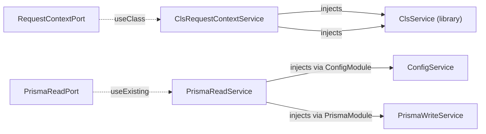

#### EventsModule — `src/platform/events/events.module.ts`

imports: — · exports: InProcessEventBus, MessageRoutingPolicy

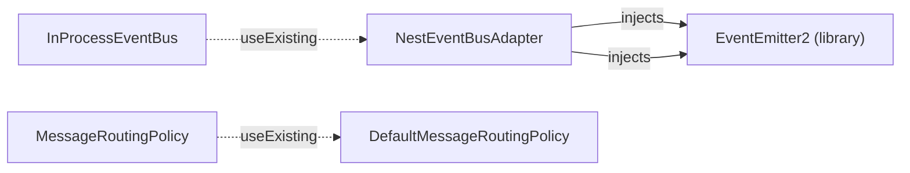

#### MessagingModule (src/platform/messaging) — `src/platform/messaging/messaging.module.ts`

imports: InfraMessagingModule · exports: MessagePublisher, RabbitMqPublisher, KafkaPublisher, SqsPublisher

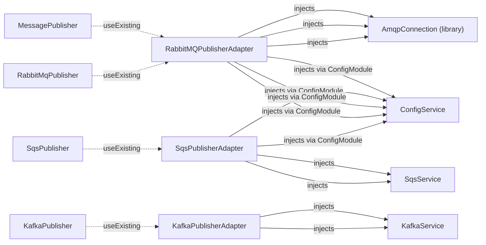

#### OutboxModule — `src/platform/outbox/outbox.module.ts`

imports: MessagingModule, EventsModule, ContextModule · exports: OutboxWriterPort

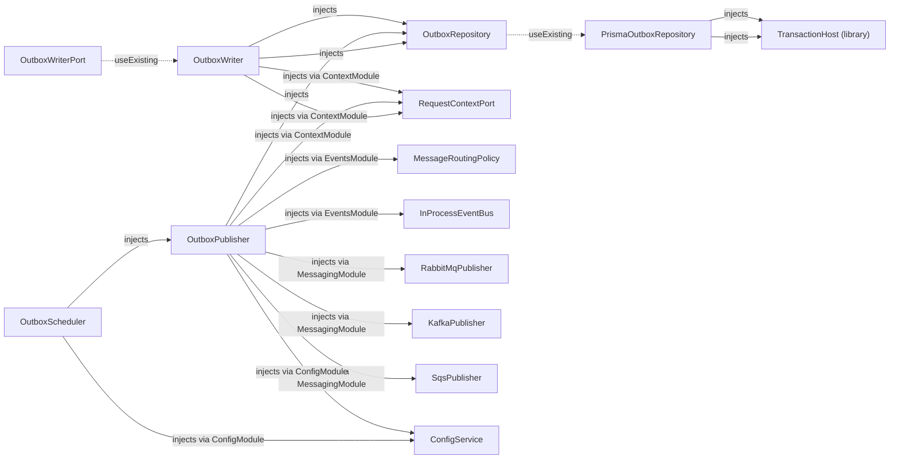

### Platform — capabilities (configuration · audit · numbering · notification · cache · storage · observability)

#### AuditModule — `src/platform/audit/audit.module.ts`

imports: ContextModule · exports: AuditPort

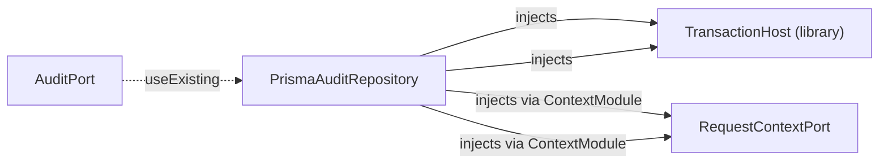

#### CacheModule (src/platform/cache) — `src/platform/cache/cache.module.ts`

imports: — · exports: CachePort

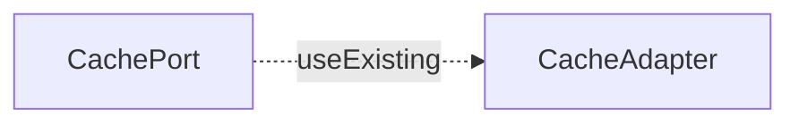

#### ConfigurationModule — `src/platform/configuration/configuration.module.ts`

imports: ContextModule · exports: CompanyConfigPort

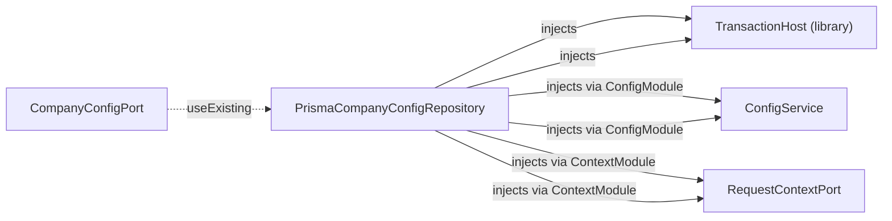

#### NotificationModule (src/platform/notification) — `src/platform/notification/notification.module.ts`

imports: InfraNotificationModule, ObservabilityModule · exports: EmailPort, NotificationPort, NotificationDispatchPort

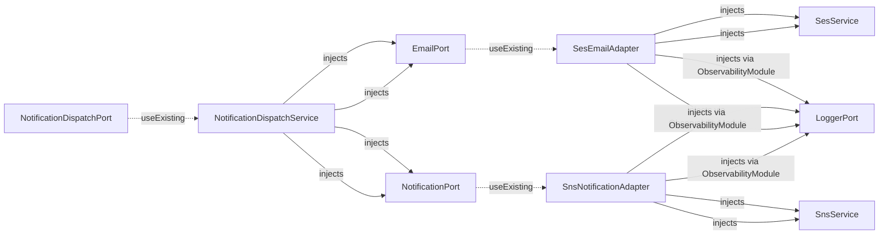

#### NumberingModule — `src/platform/numbering/numbering.module.ts`

imports: ContextModule · exports: NumberingPort

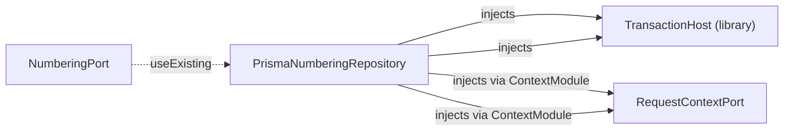

#### ObservabilityModule — `src/platform/observability/observability.module.ts`

imports: — · exports: LoggerPort, MetricsPort, ErrorTrackingPort

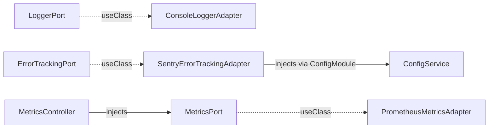

#### StorageModule (src/platform/storage) — `src/platform/storage/storage.module.ts`

imports: InfraStorageModule · exports: FileStoragePort

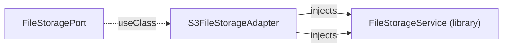

### Platform — services (scheduler · recurring · condition-engine · batch-operation · import)

#### BatchOperationModule — `src/platform/batch-operation/batch-operation.module.ts`

imports: ContextModule, AuditModule, NumberingModule, OutboxModule, BullModule.registerQueue({ name: BATCH_OPERATION_QUEUE_NAME }) · exports: BatchOperationHandlerRegistry, CreateBatchOperationJobUseCase, ValidateBatchOperationUseCase, ProcessBatchOperationRowUseCase, GetBatchOperationJobStatusUseCase, ListBatchOperationJobsUseCase, ListBatchOperationJobRowsUseCase, CancelBatchOperationJobUseCase

```mermaid
flowchart LR
    BatchOperationJobRepositoryPort["BatchOperationJobRepositoryPort"]
    PrismaBatchOperationJobRepository["PrismaBatchOperationJobRepository"]
    BatchOperationJobRepositoryPort -.->|useExisting| PrismaBatchOperationJobRepository
    BatchOperationJobRowRepositoryPort["BatchOperationJobRowRepositoryPort"]
    BatchOperationJobRowRepositoryPort -.->|useExisting| PrismaBatchOperationJobRepository
    BatchOperationJobOutboxWriterPort["BatchOperationJobOutboxWriterPort"]
    PrismaBatchOperationJobOutboxWriter["PrismaBatchOperationJobOutboxWriter"]
    BatchOperationJobOutboxWriterPort -.->|useExisting| PrismaBatchOperationJobOutboxWriter
    BatchOperationQueuePublisherPort["BatchOperationQueuePublisherPort"]
    BullMqBatchOperationQueueAdapter["BullMqBatchOperationQueueAdapter"]
    BatchOperationQueuePublisherPort -.->|useExisting| BullMqBatchOperationQueueAdapter
    BatchOperationController["BatchOperationController"]
    CreateBatchOperationJobUseCase["CreateBatchOperationJobUseCase"]
    BatchOperationController -->|injects| CreateBatchOperationJobUseCase
    ValidateBatchOperationUseCase["ValidateBatchOperationUseCase"]
    BatchOperationController -->|injects| ValidateBatchOperationUseCase
    GetBatchOperationJobStatusUseCase["GetBatchOperationJobStatusUseCase"]
    BatchOperationController -->|injects| GetBatchOperationJobStatusUseCase
    ListBatchOperationJobsUseCase["ListBatchOperationJobsUseCase"]
    BatchOperationController -->|injects| ListBatchOperationJobsUseCase
    ListBatchOperationJobRowsUseCase["ListBatchOperationJobRowsUseCase"]
    BatchOperationController -->|injects| ListBatchOperationJobRowsUseCase
    CancelBatchOperationJobUseCase["CancelBatchOperationJobUseCase"]
    BatchOperationController -->|injects| CancelBatchOperationJobUseCase
    BatchOperationHandlerRegistry["BatchOperationHandlerRegistry"]
    BatchOperationController -->|injects| BatchOperationHandlerRegistry
    TransactionHost__library_["TransactionHost (library)"]
    PrismaBatchOperationJobRepository -->|injects| TransactionHost__library_
    PrismaBatchOperationJobRepository -->|injects| TransactionHost__library_
    PrismaBatchOperationJobRepository -->|injects| TransactionHost__library_
    OutboxWriterPort["OutboxWriterPort"]
    PrismaBatchOperationJobOutboxWriter -->|injects via OutboxModule| OutboxWriterPort
    PrismaBatchOperationJobOutboxWriter -->|injects via OutboxModule| OutboxWriterPort
    Queue__library_["Queue (library)"]
    BullMqBatchOperationQueueAdapter -->|injects| Queue__library_
    ConfigService["ConfigService"]
    BullMqBatchOperationQueueAdapter -->|injects via ConfigModule| ConfigService
    BullMqBatchOperationQueueAdapter -->|injects| Queue__library_
    BullMqBatchOperationQueueAdapter -->|injects via ConfigModule| ConfigService
    BullMqBatchOperationWorker["BullMqBatchOperationWorker"]
    BatchOperationWorker["BatchOperationWorker"]
    BullMqBatchOperationWorker -->|injects| BatchOperationWorker
    BatchOperationWorker -->|injects| BatchOperationJobRepositoryPort
    BatchOperationWorker -->|injects| BatchOperationJobRowRepositoryPort
    ProcessBatchOperationRowUseCase["ProcessBatchOperationRowUseCase"]
    BatchOperationWorker -->|injects| ProcessBatchOperationRowUseCase
    BatchOperationWorker -->|injects| BatchOperationJobOutboxWriterPort
    BatchOperationReconciliationConsumer["BatchOperationReconciliationConsumer"]
    BatchOperationReconciliationConsumer -->|injects| BatchOperationJobRepositoryPort
    BatchOperationReconciliationConsumer -->|injects| BatchOperationJobRowRepositoryPort
    BatchOperationReconciliationConsumer -->|injects| BatchOperationQueuePublisherPort
    BatchOperationReconciliationConsumer -->|injects| BatchOperationJobOutboxWriterPort
    BatchOperationReconciliationConsumer -->|injects via ConfigModule| ConfigService
    CreateBatchOperationJobUseCase -->|injects| BatchOperationJobRepositoryPort
    CreateBatchOperationJobUseCase -->|injects| BatchOperationHandlerRegistry
    CreateBatchOperationJobUseCase -->|injects| BatchOperationWorker
    CreateBatchOperationJobUseCase -->|injects| BatchOperationQueuePublisherPort
    NumberingPort["NumberingPort"]
    CreateBatchOperationJobUseCase -->|injects via NumberingModule| NumberingPort
    CreateBatchOperationJobUseCase -->|injects via ConfigModule| ConfigService
    RequestContextPort["RequestContextPort"]
    CreateBatchOperationJobUseCase -->|injects via ContextModule| RequestContextPort
    ValidateBatchOperationUseCase -->|injects| BatchOperationHandlerRegistry
    ValidateBatchOperationUseCase -->|injects via ContextModule| RequestContextPort
    ProcessBatchOperationRowUseCase -->|injects| BatchOperationJobRepositoryPort
    ProcessBatchOperationRowUseCase -->|injects| BatchOperationJobRowRepositoryPort
    ProcessBatchOperationRowUseCase -->|injects| BatchOperationHandlerRegistry
    ProcessBatchOperationRowUseCase -->|injects via ConfigModule| ConfigService
    GetBatchOperationJobStatusUseCase -->|injects| BatchOperationJobRepositoryPort
    GetBatchOperationJobStatusUseCase -->|injects via ContextModule| RequestContextPort
    ListBatchOperationJobsUseCase -->|injects| BatchOperationJobRepositoryPort
    ListBatchOperationJobsUseCase -->|injects via ContextModule| RequestContextPort
    ListBatchOperationJobRowsUseCase -->|injects| BatchOperationJobRepositoryPort
    ListBatchOperationJobRowsUseCase -->|injects| BatchOperationJobRowRepositoryPort
    ListBatchOperationJobRowsUseCase -->|injects via ContextModule| RequestContextPort
    CancelBatchOperationJobUseCase -->|injects| BatchOperationJobRepositoryPort
    CancelBatchOperationJobUseCase -->|injects| BatchOperationJobRowRepositoryPort
    AuditPort["AuditPort"]
    CancelBatchOperationJobUseCase -->|injects via AuditModule| AuditPort
    CancelBatchOperationJobUseCase -->|injects via ContextModule| RequestContextPort
```

#### ConditionEngineModule — `src/platform/condition-engine/condition-engine.module.ts`

imports: — · exports: ConditionEvaluator, FieldResolverRegistry

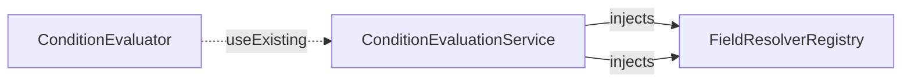

#### ImportModule — `src/platform/import/import.module.ts`

imports: ContextModule, AuditModule, NumberingModule, OutboxModule, StorageModule, BullModule.registerQueue({ name: IMPORT_QUEUE_NAME }) · exports: ImportHandlerRegistry

```mermaid
flowchart LR
    StorageObjectRepositoryPort["StorageObjectRepositoryPort"]
    PrismaStorageObjectRepository["PrismaStorageObjectRepository"]
    StorageObjectRepositoryPort -.->|useExisting| PrismaStorageObjectRepository
    ImportJobRepositoryPort["ImportJobRepositoryPort"]
    PrismaImportJobRepository["PrismaImportJobRepository"]
    ImportJobRepositoryPort -.->|useExisting| PrismaImportJobRepository
    ImportJobRowRepositoryPort["ImportJobRowRepositoryPort"]
    PrismaImportJobRowRepository["PrismaImportJobRowRepository"]
    ImportJobRowRepositoryPort -.->|useExisting| PrismaImportJobRowRepository
    ImportJobOutboxWriterPort["ImportJobOutboxWriterPort"]
    PrismaImportJobOutboxWriter["PrismaImportJobOutboxWriter"]
    ImportJobOutboxWriterPort -.->|useExisting| PrismaImportJobOutboxWriter
    ImportQueuePublisherPort["ImportQueuePublisherPort"]
    BullMqImportQueueAdapter["BullMqImportQueueAdapter"]
    ImportQueuePublisherPort -.->|useExisting| BullMqImportQueueAdapter
    ImportController["ImportController"]
    InitImportUseCase["InitImportUseCase"]
    ImportController -->|injects| InitImportUseCase
    CreateImportUploadUseCase["CreateImportUploadUseCase"]
    ImportController -->|injects| CreateImportUploadUseCase
    CreateImportJobUseCase["CreateImportJobUseCase"]
    ImportController -->|injects| CreateImportJobUseCase
    GetImportPreviewUseCase["GetImportPreviewUseCase"]
    ImportController -->|injects| GetImportPreviewUseCase
    UpdateImportMappingUseCase["UpdateImportMappingUseCase"]
    ImportController -->|injects| UpdateImportMappingUseCase
    GetImportReportUseCase["GetImportReportUseCase"]
    ImportController -->|injects| GetImportReportUseCase
    ExecuteImportJobUseCase["ExecuteImportJobUseCase"]
    ImportController -->|injects| ExecuteImportJobUseCase
    CancelImportJobUseCase["CancelImportJobUseCase"]
    ImportController -->|injects| CancelImportJobUseCase
    GetImportJobStatusUseCase["GetImportJobStatusUseCase"]
    ImportController -->|injects| GetImportJobStatusUseCase
    ListImportJobsUseCase["ListImportJobsUseCase"]
    ImportController -->|injects| ListImportJobsUseCase
    ImportHandlerRegistry["ImportHandlerRegistry"]
    ImportController -->|injects| ImportHandlerRegistry
    TransactionHost__library_["TransactionHost (library)"]
    PrismaStorageObjectRepository -->|injects| TransactionHost__library_
    PrismaStorageObjectRepository -->|injects| TransactionHost__library_
    PrismaImportJobRepository -->|injects| TransactionHost__library_
    PrismaImportJobRepository -->|injects| TransactionHost__library_
    PrismaImportJobRowRepository -->|injects| TransactionHost__library_
    PrismaImportJobRowRepository -->|injects| TransactionHost__library_
    OutboxWriterPort["OutboxWriterPort"]
    PrismaImportJobOutboxWriter -->|injects via OutboxModule| OutboxWriterPort
    PrismaImportJobOutboxWriter -->|injects via OutboxModule| OutboxWriterPort
    Queue__library_["Queue (library)"]
    BullMqImportQueueAdapter -->|injects| Queue__library_
    ConfigService["ConfigService"]
    BullMqImportQueueAdapter -->|injects via ConfigModule| ConfigService
    BullMqImportQueueAdapter -->|injects| Queue__library_
    BullMqImportQueueAdapter -->|injects via ConfigModule| ConfigService
    BullMqImportWorker["BullMqImportWorker"]
    ParseImportJobUseCase["ParseImportJobUseCase"]
    BullMqImportWorker -->|injects| ParseImportJobUseCase
    ValidateImportJobUseCase["ValidateImportJobUseCase"]
    BullMqImportWorker -->|injects| ValidateImportJobUseCase
    RunImportExecutionUseCase["RunImportExecutionUseCase"]
    BullMqImportWorker -->|injects| RunImportExecutionUseCase
    ImportReconciliationConsumer["ImportReconciliationConsumer"]
    ImportReconciliationConsumer -->|injects via ConfigModule| ConfigService
    ImportReconciliationConsumer -->|injects| ImportJobRepositoryPort
    ImportReconciliationConsumer -->|injects| ImportJobRowRepositoryPort
    ImportReconciliationConsumer -->|injects| ImportQueuePublisherPort
    ImportReconciliationConsumer -->|injects| StorageObjectRepositoryPort
    FileStoragePort["FileStoragePort"]
    ImportReconciliationConsumer -->|injects via StorageModule| FileStoragePort
    InitImportUseCase -->|injects| ImportHandlerRegistry
    InitImportUseCase -->|injects| ImportJobRepositoryPort
    RequestContextPort["RequestContextPort"]
    InitImportUseCase -->|injects via ContextModule| RequestContextPort
    CreateImportUploadUseCase -->|injects| ImportHandlerRegistry
    CreateImportUploadUseCase -->|injects via ConfigModule| ConfigService
    CreateImportUploadUseCase -->|injects via StorageModule| FileStoragePort
    CreateImportUploadUseCase -->|injects| StorageObjectRepositoryPort
    CreateImportUploadUseCase -->|injects via ContextModule| RequestContextPort
    CreateImportJobUseCase -->|injects| ImportHandlerRegistry
    CreateImportJobUseCase -->|injects via ConfigModule| ConfigService
    CreateImportJobUseCase -->|injects via StorageModule| FileStoragePort
    NumberingPort["NumberingPort"]
    CreateImportJobUseCase -->|injects via NumberingModule| NumberingPort
    CreateImportJobUseCase -->|injects| StorageObjectRepositoryPort
    CreateImportJobUseCase -->|injects| ImportJobRepositoryPort
    CreateImportJobUseCase -->|injects| ImportQueuePublisherPort
    CreateImportJobUseCase -->|injects via ContextModule| RequestContextPort
    GetImportPreviewUseCase -->|injects| ImportJobRepositoryPort
    GetImportPreviewUseCase -->|injects| ImportJobRowRepositoryPort
    GetImportPreviewUseCase -->|injects via ConfigModule| ConfigService
    ImportFileParser["ImportFileParser"]
    GetImportPreviewUseCase -->|injects| ImportFileParser
    GetImportPreviewUseCase -->|injects via ContextModule| RequestContextPort
    UpdateImportMappingUseCase -->|injects| ImportJobRepositoryPort
    UpdateImportMappingUseCase -->|injects| ImportQueuePublisherPort
    UpdateImportMappingUseCase -->|injects via ContextModule| RequestContextPort
    ValidateImportJobUseCase -->|injects| ImportHandlerRegistry
    ValidateImportJobUseCase -->|injects via ConfigModule| ConfigService
    ValidateImportJobUseCase -->|injects| ImportJobRepositoryPort
    ValidateImportJobUseCase -->|injects| ImportJobRowRepositoryPort
    ValidateImportJobUseCase -->|injects| ImportJobOutboxWriterPort
    ValidateImportJobUseCase -->|injects via ContextModule| RequestContextPort
    ValidateImportJobUseCase -->|injects| ImportFileParser
    ParseImportJobUseCase -->|injects via ConfigModule| ConfigService
    ParseImportJobUseCase -->|injects via StorageModule| FileStoragePort
    ParseImportJobUseCase -->|injects| ImportJobRepositoryPort
    ParseImportJobUseCase -->|injects| ImportJobRowRepositoryPort
    ParseImportJobUseCase -->|injects| StorageObjectRepositoryPort
    ParseImportJobUseCase -->|injects| ImportJobOutboxWriterPort
    ParseImportJobUseCase -->|injects via ContextModule| RequestContextPort
    ParseImportJobUseCase -->|injects| ImportFileParser
    ExecuteImportJobUseCase -->|injects| ImportJobRepositoryPort
    ExecuteImportJobUseCase -->|injects| ImportQueuePublisherPort
    AuditPort["AuditPort"]
    ExecuteImportJobUseCase -->|injects via AuditModule| AuditPort
    ExecuteImportJobUseCase -->|injects via ContextModule| RequestContextPort
    CancelImportJobUseCase -->|injects| ImportJobRepositoryPort
    CancelImportJobUseCase -->|injects| ImportJobOutboxWriterPort
    CancelImportJobUseCase -->|injects via AuditModule| AuditPort
    CancelImportJobUseCase -->|injects via ContextModule| RequestContextPort
    GetImportJobStatusUseCase -->|injects| ImportJobRepositoryPort
    GetImportJobStatusUseCase -->|injects via ContextModule| RequestContextPort
    ListImportJobsUseCase -->|injects| ImportJobRepositoryPort
    ListImportJobsUseCase -->|injects via ContextModule| RequestContextPort
    GetImportReportUseCase -->|injects| ImportJobRepositoryPort
    GetImportReportUseCase -->|injects| ImportJobRowRepositoryPort
    GetImportReportUseCase -->|injects via ContextModule| RequestContextPort
    RunImportExecutionUseCase -->|injects| ImportHandlerRegistry
    RunImportExecutionUseCase -->|injects via ConfigModule| ConfigService
    RunImportExecutionUseCase -->|injects| ImportJobRepositoryPort
    RunImportExecutionUseCase -->|injects| ImportJobRowRepositoryPort
    RunImportExecutionUseCase -->|injects| ImportJobOutboxWriterPort
    RunImportExecutionUseCase -->|injects via ContextModule| RequestContextPort
```

#### RecurringModule — `src/platform/recurring/recurring.module.ts`

imports: ContextModule, AuditModule, OutboxModule, SchedulerModule, ConditionEngineModule · exports: RecurringExecutionPort, RecurringTemplatePort

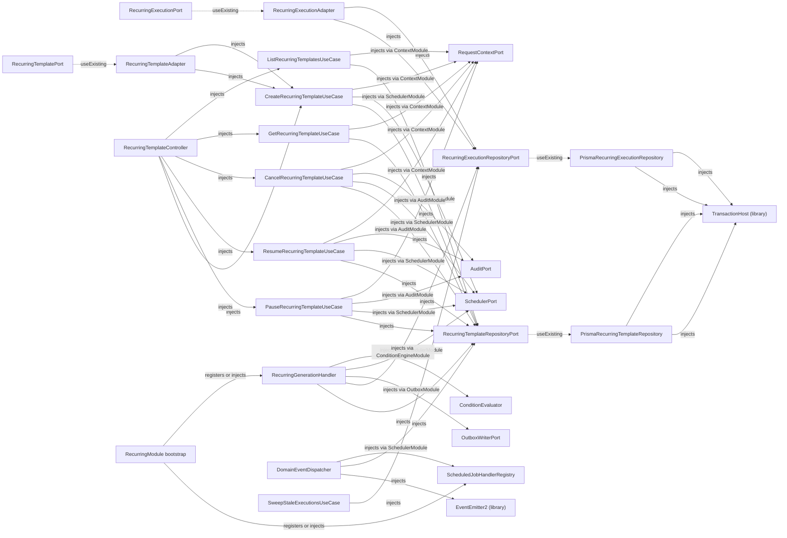

#### SchedulerModule — `src/platform/scheduler/scheduler.module.ts`

imports: ContextModule, AuditModule, LockingModule, MessagingModule, BullModule.registerQueue({ name: SCHEDULER_QUEUE_NAME }) · exports: SchedulerPort, ScheduledJobHandlerRegistry

```mermaid
flowchart LR
    ScheduledJobRepositoryPort["ScheduledJobRepositoryPort"]
    PrismaScheduledJobRepository["PrismaScheduledJobRepository"]
    ScheduledJobRepositoryPort -.->|useExisting| PrismaScheduledJobRepository
    ScheduledJobDispatchLogRepositoryPort["ScheduledJobDispatchLogRepositoryPort"]
    PrismaScheduledJobDispatchLogRepository["PrismaScheduledJobDispatchLogRepository"]
    ScheduledJobDispatchLogRepositoryPort -.->|useExisting| PrismaScheduledJobDispatchLogRepository
    ScheduledJobEditLogRepositoryPort["ScheduledJobEditLogRepositoryPort"]
    PrismaScheduledJobEditLogRepository["PrismaScheduledJobEditLogRepository"]
    ScheduledJobEditLogRepositoryPort -.->|useExisting| PrismaScheduledJobEditLogRepository
    SchedulerEventPublisherPort["SchedulerEventPublisherPort"]
    RabbitMqSchedulerEventPublisher["RabbitMqSchedulerEventPublisher"]
    SchedulerEventPublisherPort -.->|useExisting| RabbitMqSchedulerEventPublisher
    SchedulerJobQueuePort["SchedulerJobQueuePort"]
    BullMqSchedulerQueueAdapter["BullMqSchedulerQueueAdapter"]
    SchedulerJobQueuePort -.->|useExisting| BullMqSchedulerQueueAdapter
    SchedulerPort["SchedulerPort"]
    SchedulerAdapter["SchedulerAdapter"]
    SchedulerPort -.->|useExisting| SchedulerAdapter
    SchedulerController["SchedulerController"]
    GetScheduledJobStatusUseCase["GetScheduledJobStatusUseCase"]
    SchedulerController -->|injects| GetScheduledJobStatusUseCase
    ListScheduledJobDispatchLogUseCase["ListScheduledJobDispatchLogUseCase"]
    SchedulerController -->|injects| ListScheduledJobDispatchLogUseCase
    UpdateScheduledJobUseCase["UpdateScheduledJobUseCase"]
    SchedulerController -->|injects| UpdateScheduledJobUseCase
    CancelScheduledJobUseCase["CancelScheduledJobUseCase"]
    SchedulerController -->|injects| CancelScheduledJobUseCase
    RescheduleExternalJobUseCase["RescheduleExternalJobUseCase"]
    SchedulerController -->|injects| RescheduleExternalJobUseCase
    SchedulerHealthController["SchedulerHealthController"]
    GetSchedulerHealthMetricsUseCase["GetSchedulerHealthMetricsUseCase"]
    SchedulerHealthController -->|injects| GetSchedulerHealthMetricsUseCase
    TransactionHost__library_["TransactionHost (library)"]
    PrismaScheduledJobRepository -->|injects| TransactionHost__library_
    ConfigService["ConfigService"]
    PrismaScheduledJobRepository -->|injects via ConfigModule| ConfigService
    PrismaScheduledJobRepository -->|injects| TransactionHost__library_
    PrismaScheduledJobRepository -->|injects via ConfigModule| ConfigService
    PrismaScheduledJobDispatchLogRepository -->|injects| TransactionHost__library_
    PrismaScheduledJobDispatchLogRepository -->|injects| TransactionHost__library_
    PrismaScheduledJobEditLogRepository -->|injects| TransactionHost__library_
    PrismaScheduledJobEditLogRepository -->|injects| TransactionHost__library_
    RabbitMqPublisher["RabbitMqPublisher"]
    RabbitMqSchedulerEventPublisher -->|injects via MessagingModule| RabbitMqPublisher
    RabbitMqSchedulerEventPublisher -->|injects via MessagingModule| RabbitMqPublisher
    ScheduledJobProcessor["ScheduledJobProcessor"]
    ScheduledJobHandlerRegistry["ScheduledJobHandlerRegistry"]
    ScheduledJobProcessor -->|injects| ScheduledJobHandlerRegistry
    ScheduledJobProcessor -->|injects| SchedulerEventPublisherPort
    ScheduledJobProcessor -->|injects| ScheduledJobRepositoryPort
    Queue__library_["Queue (library)"]
    BullMqSchedulerQueueAdapter -->|injects| Queue__library_
    BullMqSchedulerQueueAdapter -->|injects via ConfigModule| ConfigService
    BullMqSchedulerQueueAdapter -->|injects| Queue__library_
    BullMqSchedulerQueueAdapter -->|injects via ConfigModule| ConfigService
    BullMqSchedulerJobWorker["BullMqSchedulerJobWorker"]
    BullMqSchedulerJobWorker -->|injects| ScheduledJobProcessor
    BullMqSchedulerJobWorker -->|injects via ConfigModule| ConfigService
    BullMqSchedulerJobWorker -->|injects| ScheduledJobRepositoryPort
    BullMqSchedulerJobWorker -->|injects| ScheduledJobDispatchLogRepositoryPort
    RequestContextPort["RequestContextPort"]
    BullMqSchedulerJobWorker -->|injects via ContextModule| RequestContextPort
    RegisterScheduledJobUseCase["RegisterScheduledJobUseCase"]
    RegisterScheduledJobUseCase -->|injects| ScheduledJobRepositoryPort
    CancelScheduledJobUseCase -->|injects| ScheduledJobRepositoryPort
    AuditPort["AuditPort"]
    CancelScheduledJobUseCase -->|injects via AuditModule| AuditPort
    CancelScheduledJobUseCase -->|injects via ContextModule| RequestContextPort
    RescheduleExternalJobUseCase -->|injects| ScheduledJobRepositoryPort
    RescheduleExternalJobUseCase -->|injects via AuditModule| AuditPort
    RescheduleExternalJobUseCase -->|injects via ContextModule| RequestContextPort
    UpdateScheduledJobUseCase -->|injects| ScheduledJobRepositoryPort
    UpdateScheduledJobUseCase -->|injects| ScheduledJobEditLogRepositoryPort
    UpdateScheduledJobUseCase -->|injects via ContextModule| RequestContextPort
    DispatchDueJobsUseCase["DispatchDueJobsUseCase"]
    DispatchDueJobsUseCase -->|injects| ScheduledJobRepositoryPort
    DistributedLockPort["DistributedLockPort"]
    DispatchDueJobsUseCase -->|injects via LockingModule| DistributedLockPort
    DispatchDueJobsUseCase -->|injects| SchedulerJobQueuePort
    DispatchDueJobsUseCase -->|injects| ScheduledJobDispatchLogRepositoryPort
    DispatchDueJobsUseCase -->|injects via ConfigModule| ConfigService
    SchedulerTickHeartbeat["SchedulerTickHeartbeat"]
    DispatchDueJobsUseCase -->|injects| SchedulerTickHeartbeat
    ReconcileMissedJobsUseCase["ReconcileMissedJobsUseCase"]
    ReconcileMissedJobsUseCase -->|injects| ScheduledJobRepositoryPort
    GetScheduledJobStatusUseCase -->|injects| ScheduledJobRepositoryPort
    GetScheduledJobStatusUseCase -->|injects via ContextModule| RequestContextPort
    ListScheduledJobDispatchLogUseCase -->|injects| ScheduledJobDispatchLogRepositoryPort
    ListScheduledJobDispatchLogUseCase -->|injects| ScheduledJobRepositoryPort
    ListScheduledJobDispatchLogUseCase -->|injects via ContextModule| RequestContextPort
    GetSchedulerHealthMetricsUseCase -->|injects| ScheduledJobRepositoryPort
    GetSchedulerHealthMetricsUseCase -->|injects| ScheduledJobDispatchLogRepositoryPort
    GetSchedulerHealthMetricsUseCase -->|injects| SchedulerTickHeartbeat
    SchedulerAdapter -->|injects| RegisterScheduledJobUseCase
    SchedulerAdapter -->|injects| CancelScheduledJobUseCase
    SchedulerAdapter -->|injects| RescheduleExternalJobUseCase
    SchedulerAdapter -->|injects| RegisterScheduledJobUseCase
    SchedulerAdapter -->|injects| CancelScheduledJobUseCase
    SchedulerAdapter -->|injects| RescheduleExternalJobUseCase
    SchedulerTicker["SchedulerTicker"]
    SchedulerTicker -->|injects| DispatchDueJobsUseCase
    SchedulerTicker -->|injects| ReconcileMissedJobsUseCase
    SchedulerTicker -->|injects via ConfigModule| ConfigService
    SchedulerRegistry__library_["SchedulerRegistry (library)"]
    SchedulerTicker -->|injects| SchedulerRegistry__library_
```

### Composition-only modules

#### AppModule — `src/app.module.ts`

imports: ConfigModule, ThrottlerModule.forRootAsync({
      inject: [ConfigService],
      useFactory: (config: ConfigService) => {
        const { ttlMs, limit } = config.getThrottler();
        return { throttlers: [{ ttl: ttlMs, limit }] };
      },
    }), InfrastructureModule, PlatformModule, BusinessModule · exports: —

```mermaid
flowchart LR
    APP_INTERCEPTOR["APP_INTERCEPTOR"]
    ResponseInterceptor["ResponseInterceptor"]
    APP_INTERCEPTOR -.->|useClass| ResponseInterceptor
    APP_GUARD["APP_GUARD"]
    ThrottlerGuard["ThrottlerGuard"]
    APP_GUARD -.->|useClass| ThrottlerGuard
    TenancyAuthGuard["TenancyAuthGuard"]
    APP_GUARD -.->|useClass| TenancyAuthGuard
    APP_FILTER["APP_FILTER"]
    HttpExceptionsFilter["HttpExceptionsFilter"]
    APP_FILTER -.->|useClass| HttpExceptionsFilter
    APP_PIPE["APP_PIPE"]
    AppValidationPipe["AppValidationPipe"]
    APP_PIPE -.->|useClass| AppValidationPipe
    RequestIdInterceptor["RequestIdInterceptor"]
    APP_INTERCEPTOR -.->|useClass| RequestIdInterceptor
    LoggingInterceptor["LoggingInterceptor"]
    APP_INTERCEPTOR -.->|useClass| LoggingInterceptor
    DeviceResponseInterceptor["DeviceResponseInterceptor"]
    APP_INTERCEPTOR -.->|useClass| DeviceResponseInterceptor
    ConfigService["ConfigService"]
    TenancyAuthGuard -->|injects via ConfigModule| ConfigService
    Reflector__library_["Reflector (library)"]
    TenancyAuthGuard -->|injects| Reflector__library_
    ClsService__library_["ClsService (library)"]
    RequestIdInterceptor -->|injects| ClsService__library_
    RequestIdInterceptor -->|injects via ConfigModule| ConfigService
    LoggingInterceptor -->|injects| ClsService__library_
    DeviceResponseInterceptor -->|injects| ClsService__library_
```

#### BusinessModule — `src/business/business.module.ts`

imports: PartyModule, ProcurementModule, SalesModule · exports: —

_Composition only._

#### PartyModule — `src/business/party/party.module.ts`

imports: VendorModule · exports: —

_Composition only._

#### ProcurementModule — `src/business/procurement/procurement.module.ts`

imports: ProductModule, PurchaseOrderModule, GoodReceiptNoteModule · exports: —

_Composition only._

#### SalesModule — `src/business/sales/sales.module.ts`

imports: InvoiceModule · exports: —

_Composition only._

> Companion: [`docs/FLOWCHARTS.md`](FLOWCHARTS.md) — the runtime flows these wires power.
> `TransactionHost` = CLS-backed transactional Prisma client (write side);
> `PrismaReadPort` is bound in `DatabaseModule` to `PrismaReadService` (read replica).
