# DI Wiring — who injects whom, which token binds to which implementation

**Generated** by `scripts/generate-di-wiring.mjs` (`npm run docs:di`) from real source:
`@Module` provider bindings + every constructor, with each dependency resolved through the
consuming file's own imports — so module-local tokens (each module's own `CompanyConfigPort` /
`NumberingPort`) are attributed to the right module, and only genuinely cross-boundary edges
appear. Blocks are validated for mermaid-safe syntax at generation time.

- solid `-->|injects|` — constructor dependency
- dashed `-.->` — Nest binding declared in the module (`useClass` / `useExisting`)
- `TransactionHost / Queue / AmqpConnection …` — library providers (write TX host, BullMQ, brokers)
- `injects via OwnerModule` — the token is provided by a DIFFERENT module (cross-boundary)
- `XModule bootstrap` — what the module class injects to register opt-in handlers

---

## Cross-module graph (Nest imports + token ownership)

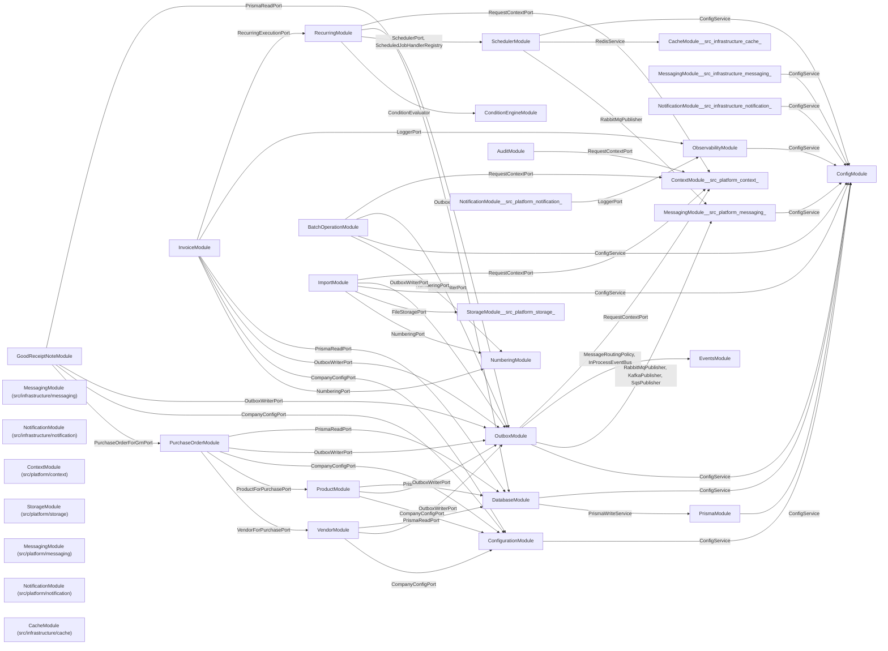

---

## Per-module wiring

### Business — party/vendor

#### VendorModule — `src/business/party/vendor/vendor.module.ts`

imports: PlatformModule · exports: VendorForPurchasePort

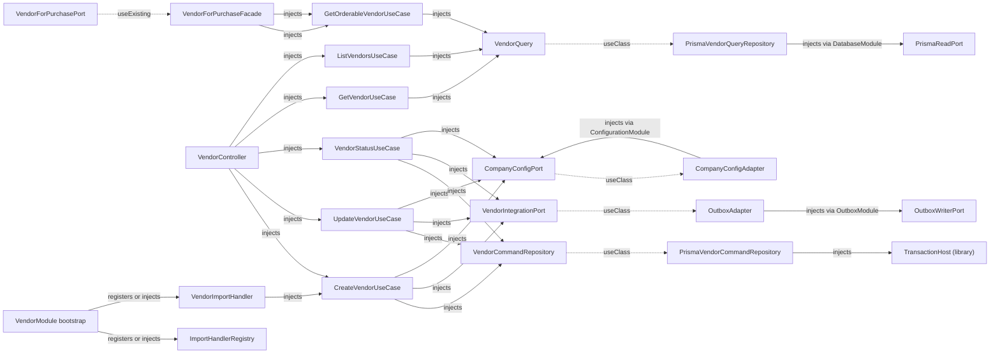

### Business — procurement

#### GoodReceiptNoteModule — `src/business/procurement/good-receipt-note/good-receipt-note.module.ts`

imports: PlatformModule, PurchaseOrderModule · exports: GrnForPurchaseOrderPort

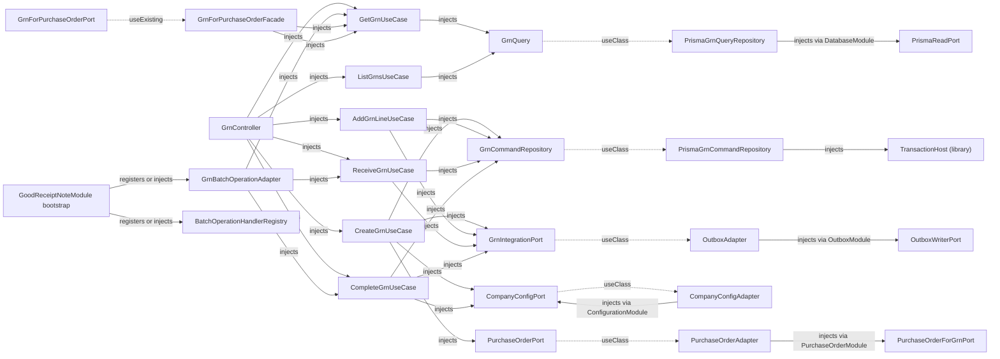

#### PurchaseOrderModule — `src/business/procurement/purchase-order/purchase-order.module.ts`

imports: PlatformModule, ProductModule, VendorModule · exports: PurchaseOrderForGrnPort

```mermaid
flowchart LR
    PurchaseOrderForGrnPort["PurchaseOrderForGrnPort"]
    PurchaseOrderForGrnFacade["PurchaseOrderForGrnFacade"]
    PurchaseOrderForGrnPort -.->|useExisting| PurchaseOrderForGrnFacade
    PurchaseOrderCommandRepository["PurchaseOrderCommandRepository"]
    PrismaPurchaseOrderCommandRepository["PrismaPurchaseOrderCommandRepository"]
    PurchaseOrderCommandRepository -.->|useClass| PrismaPurchaseOrderCommandRepository
    PurchaseOrderQuery["PurchaseOrderQuery"]
    PrismaPurchaseOrderQueryRepository["PrismaPurchaseOrderQueryRepository"]
    PurchaseOrderQuery -.->|useClass| PrismaPurchaseOrderQueryRepository
    PurchaseOrderIntegrationPort["PurchaseOrderIntegrationPort"]
    OutboxAdapter["OutboxAdapter"]
    PurchaseOrderIntegrationPort -.->|useClass| OutboxAdapter
    CompanyConfigPort["CompanyConfigPort"]
    CompanyConfigAdapter["CompanyConfigAdapter"]
    CompanyConfigPort -.->|useClass| CompanyConfigAdapter
    PurchasableProductPort["PurchasableProductPort"]
    PurchasableProductAdapter["PurchasableProductAdapter"]
    PurchasableProductPort -.->|useClass| PurchasableProductAdapter
    OrderableVendorPort["OrderableVendorPort"]
    OrderableVendorAdapter["OrderableVendorAdapter"]
    OrderableVendorPort -.->|useClass| OrderableVendorAdapter
    PurchaseOrderController["PurchaseOrderController"]
    CreatePurchaseOrderUseCase["CreatePurchaseOrderUseCase"]
    PurchaseOrderController -->|injects| CreatePurchaseOrderUseCase
    AddPurchaseOrderLineUseCase["AddPurchaseOrderLineUseCase"]
    PurchaseOrderController -->|injects| AddPurchaseOrderLineUseCase
    RemovePurchaseOrderLineUseCase["RemovePurchaseOrderLineUseCase"]
    PurchaseOrderController -->|injects| RemovePurchaseOrderLineUseCase
    PurchaseOrderTransitionUseCase["PurchaseOrderTransitionUseCase"]
    PurchaseOrderController -->|injects| PurchaseOrderTransitionUseCase
    GetPurchaseOrderUseCase["GetPurchaseOrderUseCase"]
    PurchaseOrderController -->|injects| GetPurchaseOrderUseCase
    ListPurchaseOrdersUseCase["ListPurchaseOrdersUseCase"]
    PurchaseOrderController -->|injects| ListPurchaseOrdersUseCase
    PurchaseOrderBatchOperationAdapter["PurchaseOrderBatchOperationAdapter"]
    PurchaseOrderBatchOperationAdapter -->|injects| GetPurchaseOrderUseCase
    PurchaseOrderBatchOperationAdapter -->|injects| PurchaseOrderTransitionUseCase
    CreatePurchaseOrderUseCase -->|injects| PurchaseOrderCommandRepository
    CreatePurchaseOrderUseCase -->|injects| OrderableVendorPort
    CreatePurchaseOrderUseCase -->|injects| PurchaseOrderIntegrationPort
    CreatePurchaseOrderUseCase -->|injects| CompanyConfigPort
    AddPurchaseOrderLineUseCase -->|injects| PurchaseOrderCommandRepository
    AddPurchaseOrderLineUseCase -->|injects| PurchasableProductPort
    AddPurchaseOrderLineUseCase -->|injects| PurchaseOrderIntegrationPort
    AddPurchaseOrderLineUseCase -->|injects| CompanyConfigPort
    RemovePurchaseOrderLineUseCase -->|injects| PurchaseOrderCommandRepository
    RemovePurchaseOrderLineUseCase -->|injects| PurchaseOrderIntegrationPort
    RemovePurchaseOrderLineUseCase -->|injects| CompanyConfigPort
    PurchaseOrderTransitionUseCase -->|injects| PurchaseOrderCommandRepository
    PurchaseOrderTransitionUseCase -->|injects| PurchaseOrderIntegrationPort
    PurchaseOrderTransitionUseCase -->|injects| CompanyConfigPort
    GetPurchaseOrderUseCase -->|injects| PurchaseOrderQuery
    ListPurchaseOrdersUseCase -->|injects| PurchaseOrderQuery
    PurchaseOrderForGrnFacade -->|injects| GetPurchaseOrderUseCase
    PurchaseOrderForGrnFacade -->|injects| GetPurchaseOrderUseCase
    TransactionHost__library_["TransactionHost (library)"]
    PrismaPurchaseOrderCommandRepository -->|injects| TransactionHost__library_
    PrismaReadPort["PrismaReadPort"]
    PrismaPurchaseOrderQueryRepository -->|injects via DatabaseModule| PrismaReadPort
    OutboxWriterPort["OutboxWriterPort"]
    OutboxAdapter -->|injects via OutboxModule| OutboxWriterPort
    CompanyConfigAdapter -->|injects via ConfigurationModule| CompanyConfigPort
    ProductForPurchasePort["ProductForPurchasePort"]
    PurchasableProductAdapter -->|injects via ProductModule| ProductForPurchasePort
    VendorForPurchasePort["VendorForPurchasePort"]
    OrderableVendorAdapter -->|injects via VendorModule| VendorForPurchasePort
    PurchaseOrderModule_bootstrap["PurchaseOrderModule bootstrap"]
    BatchOperationHandlerRegistry["BatchOperationHandlerRegistry"]
    PurchaseOrderModule_bootstrap -->|registers or injects| BatchOperationHandlerRegistry
    PurchaseOrderModule_bootstrap -->|registers or injects| PurchaseOrderBatchOperationAdapter
```

### Business — sales/invoice

#### InvoiceModule — `src/business/sales/invoice/invoice.module.ts`

imports: PlatformModule · exports: InvoiceForReportsPort

```mermaid
flowchart LR
    InvoiceForReportsPort["InvoiceForReportsPort"]
    InvoiceForReportsFacade["InvoiceForReportsFacade"]
    InvoiceForReportsPort -.->|useExisting| InvoiceForReportsFacade
    InvoiceCommandRepository["InvoiceCommandRepository"]
    PrismaInvoiceCommandRepository["PrismaInvoiceCommandRepository"]
    InvoiceCommandRepository -.->|useClass| PrismaInvoiceCommandRepository
    InvoiceQuery["InvoiceQuery"]
    PrismaInvoiceQueryRepository["PrismaInvoiceQueryRepository"]
    InvoiceQuery -.->|useClass| PrismaInvoiceQueryRepository
    InvoiceIntegrationPort["InvoiceIntegrationPort"]
    OutboxAdapter["OutboxAdapter"]
    InvoiceIntegrationPort -.->|useClass| OutboxAdapter
    CompanyConfigPort["CompanyConfigPort"]
    CompanyConfigAdapter["CompanyConfigAdapter"]
    CompanyConfigPort -.->|useClass| CompanyConfigAdapter
    NumberingPort["NumberingPort"]
    NumberingAdapter["NumberingAdapter"]
    NumberingPort -.->|useClass| NumberingAdapter
    InvoiceController["InvoiceController"]
    CreateInvoiceUseCase["CreateInvoiceUseCase"]
    InvoiceController -->|injects| CreateInvoiceUseCase
    PostInvoiceUseCase["PostInvoiceUseCase"]
    InvoiceController -->|injects| PostInvoiceUseCase
    GetInvoiceUseCase["GetInvoiceUseCase"]
    InvoiceController -->|injects| GetInvoiceUseCase
    ListInvoicesUseCase["ListInvoicesUseCase"]
    InvoiceController -->|injects| ListInvoicesUseCase
    CreateInvoiceUseCase -->|injects| InvoiceCommandRepository
    CreateInvoiceUseCase -->|injects| InvoiceIntegrationPort
    CreateInvoiceUseCase -->|injects| CompanyConfigPort
    CreateInvoiceUseCase -->|injects| NumberingPort
    PostInvoiceUseCase -->|injects| InvoiceCommandRepository
    PostInvoiceUseCase -->|injects| InvoiceIntegrationPort
    GetInvoiceUseCase -->|injects| InvoiceQuery
    ListInvoicesUseCase -->|injects| InvoiceQuery
    GenerateRecurringInvoiceUseCase["GenerateRecurringInvoiceUseCase"]
    GenerateRecurringInvoiceUseCase -->|injects| CreateInvoiceUseCase
    GenerateRecurringInvoiceUseCase -->|injects| GetInvoiceUseCase
    GenerateRecurringInvoiceUseCase -->|injects| PostInvoiceUseCase
    RecurringExecutionPort["RecurringExecutionPort"]
    GenerateRecurringInvoiceUseCase -->|injects via RecurringModule| RecurringExecutionPort
    LoggerPort["LoggerPort"]
    GenerateRecurringInvoiceUseCase -->|injects via ObservabilityModule| LoggerPort
    RecurringOccurrenceRequestedRabbitMQListener["RecurringOccurrenceRequestedRabbitMQListener"]
    RecurringOccurrenceRequestedRabbitMQListener -->|injects| GenerateRecurringInvoiceUseCase
    InvoiceForReportsFacade -->|injects| GetInvoiceUseCase
    InvoiceForReportsFacade -->|injects| GetInvoiceUseCase
    TransactionHost__library_["TransactionHost (library)"]
    PrismaInvoiceCommandRepository -->|injects| TransactionHost__library_
    PrismaReadPort["PrismaReadPort"]
    PrismaInvoiceQueryRepository -->|injects via DatabaseModule| PrismaReadPort
    OutboxWriterPort["OutboxWriterPort"]
    OutboxAdapter -->|injects via OutboxModule| OutboxWriterPort
    CompanyConfigAdapter -->|injects via ConfigurationModule| CompanyConfigPort
    NumberingAdapter -->|injects via NumberingModule| NumberingPort
```

### Platform — core (outbox · events · messaging · context · database)

#### ContextModule (src/platform/context) — `src/platform/context/context.module.ts`

imports: — · exports: RequestContextPort

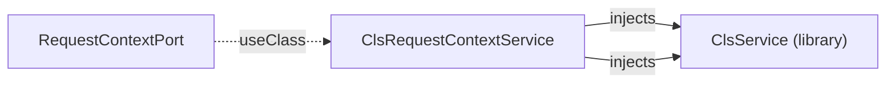

#### DatabaseModule — `src/platform/database/database.module.ts`

imports: InfrastructureModule · exports: PrismaReadPort

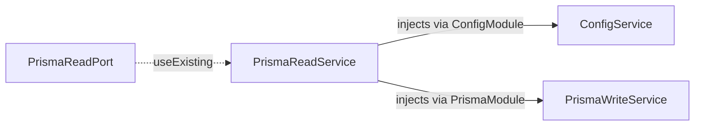

#### EventsModule — `src/platform/events/events.module.ts`

imports: — · exports: InProcessEventBus, MessageRoutingPolicy

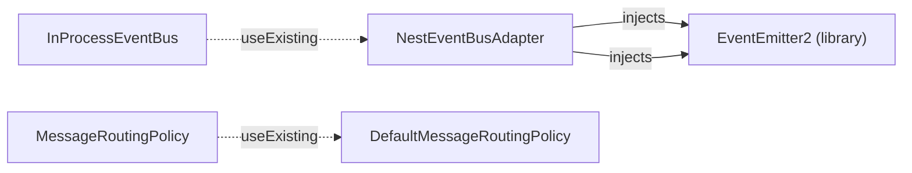

#### MessagingModule (src/platform/messaging) — `src/platform/messaging/messaging.module.ts`

imports: InfraMessagingModule · exports: MessagePublisher, RabbitMqPublisher, KafkaPublisher, SqsPublisher

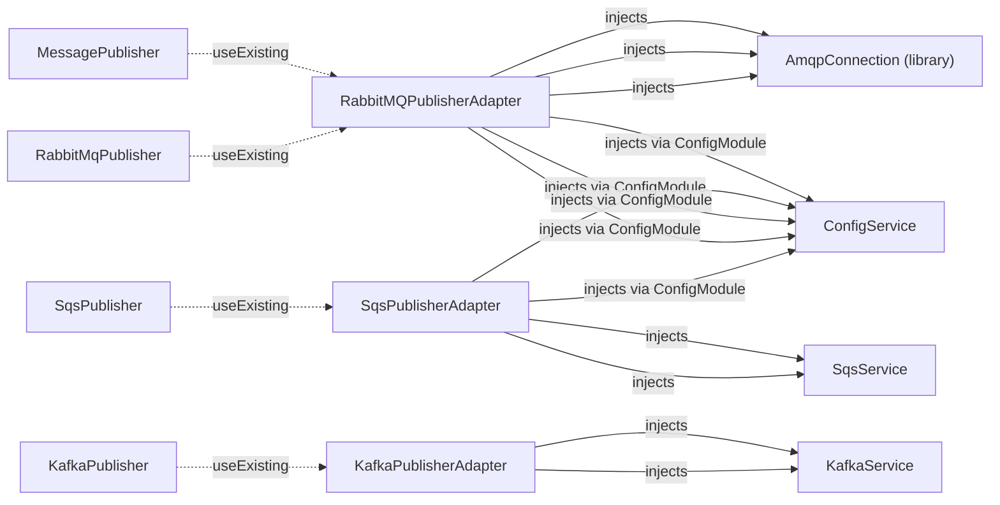

#### OutboxModule — `src/platform/outbox/outbox.module.ts`

imports: MessagingModule, EventsModule, ContextModule · exports: OutboxWriterPort

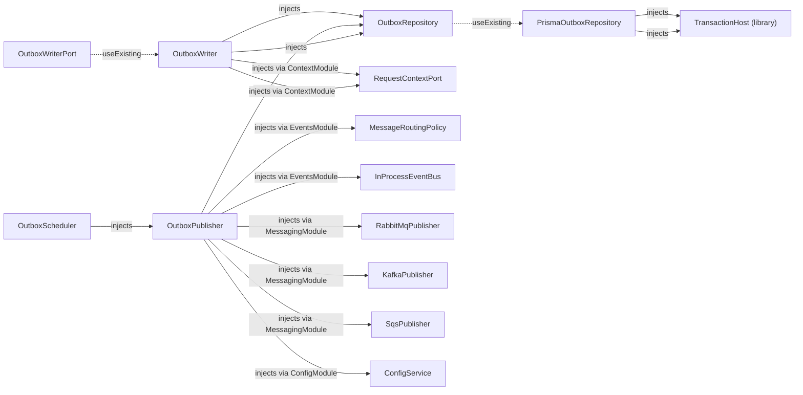

### Platform — capabilities (configuration · audit · numbering · notification · cache · storage · observability)

#### AuditModule — `src/platform/audit/audit.module.ts`

imports: ContextModule · exports: AuditPort

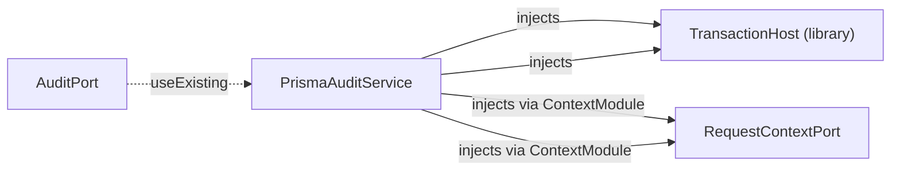

#### CacheModule (src/platform/cache) — `src/platform/cache/cache.module.ts`

imports: — · exports: CachePort

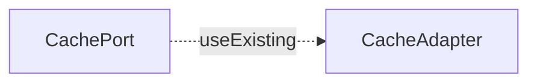

#### ConfigurationModule — `src/platform/configuration/configuration.module.ts`

imports: — · exports: CompanyConfigPort

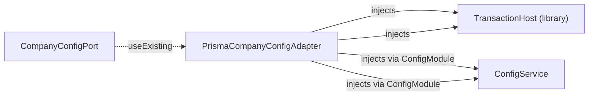

#### NotificationModule (src/platform/notification) — `src/platform/notification/notification.module.ts`

imports: InfraNotificationModule, ObservabilityModule · exports: EmailPort, NotificationPort, NotificationDispatchPort

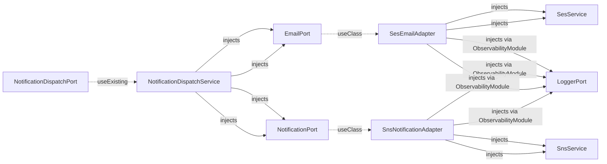

#### NumberingModule — `src/platform/numbering/numbering.module.ts`

imports: — · exports: NumberingPort

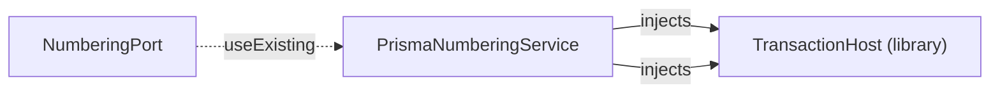

#### ObservabilityModule — `src/platform/observability/observability.module.ts`

imports: — · exports: LoggerPort, MetricsPort, ErrorTrackingPort

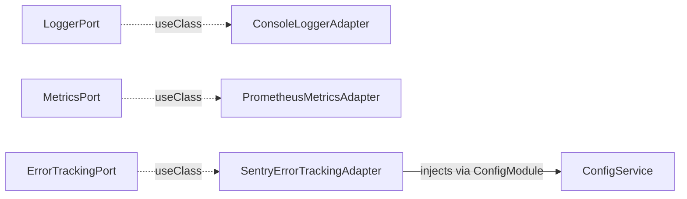

#### StorageModule (src/platform/storage) — `src/platform/storage/storage.module.ts`

imports: InfraStorageModule · exports: FileStoragePort

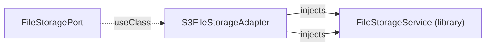

### Platform — services (scheduler · recurring · condition-engine · batch-operation · import)

#### BatchOperationModule — `src/platform/batch-operation/batch-operation.module.ts`

imports: ContextModule, NumberingModule, OutboxModule, BullModule.registerQueue({ name: BATCH_OPERATION_QUEUE_NAME }) · exports: BatchOperationHandlerRegistry, CreateBatchOperationJobPort, ValidateBatchOperationPort, ProcessBatchOperationRowPort, GetBatchOperationJobStatusPort, ListBatchOperationJobsPort, ListBatchOperationJobRowsPort, CancelBatchOperationJobPort

```mermaid
flowchart LR
    BatchOperationJobRepositoryPort["BatchOperationJobRepositoryPort"]
    PrismaBatchOperationJobRepository["PrismaBatchOperationJobRepository"]
    BatchOperationJobRepositoryPort -.->|useExisting| PrismaBatchOperationJobRepository
    BatchOperationJobRowRepositoryPort["BatchOperationJobRowRepositoryPort"]
    BatchOperationJobRowRepositoryPort -.->|useExisting| PrismaBatchOperationJobRepository
    BatchOperationJobOutboxWriterPort["BatchOperationJobOutboxWriterPort"]
    PrismaBatchOperationJobOutboxWriter["PrismaBatchOperationJobOutboxWriter"]
    BatchOperationJobOutboxWriterPort -.->|useExisting| PrismaBatchOperationJobOutboxWriter
    BatchOperationQueuePublisherPort["BatchOperationQueuePublisherPort"]
    BullMqBatchOperationQueuePublisher["BullMqBatchOperationQueuePublisher"]
    BatchOperationQueuePublisherPort -.->|useExisting| BullMqBatchOperationQueuePublisher
    CreateBatchOperationJobPort["CreateBatchOperationJobPort"]
    CreateBatchOperationJobUseCase["CreateBatchOperationJobUseCase"]
    CreateBatchOperationJobPort -.->|useExisting| CreateBatchOperationJobUseCase
    ValidateBatchOperationPort["ValidateBatchOperationPort"]
    ValidateBatchOperationUseCase["ValidateBatchOperationUseCase"]
    ValidateBatchOperationPort -.->|useExisting| ValidateBatchOperationUseCase
    ProcessBatchOperationRowPort["ProcessBatchOperationRowPort"]
    ProcessBatchOperationRowUseCase["ProcessBatchOperationRowUseCase"]
    ProcessBatchOperationRowPort -.->|useExisting| ProcessBatchOperationRowUseCase
    GetBatchOperationJobStatusPort["GetBatchOperationJobStatusPort"]
    GetBatchOperationJobStatusUseCase["GetBatchOperationJobStatusUseCase"]
    GetBatchOperationJobStatusPort -.->|useExisting| GetBatchOperationJobStatusUseCase
    ListBatchOperationJobsPort["ListBatchOperationJobsPort"]
    ListBatchOperationJobsUseCase["ListBatchOperationJobsUseCase"]
    ListBatchOperationJobsPort -.->|useExisting| ListBatchOperationJobsUseCase
    ListBatchOperationJobRowsPort["ListBatchOperationJobRowsPort"]
    ListBatchOperationJobRowsUseCase["ListBatchOperationJobRowsUseCase"]
    ListBatchOperationJobRowsPort -.->|useExisting| ListBatchOperationJobRowsUseCase
    CancelBatchOperationJobPort["CancelBatchOperationJobPort"]
    CancelBatchOperationJobUseCase["CancelBatchOperationJobUseCase"]
    CancelBatchOperationJobPort -.->|useExisting| CancelBatchOperationJobUseCase
    BatchOperationController["BatchOperationController"]
    BatchOperationController -->|injects| CreateBatchOperationJobPort
    BatchOperationController -->|injects| ValidateBatchOperationPort
    BatchOperationController -->|injects| GetBatchOperationJobStatusPort
    BatchOperationController -->|injects| ListBatchOperationJobsPort
    BatchOperationController -->|injects| ListBatchOperationJobRowsPort
    BatchOperationController -->|injects| CancelBatchOperationJobPort
    BatchOperationHandlerRegistry["BatchOperationHandlerRegistry"]
    BatchOperationController -->|injects| BatchOperationHandlerRegistry
    RequestContextPort["RequestContextPort"]
    BatchOperationController -->|injects via ContextModule| RequestContextPort
    TransactionHost__library_["TransactionHost (library)"]
    PrismaBatchOperationJobRepository -->|injects| TransactionHost__library_
    PrismaBatchOperationJobRepository -->|injects| TransactionHost__library_
    PrismaBatchOperationJobRepository -->|injects| TransactionHost__library_
    OutboxWriterPort["OutboxWriterPort"]
    PrismaBatchOperationJobOutboxWriter -->|injects via OutboxModule| OutboxWriterPort
    PrismaBatchOperationJobOutboxWriter -->|injects via OutboxModule| OutboxWriterPort
    Queue__library_["Queue (library)"]
    BullMqBatchOperationQueuePublisher -->|injects| Queue__library_
    ConfigService["ConfigService"]
    BullMqBatchOperationQueuePublisher -->|injects via ConfigModule| ConfigService
    BullMqBatchOperationQueuePublisher -->|injects| Queue__library_
    BullMqBatchOperationQueuePublisher -->|injects via ConfigModule| ConfigService
    BullMqBatchOperationWorker["BullMqBatchOperationWorker"]
    BatchOperationWorker["BatchOperationWorker"]
    BullMqBatchOperationWorker -->|injects| BatchOperationWorker
    BatchOperationWorker -->|injects| BatchOperationJobRepositoryPort
    BatchOperationWorker -->|injects| BatchOperationJobRowRepositoryPort
    BatchOperationWorker -->|injects| ProcessBatchOperationRowPort
    BatchOperationWorker -->|injects| BatchOperationJobOutboxWriterPort
    BatchOperationReconciliationConsumer["BatchOperationReconciliationConsumer"]
    BatchOperationReconciliationConsumer -->|injects| BatchOperationJobRepositoryPort
    BatchOperationReconciliationConsumer -->|injects| BatchOperationJobRowRepositoryPort
    BatchOperationReconciliationConsumer -->|injects| BatchOperationQueuePublisherPort
    BatchOperationReconciliationConsumer -->|injects via ConfigModule| ConfigService
    CreateBatchOperationJobUseCase -->|injects| BatchOperationJobRepositoryPort
    CreateBatchOperationJobUseCase -->|injects| BatchOperationHandlerRegistry
    CreateBatchOperationJobUseCase -->|injects| BatchOperationWorker
    CreateBatchOperationJobUseCase -->|injects| BatchOperationQueuePublisherPort
    NumberingPort["NumberingPort"]
    CreateBatchOperationJobUseCase -->|injects via NumberingModule| NumberingPort
    CreateBatchOperationJobUseCase -->|injects via ConfigModule| ConfigService
    CreateBatchOperationJobUseCase -->|injects| BatchOperationJobRepositoryPort
    CreateBatchOperationJobUseCase -->|injects| BatchOperationHandlerRegistry
    CreateBatchOperationJobUseCase -->|injects| BatchOperationWorker
    CreateBatchOperationJobUseCase -->|injects| BatchOperationQueuePublisherPort
    CreateBatchOperationJobUseCase -->|injects via NumberingModule| NumberingPort
    CreateBatchOperationJobUseCase -->|injects via ConfigModule| ConfigService
    ValidateBatchOperationUseCase -->|injects| BatchOperationHandlerRegistry
    ValidateBatchOperationUseCase -->|injects| BatchOperationHandlerRegistry
    ProcessBatchOperationRowUseCase -->|injects| BatchOperationJobRepositoryPort
    ProcessBatchOperationRowUseCase -->|injects| BatchOperationJobRowRepositoryPort
    ProcessBatchOperationRowUseCase -->|injects| BatchOperationHandlerRegistry
    ProcessBatchOperationRowUseCase -->|injects via ConfigModule| ConfigService
    ProcessBatchOperationRowUseCase -->|injects| BatchOperationJobRepositoryPort
    ProcessBatchOperationRowUseCase -->|injects| BatchOperationJobRowRepositoryPort
    ProcessBatchOperationRowUseCase -->|injects| BatchOperationHandlerRegistry
    ProcessBatchOperationRowUseCase -->|injects via ConfigModule| ConfigService
    GetBatchOperationJobStatusUseCase -->|injects| BatchOperationJobRepositoryPort
    GetBatchOperationJobStatusUseCase -->|injects| BatchOperationJobRepositoryPort
    ListBatchOperationJobsUseCase -->|injects| BatchOperationJobRepositoryPort
    ListBatchOperationJobsUseCase -->|injects| BatchOperationJobRepositoryPort
    ListBatchOperationJobRowsUseCase -->|injects| BatchOperationJobRepositoryPort
    ListBatchOperationJobRowsUseCase -->|injects| BatchOperationJobRowRepositoryPort
    ListBatchOperationJobRowsUseCase -->|injects| BatchOperationJobRepositoryPort
    ListBatchOperationJobRowsUseCase -->|injects| BatchOperationJobRowRepositoryPort
    CancelBatchOperationJobUseCase -->|injects| BatchOperationJobRepositoryPort
    CancelBatchOperationJobUseCase -->|injects| BatchOperationJobRowRepositoryPort
    CancelBatchOperationJobUseCase -->|injects| BatchOperationJobRepositoryPort
    CancelBatchOperationJobUseCase -->|injects| BatchOperationJobRowRepositoryPort
```

#### ConditionEngineModule — `src/platform/condition-engine/condition-engine.module.ts`

imports: — · exports: ConditionEvaluator, FieldResolverRegistry

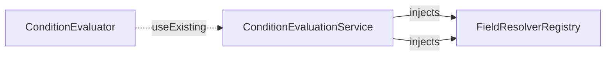

#### ImportModule — `src/platform/import/import.module.ts`

imports: ContextModule, NumberingModule, OutboxModule, StorageModule, BullModule.registerQueue({ name: IMPORT_QUEUE_NAME }) · exports: ImportHandlerRegistry, InitImportPort, CreateImportUploadPort, CreateImportJobPort, GetImportPreviewPort, UpdateImportMappingPort, GetImportReportPort, ExecuteImportJobPort, CancelImportJobPort, GetImportJobStatusPort, ListImportJobsPort

```mermaid
flowchart LR
    StorageObjectRepositoryPort["StorageObjectRepositoryPort"]
    PrismaStorageObjectRepository["PrismaStorageObjectRepository"]
    StorageObjectRepositoryPort -.->|useExisting| PrismaStorageObjectRepository
    ImportJobRepositoryPort["ImportJobRepositoryPort"]
    PrismaImportJobRepository["PrismaImportJobRepository"]
    ImportJobRepositoryPort -.->|useExisting| PrismaImportJobRepository
    ImportJobRowRepositoryPort["ImportJobRowRepositoryPort"]
    PrismaImportJobRowRepository["PrismaImportJobRowRepository"]
    ImportJobRowRepositoryPort -.->|useExisting| PrismaImportJobRowRepository
    ImportJobOutboxWriterPort["ImportJobOutboxWriterPort"]
    PrismaImportJobOutboxWriter["PrismaImportJobOutboxWriter"]
    ImportJobOutboxWriterPort -.->|useExisting| PrismaImportJobOutboxWriter
    ImportQueuePublisherPort["ImportQueuePublisherPort"]
    BullMqImportQueuePublisher["BullMqImportQueuePublisher"]
    ImportQueuePublisherPort -.->|useExisting| BullMqImportQueuePublisher
    InitImportPort["InitImportPort"]
    InitImportUseCase["InitImportUseCase"]
    InitImportPort -.->|useExisting| InitImportUseCase
    CreateImportUploadPort["CreateImportUploadPort"]
    CreateImportUploadUseCase["CreateImportUploadUseCase"]
    CreateImportUploadPort -.->|useExisting| CreateImportUploadUseCase
    CreateImportJobPort["CreateImportJobPort"]
    CreateImportJobUseCase["CreateImportJobUseCase"]
    CreateImportJobPort -.->|useExisting| CreateImportJobUseCase
    GetImportPreviewPort["GetImportPreviewPort"]
    GetImportPreviewUseCase["GetImportPreviewUseCase"]
    GetImportPreviewPort -.->|useExisting| GetImportPreviewUseCase
    UpdateImportMappingPort["UpdateImportMappingPort"]
    UpdateImportMappingUseCase["UpdateImportMappingUseCase"]
    UpdateImportMappingPort -.->|useExisting| UpdateImportMappingUseCase
    GetImportReportPort["GetImportReportPort"]
    GetImportReportUseCase["GetImportReportUseCase"]
    GetImportReportPort -.->|useExisting| GetImportReportUseCase
    ExecuteImportJobPort["ExecuteImportJobPort"]
    ExecuteImportJobUseCase["ExecuteImportJobUseCase"]
    ExecuteImportJobPort -.->|useExisting| ExecuteImportJobUseCase
    CancelImportJobPort["CancelImportJobPort"]
    CancelImportJobUseCase["CancelImportJobUseCase"]
    CancelImportJobPort -.->|useExisting| CancelImportJobUseCase
    GetImportJobStatusPort["GetImportJobStatusPort"]
    GetImportJobStatusUseCase["GetImportJobStatusUseCase"]
    GetImportJobStatusPort -.->|useExisting| GetImportJobStatusUseCase
    ListImportJobsPort["ListImportJobsPort"]
    ListImportJobsUseCase["ListImportJobsUseCase"]
    ListImportJobsPort -.->|useExisting| ListImportJobsUseCase
    ParseImportJobPort["ParseImportJobPort"]
    ParseImportJobUseCase["ParseImportJobUseCase"]
    ParseImportJobPort -.->|useExisting| ParseImportJobUseCase
    ValidateImportJobPort["ValidateImportJobPort"]
    ValidateImportJobUseCase["ValidateImportJobUseCase"]
    ValidateImportJobPort -.->|useExisting| ValidateImportJobUseCase
    RunImportExecutionPort["RunImportExecutionPort"]
    RunImportExecutionUseCase["RunImportExecutionUseCase"]
    RunImportExecutionPort -.->|useExisting| RunImportExecutionUseCase
    ImportController["ImportController"]
    ImportController -->|injects| InitImportPort
    ImportController -->|injects| CreateImportUploadPort
    ImportController -->|injects| CreateImportJobPort
    ImportController -->|injects| GetImportPreviewPort
    ImportController -->|injects| UpdateImportMappingPort
    ImportController -->|injects| GetImportReportPort
    ImportController -->|injects| ExecuteImportJobPort
    ImportController -->|injects| CancelImportJobPort
    ImportController -->|injects| GetImportJobStatusPort
    ImportController -->|injects| ListImportJobsPort
    ImportHandlerRegistry["ImportHandlerRegistry"]
    ImportController -->|injects| ImportHandlerRegistry
    RequestContextPort["RequestContextPort"]
    ImportController -->|injects via ContextModule| RequestContextPort
    TransactionHost__library_["TransactionHost (library)"]
    PrismaStorageObjectRepository -->|injects| TransactionHost__library_
    PrismaStorageObjectRepository -->|injects| TransactionHost__library_
    PrismaImportJobRepository -->|injects| TransactionHost__library_
    PrismaImportJobRepository -->|injects| TransactionHost__library_
    PrismaImportJobRowRepository -->|injects| TransactionHost__library_
    PrismaImportJobRowRepository -->|injects| TransactionHost__library_
    OutboxWriterPort["OutboxWriterPort"]
    PrismaImportJobOutboxWriter -->|injects via OutboxModule| OutboxWriterPort
    PrismaImportJobOutboxWriter -->|injects via OutboxModule| OutboxWriterPort
    Queue__library_["Queue (library)"]
    BullMqImportQueuePublisher -->|injects| Queue__library_
    ConfigService["ConfigService"]
    BullMqImportQueuePublisher -->|injects via ConfigModule| ConfigService
    BullMqImportQueuePublisher -->|injects| Queue__library_
    BullMqImportQueuePublisher -->|injects via ConfigModule| ConfigService
    BullMqImportWorker["BullMqImportWorker"]
    BullMqImportWorker -->|injects| ParseImportJobPort
    BullMqImportWorker -->|injects| ValidateImportJobPort
    BullMqImportWorker -->|injects| RunImportExecutionPort
    ImportReconciliationConsumer["ImportReconciliationConsumer"]
    ImportReconciliationConsumer -->|injects via ConfigModule| ConfigService
    ImportReconciliationConsumer -->|injects| ImportJobRepositoryPort
    ImportReconciliationConsumer -->|injects| ImportJobRowRepositoryPort
    ImportReconciliationConsumer -->|injects| ImportJobOutboxWriterPort
    InitImportUseCase -->|injects| ImportHandlerRegistry
    InitImportUseCase -->|injects| ImportJobRepositoryPort
    InitImportUseCase -->|injects| ImportHandlerRegistry
    InitImportUseCase -->|injects| ImportJobRepositoryPort
    CreateImportUploadUseCase -->|injects| ImportHandlerRegistry
    CreateImportUploadUseCase -->|injects via ConfigModule| ConfigService
    FileStoragePort["FileStoragePort"]
    CreateImportUploadUseCase -->|injects via StorageModule| FileStoragePort
    CreateImportUploadUseCase -->|injects| StorageObjectRepositoryPort
    CreateImportUploadUseCase -->|injects| ImportHandlerRegistry
    CreateImportUploadUseCase -->|injects via ConfigModule| ConfigService
    CreateImportUploadUseCase -->|injects via StorageModule| FileStoragePort
    CreateImportUploadUseCase -->|injects| StorageObjectRepositoryPort
    CreateImportJobUseCase -->|injects| ImportHandlerRegistry
    CreateImportJobUseCase -->|injects via ConfigModule| ConfigService
    CreateImportJobUseCase -->|injects via StorageModule| FileStoragePort
    NumberingPort["NumberingPort"]
    CreateImportJobUseCase -->|injects via NumberingModule| NumberingPort
    CreateImportJobUseCase -->|injects| StorageObjectRepositoryPort
    CreateImportJobUseCase -->|injects| ImportJobRepositoryPort
    CreateImportJobUseCase -->|injects| ImportQueuePublisherPort
    CreateImportJobUseCase -->|injects| ImportHandlerRegistry
    CreateImportJobUseCase -->|injects via ConfigModule| ConfigService
    CreateImportJobUseCase -->|injects via StorageModule| FileStoragePort
    CreateImportJobUseCase -->|injects via NumberingModule| NumberingPort
    CreateImportJobUseCase -->|injects| StorageObjectRepositoryPort
    CreateImportJobUseCase -->|injects| ImportJobRepositoryPort
    CreateImportJobUseCase -->|injects| ImportQueuePublisherPort
    GetImportPreviewUseCase -->|injects| ImportJobRepositoryPort
    GetImportPreviewUseCase -->|injects| ImportJobRowRepositoryPort
    GetImportPreviewUseCase -->|injects via ConfigModule| ConfigService
    GetImportPreviewUseCase -->|injects| ImportJobRepositoryPort
    GetImportPreviewUseCase -->|injects| ImportJobRowRepositoryPort
    GetImportPreviewUseCase -->|injects via ConfigModule| ConfigService
    UpdateImportMappingUseCase -->|injects| ImportJobRepositoryPort
    UpdateImportMappingUseCase -->|injects| ImportQueuePublisherPort
    UpdateImportMappingUseCase -->|injects| ImportJobRepositoryPort
    UpdateImportMappingUseCase -->|injects| ImportQueuePublisherPort
    GetImportReportUseCase -->|injects| ImportJobRepositoryPort
    GetImportReportUseCase -->|injects| ImportJobRowRepositoryPort
    GetImportReportUseCase -->|injects| ImportJobRepositoryPort
    GetImportReportUseCase -->|injects| ImportJobRowRepositoryPort
    ExecuteImportJobUseCase -->|injects| ImportJobRepositoryPort
    ExecuteImportJobUseCase -->|injects| ImportQueuePublisherPort
    ExecuteImportJobUseCase -->|injects| ImportJobRepositoryPort
    ExecuteImportJobUseCase -->|injects| ImportQueuePublisherPort
    CancelImportJobUseCase -->|injects| ImportJobRepositoryPort
    CancelImportJobUseCase -->|injects| ImportJobOutboxWriterPort
    CancelImportJobUseCase -->|injects| ImportJobRepositoryPort
    CancelImportJobUseCase -->|injects| ImportJobOutboxWriterPort
    GetImportJobStatusUseCase -->|injects| ImportJobRepositoryPort
    GetImportJobStatusUseCase -->|injects| ImportJobRepositoryPort
    ListImportJobsUseCase -->|injects| ImportJobRepositoryPort
    ListImportJobsUseCase -->|injects| ImportJobRepositoryPort
    ParseImportJobUseCase -->|injects via ConfigModule| ConfigService
    ParseImportJobUseCase -->|injects via StorageModule| FileStoragePort
    ParseImportJobUseCase -->|injects| ImportJobRepositoryPort
    ParseImportJobUseCase -->|injects| ImportJobRowRepositoryPort
    ParseImportJobUseCase -->|injects| StorageObjectRepositoryPort
    ParseImportJobUseCase -->|injects| ImportJobOutboxWriterPort
    ParseImportJobUseCase -->|injects via ConfigModule| ConfigService
    ParseImportJobUseCase -->|injects via StorageModule| FileStoragePort
    ParseImportJobUseCase -->|injects| ImportJobRepositoryPort
    ParseImportJobUseCase -->|injects| ImportJobRowRepositoryPort
    ParseImportJobUseCase -->|injects| StorageObjectRepositoryPort
    ParseImportJobUseCase -->|injects| ImportJobOutboxWriterPort
    ValidateImportJobUseCase -->|injects| ImportHandlerRegistry
    ValidateImportJobUseCase -->|injects via ConfigModule| ConfigService
    ValidateImportJobUseCase -->|injects| ImportJobRepositoryPort
    ValidateImportJobUseCase -->|injects| ImportJobRowRepositoryPort
    ValidateImportJobUseCase -->|injects| ImportJobOutboxWriterPort
    ValidateImportJobUseCase -->|injects| ImportHandlerRegistry
    ValidateImportJobUseCase -->|injects via ConfigModule| ConfigService
    ValidateImportJobUseCase -->|injects| ImportJobRepositoryPort
    ValidateImportJobUseCase -->|injects| ImportJobRowRepositoryPort
    ValidateImportJobUseCase -->|injects| ImportJobOutboxWriterPort
    RunImportExecutionUseCase -->|injects| ImportHandlerRegistry
    RunImportExecutionUseCase -->|injects via ConfigModule| ConfigService
    RunImportExecutionUseCase -->|injects| ImportJobRepositoryPort
    RunImportExecutionUseCase -->|injects| ImportJobRowRepositoryPort
    RunImportExecutionUseCase -->|injects| ImportJobOutboxWriterPort
    RunImportExecutionUseCase -->|injects| ImportHandlerRegistry
    RunImportExecutionUseCase -->|injects via ConfigModule| ConfigService
    RunImportExecutionUseCase -->|injects| ImportJobRepositoryPort
    RunImportExecutionUseCase -->|injects| ImportJobRowRepositoryPort
    RunImportExecutionUseCase -->|injects| ImportJobOutboxWriterPort
```

#### RecurringModule — `src/platform/recurring/recurring.module.ts`

imports: ContextModule, OutboxModule, SchedulerModule, ConditionEngineModule · exports: RecurringGeneratorRegistry, RecurringExecutionPort, CreateRecurringTemplateUseCase

```mermaid
flowchart LR
    RecurringTemplateRepositoryPort["RecurringTemplateRepositoryPort"]
    PrismaRecurringTemplateRepository["PrismaRecurringTemplateRepository"]
    RecurringTemplateRepositoryPort -.->|useExisting| PrismaRecurringTemplateRepository
    RecurringExecutionRepositoryPort["RecurringExecutionRepositoryPort"]
    PrismaRecurringExecutionRepository["PrismaRecurringExecutionRepository"]
    RecurringExecutionRepositoryPort -.->|useExisting| PrismaRecurringExecutionRepository
    RecurringExecutionPort["RecurringExecutionPort"]
    RecurringExecutionFacade["RecurringExecutionFacade"]
    RecurringExecutionPort -.->|useExisting| RecurringExecutionFacade
    RecurringTemplateController["RecurringTemplateController"]
    CreateRecurringTemplateUseCase["CreateRecurringTemplateUseCase"]
    RecurringTemplateController -->|injects| CreateRecurringTemplateUseCase
    PauseRecurringTemplateUseCase["PauseRecurringTemplateUseCase"]
    RecurringTemplateController -->|injects| PauseRecurringTemplateUseCase
    ResumeRecurringTemplateUseCase["ResumeRecurringTemplateUseCase"]
    RecurringTemplateController -->|injects| ResumeRecurringTemplateUseCase
    CancelRecurringTemplateUseCase["CancelRecurringTemplateUseCase"]
    RecurringTemplateController -->|injects| CancelRecurringTemplateUseCase
    GetRecurringTemplateUseCase["GetRecurringTemplateUseCase"]
    RecurringTemplateController -->|injects| GetRecurringTemplateUseCase
    ListRecurringTemplatesUseCase["ListRecurringTemplatesUseCase"]
    RecurringTemplateController -->|injects| ListRecurringTemplatesUseCase
    RequestContextPort["RequestContextPort"]
    RecurringTemplateController -->|injects via ContextModule| RequestContextPort
    TransactionHost__library_["TransactionHost (library)"]
    PrismaRecurringTemplateRepository -->|injects| TransactionHost__library_
    PrismaRecurringTemplateRepository -->|injects| TransactionHost__library_
    PrismaRecurringExecutionRepository -->|injects| TransactionHost__library_
    PrismaRecurringExecutionRepository -->|injects| TransactionHost__library_
    RecurringGenerationHandler["RecurringGenerationHandler"]
    RecurringGenerationHandler -->|injects| RecurringTemplateRepositoryPort
    RecurringGenerationHandler -->|injects| RecurringExecutionRepositoryPort
    OutboxWriterPort["OutboxWriterPort"]
    RecurringGenerationHandler -->|injects via OutboxModule| OutboxWriterPort
    SchedulerPort["SchedulerPort"]
    RecurringGenerationHandler -->|injects via SchedulerModule| SchedulerPort
    ConditionEvaluator["ConditionEvaluator"]
    RecurringGenerationHandler -->|injects via ConditionEngineModule| ConditionEvaluator
    RecurringExecutionFacade -->|injects| RecurringExecutionRepositoryPort
    RecurringExecutionFacade -->|injects| RecurringExecutionRepositoryPort
    DomainEventDispatcher["DomainEventDispatcher"]
    EventEmitter2__library_["EventEmitter2 (library)"]
    DomainEventDispatcher -->|injects| EventEmitter2__library_
    DomainEventDispatcher -->|injects| RecurringTemplateRepositoryPort
    ScheduledJobHandlerRegistry["ScheduledJobHandlerRegistry"]
    DomainEventDispatcher -->|injects via SchedulerModule| ScheduledJobHandlerRegistry
    CreateRecurringTemplateUseCase -->|injects| RecurringTemplateRepositoryPort
    CreateRecurringTemplateUseCase -->|injects via SchedulerModule| SchedulerPort
    PauseRecurringTemplateUseCase -->|injects| RecurringTemplateRepositoryPort
    PauseRecurringTemplateUseCase -->|injects via SchedulerModule| SchedulerPort
    ResumeRecurringTemplateUseCase -->|injects| RecurringTemplateRepositoryPort
    ResumeRecurringTemplateUseCase -->|injects via SchedulerModule| SchedulerPort
    CancelRecurringTemplateUseCase -->|injects| RecurringTemplateRepositoryPort
    CancelRecurringTemplateUseCase -->|injects via SchedulerModule| SchedulerPort
    GetRecurringTemplateUseCase -->|injects| RecurringTemplateRepositoryPort
    ListRecurringTemplatesUseCase -->|injects| RecurringTemplateRepositoryPort
    RecurringModule_bootstrap["RecurringModule bootstrap"]
    RecurringModule_bootstrap -->|registers or injects| ScheduledJobHandlerRegistry
    RecurringModule_bootstrap -->|registers or injects| RecurringGenerationHandler
```

#### SchedulerModule — `src/platform/scheduler/scheduler.module.ts`

imports: MessagingModule, BullModule.registerQueue({ name: SCHEDULER_QUEUE_NAME }) · exports: SchedulerPort, RegisterScheduledJobPort, CancelScheduledJobPort, RescheduleExternalJobPort, UpdateScheduledJobPort, DispatchDueJobsPort, ReconcileMissedJobsPort, GetScheduledJobStatusPort, ListScheduledJobDispatchLogPort, GetSchedulerHealthMetricsPort, ScheduledJobHandlerRegistry

```mermaid
flowchart LR
    ScheduledJobRepositoryPort["ScheduledJobRepositoryPort"]
    PrismaScheduledJobRepository["PrismaScheduledJobRepository"]
    ScheduledJobRepositoryPort -.->|useExisting| PrismaScheduledJobRepository
    ScheduledJobDispatchLogRepositoryPort["ScheduledJobDispatchLogRepositoryPort"]
    PrismaScheduledJobDispatchLogRepository["PrismaScheduledJobDispatchLogRepository"]
    ScheduledJobDispatchLogRepositoryPort -.->|useExisting| PrismaScheduledJobDispatchLogRepository
    ScheduledJobEditLogRepositoryPort["ScheduledJobEditLogRepositoryPort"]
    PrismaScheduledJobEditLogRepository["PrismaScheduledJobEditLogRepository"]
    ScheduledJobEditLogRepositoryPort -.->|useExisting| PrismaScheduledJobEditLogRepository
    DistributedLockPort["DistributedLockPort"]
    RedisDistributedLockAdapter["RedisDistributedLockAdapter"]
    DistributedLockPort -.->|useExisting| RedisDistributedLockAdapter
    SchedulerEventPublisherPort["SchedulerEventPublisherPort"]
    RabbitMqSchedulerEventPublisher["RabbitMqSchedulerEventPublisher"]
    SchedulerEventPublisherPort -.->|useExisting| RabbitMqSchedulerEventPublisher
    SchedulerJobQueuePort["SchedulerJobQueuePort"]
    BullMqSchedulerJobQueue["BullMqSchedulerJobQueue"]
    SchedulerJobQueuePort -.->|useExisting| BullMqSchedulerJobQueue
    RegisterScheduledJobPort["RegisterScheduledJobPort"]
    RegisterScheduledJobUseCase["RegisterScheduledJobUseCase"]
    RegisterScheduledJobPort -.->|useExisting| RegisterScheduledJobUseCase
    CancelScheduledJobPort["CancelScheduledJobPort"]
    CancelScheduledJobUseCase["CancelScheduledJobUseCase"]
    CancelScheduledJobPort -.->|useExisting| CancelScheduledJobUseCase
    RescheduleExternalJobPort["RescheduleExternalJobPort"]
    RescheduleExternalJobUseCase["RescheduleExternalJobUseCase"]
    RescheduleExternalJobPort -.->|useExisting| RescheduleExternalJobUseCase
    UpdateScheduledJobPort["UpdateScheduledJobPort"]
    UpdateScheduledJobUseCase["UpdateScheduledJobUseCase"]
    UpdateScheduledJobPort -.->|useExisting| UpdateScheduledJobUseCase
    DispatchDueJobsPort["DispatchDueJobsPort"]
    DispatchDueJobsUseCase["DispatchDueJobsUseCase"]
    DispatchDueJobsPort -.->|useExisting| DispatchDueJobsUseCase
    ReconcileMissedJobsPort["ReconcileMissedJobsPort"]
    ReconcileMissedJobsUseCase["ReconcileMissedJobsUseCase"]
    ReconcileMissedJobsPort -.->|useExisting| ReconcileMissedJobsUseCase
    GetScheduledJobStatusPort["GetScheduledJobStatusPort"]
    GetScheduledJobStatusUseCase["GetScheduledJobStatusUseCase"]
    GetScheduledJobStatusPort -.->|useExisting| GetScheduledJobStatusUseCase
    ListScheduledJobDispatchLogPort["ListScheduledJobDispatchLogPort"]
    ListScheduledJobDispatchLogUseCase["ListScheduledJobDispatchLogUseCase"]
    ListScheduledJobDispatchLogPort -.->|useExisting| ListScheduledJobDispatchLogUseCase
    GetSchedulerHealthMetricsPort["GetSchedulerHealthMetricsPort"]
    GetSchedulerHealthMetricsUseCase["GetSchedulerHealthMetricsUseCase"]
    GetSchedulerHealthMetricsPort -.->|useExisting| GetSchedulerHealthMetricsUseCase
    SchedulerPort["SchedulerPort"]
    SchedulerPortFacade["SchedulerPortFacade"]
    SchedulerPort -.->|useExisting| SchedulerPortFacade
    SchedulerController["SchedulerController"]
    SchedulerController -->|injects| GetScheduledJobStatusPort
    SchedulerController -->|injects| ListScheduledJobDispatchLogPort
    SchedulerController -->|injects| UpdateScheduledJobPort
    SchedulerController -->|injects| CancelScheduledJobPort
    SchedulerHealthController["SchedulerHealthController"]
    SchedulerHealthController -->|injects| GetSchedulerHealthMetricsPort
    TransactionHost__library_["TransactionHost (library)"]
    PrismaScheduledJobRepository -->|injects| TransactionHost__library_
    ConfigService["ConfigService"]
    PrismaScheduledJobRepository -->|injects via ConfigModule| ConfigService
    PrismaScheduledJobRepository -->|injects| TransactionHost__library_
    PrismaScheduledJobRepository -->|injects via ConfigModule| ConfigService
    PrismaScheduledJobDispatchLogRepository -->|injects| TransactionHost__library_
    PrismaScheduledJobDispatchLogRepository -->|injects| TransactionHost__library_
    PrismaScheduledJobEditLogRepository -->|injects| TransactionHost__library_
    PrismaScheduledJobEditLogRepository -->|injects| TransactionHost__library_
    RedisService["RedisService"]
    RedisDistributedLockAdapter -->|injects via CacheModule| RedisService
    RedisDistributedLockAdapter -->|injects via CacheModule| RedisService
    RabbitMqPublisher["RabbitMqPublisher"]
    RabbitMqSchedulerEventPublisher -->|injects via MessagingModule| RabbitMqPublisher
    RabbitMqSchedulerEventPublisher -->|injects via MessagingModule| RabbitMqPublisher
    ScheduledJobProcessor["ScheduledJobProcessor"]
    ScheduledJobHandlerRegistry["ScheduledJobHandlerRegistry"]
    ScheduledJobProcessor -->|injects| ScheduledJobHandlerRegistry
    ScheduledJobProcessor -->|injects| SchedulerEventPublisherPort
    Queue__library_["Queue (library)"]
    BullMqSchedulerJobQueue -->|injects| Queue__library_
    BullMqSchedulerJobQueue -->|injects via ConfigModule| ConfigService
    BullMqSchedulerJobQueue -->|injects| Queue__library_
    BullMqSchedulerJobQueue -->|injects via ConfigModule| ConfigService
    BullMqSchedulerJobWorker["BullMqSchedulerJobWorker"]
    BullMqSchedulerJobWorker -->|injects| ScheduledJobProcessor
    BullMqSchedulerJobWorker -->|injects via ConfigModule| ConfigService
    BullMqSchedulerJobWorker -->|injects| ScheduledJobRepositoryPort
    BullMqSchedulerJobWorker -->|injects| ScheduledJobDispatchLogRepositoryPort
    RegisterScheduledJobUseCase -->|injects| ScheduledJobRepositoryPort
    RegisterScheduledJobUseCase -->|injects| ScheduledJobRepositoryPort
    CancelScheduledJobUseCase -->|injects| ScheduledJobRepositoryPort
    CancelScheduledJobUseCase -->|injects| ScheduledJobRepositoryPort
    RescheduleExternalJobUseCase -->|injects| ScheduledJobRepositoryPort
    RescheduleExternalJobUseCase -->|injects| ScheduledJobRepositoryPort
    UpdateScheduledJobUseCase -->|injects| ScheduledJobRepositoryPort
    UpdateScheduledJobUseCase -->|injects| ScheduledJobEditLogRepositoryPort
    UpdateScheduledJobUseCase -->|injects| ScheduledJobRepositoryPort
    UpdateScheduledJobUseCase -->|injects| ScheduledJobEditLogRepositoryPort
    DispatchDueJobsUseCase -->|injects| ScheduledJobRepositoryPort
    DispatchDueJobsUseCase -->|injects| DistributedLockPort
    DispatchDueJobsUseCase -->|injects| SchedulerJobQueuePort
    DispatchDueJobsUseCase -->|injects| ScheduledJobDispatchLogRepositoryPort
    DispatchDueJobsUseCase -->|injects via ConfigModule| ConfigService
    DispatchDueJobsUseCase -->|injects| ScheduledJobRepositoryPort
    DispatchDueJobsUseCase -->|injects| DistributedLockPort
    DispatchDueJobsUseCase -->|injects| SchedulerJobQueuePort
    DispatchDueJobsUseCase -->|injects| ScheduledJobDispatchLogRepositoryPort
    DispatchDueJobsUseCase -->|injects via ConfigModule| ConfigService
    ReconcileMissedJobsUseCase -->|injects| ScheduledJobRepositoryPort
    ReconcileMissedJobsUseCase -->|injects| DistributedLockPort
    ReconcileMissedJobsUseCase -->|injects| ScheduledJobRepositoryPort
    ReconcileMissedJobsUseCase -->|injects| DistributedLockPort
    GetScheduledJobStatusUseCase -->|injects| ScheduledJobRepositoryPort
    GetScheduledJobStatusUseCase -->|injects| ScheduledJobRepositoryPort
    ListScheduledJobDispatchLogUseCase -->|injects| ScheduledJobDispatchLogRepositoryPort
    ListScheduledJobDispatchLogUseCase -->|injects| ScheduledJobDispatchLogRepositoryPort
    GetSchedulerHealthMetricsUseCase -->|injects| ScheduledJobRepositoryPort
    GetSchedulerHealthMetricsUseCase -->|injects| ScheduledJobDispatchLogRepositoryPort
    GetSchedulerHealthMetricsUseCase -->|injects| ScheduledJobRepositoryPort
    GetSchedulerHealthMetricsUseCase -->|injects| ScheduledJobDispatchLogRepositoryPort
    SchedulerPortFacade -->|injects| RegisterScheduledJobPort
    SchedulerPortFacade -->|injects| CancelScheduledJobPort
    SchedulerPortFacade -->|injects| RescheduleExternalJobPort
    SchedulerPortFacade -->|injects| RegisterScheduledJobPort
    SchedulerPortFacade -->|injects| CancelScheduledJobPort
    SchedulerPortFacade -->|injects| RescheduleExternalJobPort
    SchedulerTicker["SchedulerTicker"]
    SchedulerTicker -->|injects| DispatchDueJobsPort
    SchedulerTicker -->|injects| ReconcileMissedJobsPort
    SchedulerTicker -->|injects via ConfigModule| ConfigService
    SchedulerRegistry__library_["SchedulerRegistry (library)"]
    SchedulerTicker -->|injects| SchedulerRegistry__library_
```

### Composition-only modules

#### AppModule — `src/app.module.ts`

imports: ConfigModule, InfrastructureModule, PlatformModule, BusinessModule · exports: —

```mermaid
flowchart LR
    APP_INTERCEPTOR["APP_INTERCEPTOR"]
    ResponseInterceptor["ResponseInterceptor"]
    APP_INTERCEPTOR -.->|useClass| ResponseInterceptor
    APP_FILTER["APP_FILTER"]
    HttpExceptionsFilter["HttpExceptionsFilter"]
    APP_FILTER -.->|useClass| HttpExceptionsFilter
    APP_PIPE["APP_PIPE"]
    AppValidationPipe["AppValidationPipe"]
    APP_PIPE -.->|useClass| AppValidationPipe
    RequestIdInterceptor["RequestIdInterceptor"]
    APP_INTERCEPTOR -.->|useClass| RequestIdInterceptor
    LoggingInterceptor["LoggingInterceptor"]
    APP_INTERCEPTOR -.->|useClass| LoggingInterceptor
    DeviceResponseInterceptor["DeviceResponseInterceptor"]
    APP_INTERCEPTOR -.->|useClass| DeviceResponseInterceptor
    ClsService__library_["ClsService (library)"]
    RequestIdInterceptor -->|injects| ClsService__library_
    LoggingInterceptor -->|injects| ClsService__library_
    DeviceResponseInterceptor -->|injects| ClsService__library_
```

#### BusinessModule — `src/business/business.module.ts`

imports: PartyModule, ProcurementModule, SalesModule · exports: —

_Composition only._

#### PartyModule — `src/business/party/party.module.ts`

imports: VendorModule · exports: —

_Composition only._

#### ProcurementModule — `src/business/procurement/procurement.module.ts`

imports: ProductModule, PurchaseOrderModule, GoodReceiptNoteModule · exports: —

_Composition only._

#### SalesModule — `src/business/sales/sales.module.ts`

imports: InvoiceModule · exports: —

_Composition only._

> Companion: [`docs/FLOWCHARTS.md`](FLOWCHARTS.md) — the runtime flows these wires power.
> `TransactionHost` = CLS-backed transactional Prisma client (write side);
> `PrismaReadPort` is bound in `DatabaseModule` to `PrismaReadService` (read replica).
