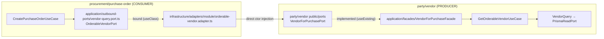

# Flowcharts — How Every Module Works and Communicates

Companion to [`ARCHITECTURE.md`](../ARCHITECTURE.md). Where that document defines the **rules**,
this one draws the **flows**: how a request travels through a business module, how modules talk
to each other and to the platform through ports & adapters, and how each platform service works
internally. Every class, port, and file name here is the real one from `src/`.

## Table of Contents

1. [Legend — the 4 port directions](#1-legend--the-4-port-directions)
2. [Big picture](#2-big-picture)
3. [Write request end-to-end (the golden path)](#3-write-request-end-to-end-the-golden-path)
4. [Read request (query path)](#4-read-request-query-path)
5. [Cross-module communication (3-hop contract chain)](#5-cross-module-communication-3-hop-contract-chain)
6. [Platform services](#6-platform-services)
   - [6.1 Outbox, events & messaging](#61-outbox-events--messaging)
   - [6.2 Scheduler](#62-scheduler)
   - [6.3 Recurring](#63-recurring)
   - [6.4 Batch operation](#64-batch-operation)
   - [6.5 Import](#65-import)
   - [6.6 Condition engine](#66-condition-engine)
7. [End-to-end story: a recurring monthly invoice](#7-end-to-end-story-a-recurring-monthly-invoice)
8. [Opt-in registrations table](#8-opt-in-registrations-who-plugs-into-whom)
9. [Mental-model cheat sheet](#9-mental-model-cheat-sheet)

---

## 1. Legend — the 4 port directions

```text
INBOUND port  = "what the world can ask THIS module to do"   → implemented by a USE CASE (useExisting)
OUTBOUND port = "what THIS module needs from the world"      → implemented by an ADAPTER (useClass)
  ├─ to platform:  infrastructure/adapters/platform/*.adapter.ts   (wraps a @platform port)
  └─ to a module:  infrastructure/adapters/module/*.adapter.ts     (injects another module's public port)
PUBLIC port   = "what THIS module offers to other modules"   → implemented by a FACADE in application/facades/
REGISTRY      = "who may plug a handler in"                  → owner module registers in onApplicationBootstrap
```

All four are **abstract classes used as their own DI token**; every binding lives in the module
file. Dependencies always point **inward**: HTTP / brokers / queues → use cases → domain.

## 2. Big picture

```mermaid
flowchart TD
    UI[Client / UI] -->|x-device-type, x-tenant-id| GW["Global pipeline\nRequestId → Response → Logging → DeviceResponse → AppValidationPipe(Zod)"]
    GW --> BIZ
    subgraph BIZ["BUSINESS (hexagonal aggregates)"]
        PO[procurement/purchase-order]
        GRN[procurement/good-receipt-note]
        PROD[procurement/product]
        VEN[party/vendor]
        INV[sales/invoice]
    end
    BIZ -->|imports PlatformModule, injects port abstractions only| PLAT
    subgraph PLAT["PLATFORM (modular monolith, module + ports per service)"]
        OUTB[outbox] --- EV[events/routing-policy] --- MSG[messaging rabbit/kafka/sqs]
        SCH[scheduler] --- REC[recurring] --- COND[condition-engine]
        BATCH[batch-operation] --- IMP[import]
        NUM[numbering] --- AUD[audit] --- CFG[configuration] --- NOTIF[notification]
        CTX[context CLS] --- DB[database] --- CACHE[cache] --- STORAGE[storage] --- OBS[observability]
    end
    PLAT --> INFRA["INFRASTRUCTURE (clients only: Prisma, RabbitMQ, Kafka, SQS, Redis, S3, SES/SNS, CLS, BullMQ)"]
    INFRA --> EXT[(PostgreSQL) Redis RabbitMQ Kafka SQS S3]
```

Rules this diagram encodes: business never imports `@infrastructure`; platform wraps every
third-party client into a port; `PlatformModule` is **not** `@Global` — each business module
lists `imports: [PlatformModule]` so the dependency is visible in module metadata.

## 3. Write request end-to-end (the golden path)

Example: `POST /purchase-orders` → `CreatePurchaseOrderUseCase`.

```mermaid
sequenceDiagram
    participant C as Client
    participant CTL as PurchaseOrderController
    participant UC as CreatePurchaseOrderUseCase (@Transactional)
    participant OUT as outbound ports
    participant F as PurchaseOrderFactory
    participant A as PurchaseOrder aggregate
    participant CR as PurchaseOrderCommandRepository (TransactionHost)
    participant IP as PurchaseOrderIntegrationPort → OutboxAdapter
    participant OW as platform OutboxWriterPort
    C->>CTL: CreatePurchaseOrderDto (Zod)
    CTL->>UC: execute(input)
    Note over UC: one DB transaction opens
    UC->>OUT: companyConfig.getCompanyConfig() · vendorQueryPort.getOrderableVendor(id)
    UC->>F: create(orderNumber, currency) — enforces invariants/policies, raises PurchaseOrderCreated
    F->>A: instantiate(version 1)
    UC->>CR: save(purchaseOrder) — version written back
    UC->>IP: send(event, id)
    IP->>OW: append(event,'PurchaseOrder',id) → INSERT outbox_messages IN THE SAME TX
    Note over UC: COMMIT — data + event commit atomically; NOTHING published here
    CTL-->>C: {data:{id},message} → ResponseInterceptor envelope
```

Then — asynchronously, the outbox's job, never the business transaction's:

```text
OutboxScheduler (cron 10s) → OutboxPublisher.publishPendingBatch
  → claimBatch (PENDING|FAILED → PUBLISHING)
  → MessageRoutingPolicy.resolve(eventType) → RabbitMQ / Kafka / SQS envelope
    (headers: event-id · request-id · correlation-id)
  → domainEventRegistry rehydrate → InProcessEventBus.emit('PurchaseOrderCreated')
  → PUBLISHED · FAILED retried 1/min ≤ maxAttempts · cleanup hourly
  → module listeners (application/integrations/listeners/*) react:
    @OnEvent / @RabbitSubscribe / @KafkaEvent / @SqsMessageHandler — delegate to use cases only
```

Status machine: `PENDING → PUBLISHING → PUBLISHED | FAILED`.

## 4. Read request (query path)

The query path skips the domain, the transaction and the outbox entirely:

```text
GET /purchase-orders → ListPurchaseOrdersUseCase
  → PurchaseOrderQuery port (application/queries/)
  → PrismaPurchaseOrderQueryRepository (PrismaReadPort = replica client)
  → plain PurchaseOrderQueryRecord
  → @DeviceResponse picks web/mobile Zod response DTO per x-device-type
```

## 5. Cross-module communication (3-hop contract chain)

Modules **never import each other's internals** — only another module's `public/**` and their own
consumer-owned `application/outbound-ports/**`. Nest `imports` exist only to make the producer's
exported provider resolvable; the use case injects its outbound port directly.



Full contract map in this repo:

```text
PurchaseOrder ──PurchasableProductPort──▶ ProductModule: ProductForPurchaseFacade
              ──OrderableVendorPort────▶ VendorModule:   VendorForPurchaseFacade
GoodReceiptNote ──PurchaseOrderPort────▶ PurchaseOrderModule: PurchaseOrderForGrnFacade

PurchaseOrderModule exposes PurchaseOrderForGrnPort  (public/) → consumed by GRN adapter
GoodReceiptNoteModule exposes GrnForPurchaseOrderPort(public/) → reserved
InvoiceModule        exposes InvoiceForReportsPort   (public/) → reserved
```

Business rules encoded in these paths: only **ACTIVE** products are purchasable; only **ACTIVE**
vendors are orderable (non-orderable ⇒ `ConflictException`).

## 6. Platform services

### 6.1 Outbox, events & messaging

Covered in [§3](#3-write-request-end-to-end-the-golden-path). One addition — fan-out is explicit
in exactly one file, `platform/events/message-routing.policy.ts`:

```text
FAN_OUT_EVENTS: ProductCreated/VendorCreated/PurchaseOrderCreated/GrnCreated/InvoiceCreated
              → ['rabbitmq','kafka','sqs']        everything else → ['rabbitmq']
```

Kafka/SQS adapters self-disable until `KAFKA_BROKERS` / `SQS_URL` are configured.
The same envelope shape rides all three transports.

### 6.2 Scheduler

```text
writes:  SchedulerPort facade + 9 granular ports (register/cancel/reschedule/update/…)
         DB is the source of truth: scheduled_jobs (+ scheduled_job_dispatch_log / _edit_log)

SchedulerTicker (SCHEDULER_POLL_INTERVAL_MS, default 30s)
  └▶ DispatchDueJobsUseCase:
       claimDue (FOR UPDATE SKIP LOCKED, PENDING→CLAIMED)
       └▶ per job: DistributedLockPort (Redis SET NX PX) — fail closed
            └▶ SchedulerJobQueuePort → BullMQ 'scheduler.jobs' (jobId = idempotencyKey)
            └▶ CRON mode: recompute nextRunAt · EXTERNAL mode: stay CLAIMED until handler reschedules
BullMqSchedulerJobWorker ─▶ ScheduledJobProcessor:
  ├─ ScheduledJobHandlerRegistry.has(jobType)? ─▶ handler.handle(payload)   [in-process, opt-in]
  └─ else ─▶ SchedulerEventPublisherPort → RabbitMQ 'scheduler.job.<jobType>' [external subscriber]
ReconcileMissedJobsUseCase (interval): releases stale CLAIMED rows; CRON skip-to-next; EXTERNAL catch-up
ops:   /scheduled-jobs (list/get/dispatch-log/patch+version/cancel) · /scheduler/health
```

### 6.3 Recurring

```text
POST /recurring-templates ─▶ CreateRecurringTemplateUseCase
   [ONE TX: recurring_templates row + (TIME only) scheduled_jobs row via SchedulerPort.schedule]

scheduler fires jobType 'Recurring' ─▶ RecurringGenerationHandler
   (registered by RecurringModule itself in onApplicationBootstrap):
  1. triggerKey = run-date (TIME) | sourceEventId (EVENT)
  2. executionRepository.claim — unique (templateId, triggerKey) IS the idempotency; null ⇒ exit clean
  3. generationCondition? ─▶ ConditionEvaluator (fields via FieldResolverRegistry)
       not passed ⇒ execution.skip('ConditionNotMet') + reschedule
  4. pass ⇒ OutboxWriterPort.append(RecurringOccurrenceRequested)
       (the platform NEVER creates documents — consumers own their domain rules)
  5. reschedule: nextRunDate ─▶ template.update + SchedulerPort.rescheduleByAggregate
     past endDate ⇒ template COMPLETED + cancelByAggregate

EVENT-triggered templates: no scheduled_jobs row — DomainEventDispatcher (eventEmitter.onAny)
matches ACTIVE templates by eventName and calls the SAME handler with jobId: null.

consumers report back via RecurringExecutionPort.complete/fail(executionId, snapshot)
```

### 6.4 Batch operation

```text
POST /batch-operations {aggregateType, operationCode, entityIds}
 ─▶ CreateBatchOperationJobUseCase:
      BatchOperationHandlerRegistry.resolveHandler + assertOperationSupported
      dedupe/limit checks → SYNC (≤ syncThreshold) or ASYNC
      [ONE TX: batch_operation_jobs header + one PENDING row per entity]
  ├─ SYNC:  BatchOperationWorker.processChunk in-process        → HTTP 200 with per-row results
  └─ ASYNC: BatchOperationQueuePublisherPort → BullMQ 'batch-operation.chunks' → HTTP 202

per row: ProcessBatchOperationRowUseCase
  claim (UPDATE … WHERE status='PENDING' ⇒ the only execution idempotency)
  ─▶ handler.validate() → SKIPPED? handler.execute() → SUCCESS/FAILED
  ─▶ the business handler delegates to the aggregate's OWN single-record use case
     (a batch-moved PO is indistinguishable from a hand-moved one)
counters bump per row (processed/success/failed/skipped) → finalise
  ─▶ BatchOperationJobOutboxWriterPort → BatchOperationJobCompleted event
Reconciliation cron (5m): reset stuck PROCESSING rows, re-dispatch orphaned PENDING chunks
dry-run: POST /batch-operations/validate → per-record preview, nothing persisted
```

### 6.5 Import

```text
POST /import/uploads  ─▶ FileStoragePort.createPresignedUpload (browser PUTs straight to S3)
                          + storage_objects row (UPLOADED/CLEAN markers)
POST /import/jobs     ─▶ [TX] import_jobs row (descriptor snapshot) + BullMQ parse job
Parse    ─▶ xlsx/CSV → headers detection → suggested ColumnMapping → sample rows → /preview
PATCH /import/jobs/:id/mapping ─▶ enqueue VALIDATE (chunked): generic structural checks
                                  + handler.validateBatch (domain verdicts per row, never aborts job)
POST /import/jobs/:id/execute ─▶ handler.executeBatch — ONE transaction per row, owned by the
                                  domain use case → APPLIED/FAILED/SKIPPED per row + progress
terminal ─▶ ImportJobCompleted/Failed/Cancelled → outbox → RabbitMQ; error report as StorageObject
Reconciliation cron: stale heartbeat jobs → FAILED; cancel flag honored between chunks
```

### 6.6 Condition engine

```text
ConditionEvaluator.evaluate(GenerationCondition{logic, clauses}, EvaluationContext)
  ─▶ FieldResolverRegistry.resolve('stock_balance.qtyOnHand') by prefix
       resolvers are registered BY THE DATA-OWNING module (opt-in) — engine imports no module
  ─▶ pure AND/OR walker: eq neq gt gte lt lte in notIn
  ─▶ { passed, evaluatedValues }  · unknown field ⇒ UnregisteredFieldError (config bug, not "false")
```

## 7. End-to-end story: a recurring monthly invoice

```text
User (one call):  POST /recurring-templates
   {targetEntityType:'Invoice', partyId:<customer>, partyType:'CUSTOMER',
    triggerType:'TIME', frequency:'MONTHLY', interval:1, startDate, lines:[…], autoPost:true}

every 30s:  SchedulerTicker claims the due scheduled_jobs row → Redis lock → BullMQ
            → processor → 'Recurring' handler (RecurringModule's opt-in)
            → claim(execution exec-1, idempotent) → condition gate → outbox:
              RecurringOccurrenceRequested → reschedule next month

every 10s:  OutboxScheduler publishes to RabbitMQ (routing key RecurringOccurrenceRequested)

sales/invoice module:
  RecurringOccurrenceRequestedRabbitMQListener (durable queue recurring-occurrence.invoice.erp)
   └▶ GenerateRecurringInvoiceUseCase
        guard targetEntityType · execution still IN_PROGRESS? (else skip)
        └▶ CreateInvoiceUseCase (its own @Transactional):
             NumberingPort → INV-00000001 · InvoiceFactory raises InvoiceCreated
             save + outbox.append(InvoiceCreated)
        └▶ RecurringExecutionPort.complete(exec-1, {generatedDocumentId, snapshot})
        └▶ autoPost → PostInvoiceUseCase (DRAFT→POSTED, raises InvoicePosted, outbox)

then:       InvoiceCreated itself fans out rabbit+kafka+sqs per FAN_OUT_EVENTS for any external
            subscriber; the user sees the result via GET /invoices, /scheduled-jobs,
            /scheduled-jobs/:id/dispatch-log, /scheduler/health.
```

PurchaseOrder recurring would be the **same platform path** — the module only needs its own
listener + `GenerateRecurring…UseCase` (see deferred plans).

## 8. Opt-in registrations (who plugs into whom)

Every registry is injected directly by its owner module and populated in
`onApplicationBootstrap` — no `ModuleRef` lookups; duplicates / supportedOperations mismatches
throw at boot.

| Owner module            | Registry injected             | Key               | Handler the owner provides itself                                        |
| ----------------------- | ----------------------------- | ----------------- | ------------------------------------------------------------------------ |
| PurchaseOrderModule     | BatchOperationHandlerRegistry | `PurchaseOrder`   | PurchaseOrderBatchOperationAdapter (`infrastructure/adapters/platform/`) |
| GoodReceiptNoteModule   | BatchOperationHandlerRegistry | `GoodReceiptNote` | GrnBatchOperationAdapter                                                 |
| VendorModule            | ImportHandlerRegistry         | `vendor`          | VendorImportHandler                                                      |
| RecurringModule         | ScheduledJobHandlerRegistry   | `Recurring`       | RecurringGenerationHandler                                               |
| data-owning modules     | FieldResolverRegistry         | field prefix      | FieldResolver                                                            |
| document-owning modules | RecurringGeneratorRegistry    | targetEntityType  | RecurringGenerator                                                       |

## 9. Mental-model cheat sheet

| Question                                       | Answer in this system                                                                                                                                                                           |
| ---------------------------------------------- | ----------------------------------------------------------------------------------------------------------------------------------------------------------------------------------------------- |
| Who talks to the database?                     | Adapters only: `*CommandRepository` on `TransactionHost` (write TX) and `*QueryRepository` on `PrismaReadPort` (replica). Use cases never see Prisma.                                           |
| Who publishes events?                          | Nobody inside a transaction. Use cases append to the outbox; `OutboxScheduler` publishes.                                                                                                       |
| How does a use case get another module's data? | Own `outbound-ports/` port → `adapters/module/` adapter → producer's `public/` port → producer's facade → producer's query use case.                                                            |
| How does a use case get a platform capability? | Own `outbound-ports/` port (CompanyConfig, Numbering) → `adapters/platform/` adapter → platform port; or inject a platform port directly (OutboxWriterPort, SchedulerPort, ConditionEvaluator). |
| How does the platform trigger business work?   | It never calls business code directly — it emits (outbox→broker) or fires a registered handler; business owns what happens next.                                                                |
| Where do responses differ per device?          | Controller `@DeviceResponse(MobileDto, WebDto)` + `DeviceResponseInterceptor`, selected by `x-device-type`.                                                                                     |
| Where are the rules enforced?                  | `eslint.config.mjs` (`no-restricted-imports`) — run `npm run lint:check`.                                                                                                                       |
